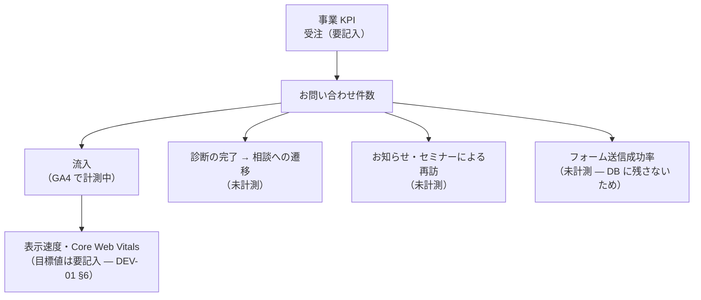

# 02-value-kpi.md — 価値指標・KPI 設計テンプレート

## このセクションの目的

事業・プロダクトの各レイヤーで何を成功とみなすかを統一する。**本ファイルは「事業・プロダクト KPI（KPI-01〜09）」の正本**である。性能・稼働率・サポート応答などの技術・運用系の数値は本書では定義せず、§2-2 の正本マップに従い各文書がオーナーシップを持つ。

## 0-H. ハイブリッド編集ガイド（要点）

- 推奨モード: Hybrid（AI 整理 + 事業責任者 / PdM 確定。兼務前提）
- 人間確認必須: KPI 算式、目標値、オーナー、他文書との参照整合

> 本テンプレートは **コンテンツ主体サイト + 軽量な管理画面** を前提とする（00_README §0-1）。以下の KPI 例は「Web サイトの受託制作 + 運用保守」を主業態とした場合のものであり、自社運営メディア/コンテンツサイトの場合は KPI-01〜03 を広告収益・アフィリエイト収益等に読み替える（§1 の分岐参照）。

---

## 1. KPI ツリー

<!-- TEMPLATE: 事業 KPI → 機能 KPI → 技術 KPI → 運用 KPI の因果を可視化する。技術・運用 KPI はここでは因果関係の表示のみで、定義・目標値は §2-2 の正本マップ先を参照 -->
> **KPI は未設定。** 00_INTAKE に事業目標の入力がなく、目標値を置く根拠がない（GOV-02 TBD-05）。以下は「サイトが果たしている役割」の構造であって、合意された KPI ツリーではない。

サイトの役割は**リード獲得**に集約される。診断とセミナーが入口、お問い合わせが出口という構造になっている。

---

## 2. KPI マスターテーブル

### 2-1. 事業・プロダクト KPI（本書が正本）

目標値の数値は **§3「フェーズ別 KPI 目標値」のみで管理**する（本表との二重管理を禁止）。本表は定義・計測方法・担当の正本。

**目標値はすべて要記入。** 計測手段の有無だけが現時点の事実。

| KPI-ID | 名称 | 定義 | 計測できるか | 目標値 |
| --- | --- | --- | --- | --- |
| KPI-01 | セッション数・オーガニック流入 | 検索経由のセッション数 | **計測中**（GA4、測定 ID `G-74BTEE20D1`） | 要記入 |
| KPI-02 | お問い合わせ件数 | フォーム送信の完了数 | **未計測**。DB に残さないため、`CONTACT_NOTIFY_TO` の受信メールを数えるしかない | 要記入 |
| KPI-03 | 訪問 → お問い合わせ CVR | セッションのうち送信完了に至った割合 | **未計測**。GA4 側に送信完了イベントを実装していない | 要記入 |
| KPI-04 | 診断の開始数・完了数 | 設問画面への到達数と結果表示数 | **未計測**。結果ページは URL が分かれるので GA4 のページビューで代替可能 | 要記入 |
| KPI-05 | 診断 → お問い合わせの遷移率 | 結果ページから `/contact/` へ進んだ割合 | **未計測**。事前入力パラメータ付きの流入を GA4 で識別すれば取得可能 | 要記入 |
| KPI-06 | お知らせ更新頻度 | 月間の新規公開件数 | **計測可能**（`packages/content/news/` のファイル数・git 履歴） | 要記入 |
| KPI-07 | Core Web Vitals | LCP / CLS / INP | **未計測**（GA4 の標準指標で部分的に取得可） | 要記入（DEV-01 §6） |

**計測の穴が 2 つある**: ①お問い合わせ件数がシステム上に残らない（GOV-02 TBD-02 と関連）、②GA4 にコンバージョンイベントを実装していない。CVR を追いたいなら先にこの 2 つを埋める必要がある。

> **診断プラットフォームの KPI**（診断別・流入元別・パートナー別の完了率、15 分解説、有料診断、商談化、成約、契約額、粗利益、手数料、営業 100 件あたり粗利）は **BIZ-04 §14** に定義してある。KPI-04 / KPI-05 はその中に吸収される。本表への転記と採番は GOV-02 TBD-26 で決める（KPI-10〜14 が §2-2 の欠番として予約済みのため）。

### 2-2. 技術・運用 KPI の正本マップ

以下の KPI は本書では定義しない。定義・目標値・計測方法はすべて右列の文書が正本である。**KPI-ID は他文書からの参照を壊さないため欠番のまま保持し、再採番しない。**

| KPI-ID（欠番） | 名称 | 区分 | 正本文書 |
| --- | --- | --- | --- |
| KPI-10 | Core Web Vitals（LCP/CLS/INP） | 技術（性能） | DEV-01 §6（非機能要件） |
| KPI-11 | 主要ページ p95 表示時間 | 技術（性能） | DEV-01 §6（非機能要件） |
| KPI-12a / KPI-12b | 稼働率（管理側 / 公開側） | 技術（可用性） | PRD-02 §5-2（可用性目標の正本） |
| KPI-13 | 一次応答時間 | 運用（サポート） | OPS-01 §3-3（プラン別一次応答 SLA の正本） |
| KPI-14 | MTTR | 運用（障害対応） | **廃止** — OPS-02 §2 の解決目安に一本化し、独立 KPI としては管理しない |

---

## 3. フェーズ別 KPI 目標値

フェーズ命名は BIZ-01 §7 と共通の **MVP 期 / 成長期 / 安定期**。本表が事業・プロダクト KPI の目標値の唯一の置き場所である。

**要記入。** BIZ-01 §7 のとおりフェーズ定義そのものが未設定のため、フェーズ別目標も置けない。

---

## 4. KPI ダッシュボード設計

### 4-1. 方針

**専用のダッシュボードは無い。** 現在参照できるのは次の 2 つのみ。

- **Google Analytics 4** — 流入・ページビュー・回遊。診断の各ステップは URL が分かれているため、ページビューだけでも進行状況をある程度追える
- **Cloudflare Workers Logs / Analytics** — `observability.enabled: true`。リクエスト数とエラー。ただし公開ページは静的配信で Worker を通らないため、ここに出るのはほぼ `/api/contact/` のみ

アラートは未設定。

### 4-2. ダッシュボード構成

<!-- TEMPLATE: ビューの分け方の標準構成。技術・運用ビューの数値目標は §2-2 の正本文書に従う -->
**未整備。** 上記のとおり GA4 と Cloudflare のコンソールを直接見ている状態で、ビューの切り分けはしていない。

---

## 5. KPI 定義変更ルール

| 項目 | ルール |
| --- | --- |
| 定義変更権限 | 事業責任者 / PdM の合意で変更（兼務時は単独判断可、ただし GOV-01 に記録） |
| 変更記録先 | GOV-01 |
| 周知対象 | プロジェクト関係者全員 |
| 反映先 | §2-2 正本マップの各文書、DEV-03、OPS-02、ダッシュボード設定 |

（記録なし。KPI 未設定のため定義変更も発生していない）

---

## 6. 記入時チェックポイント

- 事業 KPI と技術 KPI の因果がつながっているか（§1）
- 定義・算式・頻度・担当者が空欄になっていないか
- 目標値の数値が §3 以外の場所（§2 含む）に重複記載されていないか
- 技術・運用系の数値を本書に再定義していないか（§2-2 の正本マップ経由になっているか）
- フェーズごとの目標値が現実的かつ成長余地を示しているか
- BIZ-03 の採算前提（案件単価・保守継続率等）と §3 のフェーズ・数値が整合しているか
- 自社運営メディア/コンテンツサイトの場合、KPI-01〜03 を広告収益・アフィリエイト収益等に読み替えたか
