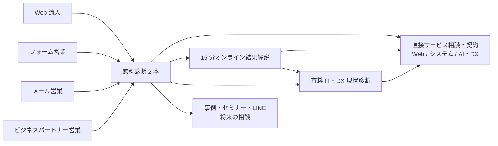
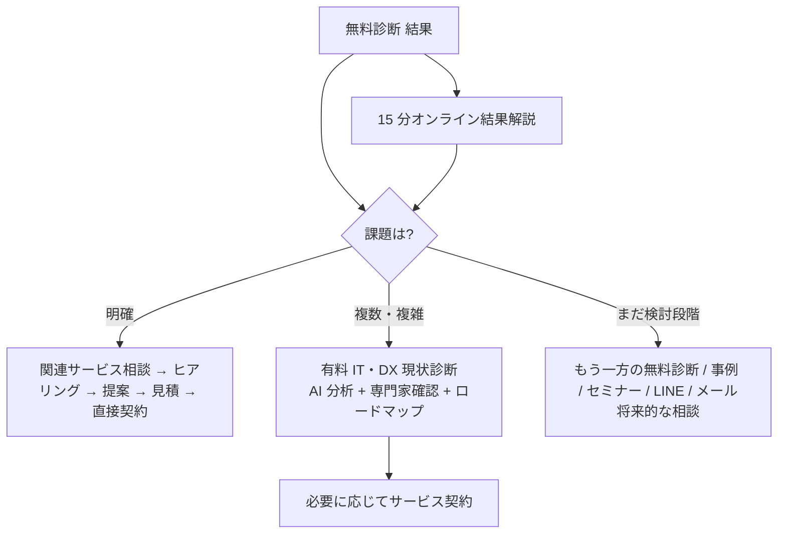
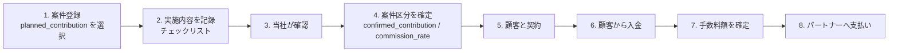

# 04-diagnosis-platform.md — 診断プラットフォーム 事業設計

## このセクションの目的

コーポレートサイト内の無料診断 2 本を、**Web 流入・フォーム／メール営業・ビジネスパートナー営業・有料診断・サービス契約をつなぐ共通の営業基盤**へ発展させるための事業設計を定義する。2026-09-24 に合意済みとして提示された要件を `Confirmed`、本書で提案した値を `Assumed`、確定していないものを `Open`（GOV-02 §2-6 に採番）として区別する。

> **入力源について**: 本書の要件は 2026-09-24 の依頼文（事業責任者）を出典とする。00_INTAKE は AI 読み取り専用のため転記していない。人間が INTAKE §4（顧客発言）・§5（課題）・§10（未確定論点）へ反映すること。

---

## 1. 背景

株式会社ナチュラルは中小企業向けに Web サイト制作・Web システム開発・モバイルアプリ開発・AI・DX 支援・自社サービス・セミナーを提供している（BIZ-01 §1・§5）。**受託案件が減少傾向**にあり、今後は次を強化する（`Confirmed`）。

- 自社サービス、AI・DX 支援、セミナー
- 診断コンテンツを起点にしたリード獲得
- フォーム営業・メール営業
- ビジネスパートナー経由の案件獲得
- 有料診断
- 診断後のシステム開発・AI・DX 支援契約

現行の無料診断 2 本（PRD-06）は「Web 集客コンテンツ」として稼働しており、結果ページの CTA は全タイプ共通の「無料相談」1 本、計測はページビューのみ、回答は保存されない。営業や有料化に使える基盤にはなっていない。

## 2. 目的

診断を **単なる集客コンテンツではなく、次をつなぐ共通営業基盤** にする（`Confirmed`）。

最重要 KPI は診断完了数ではなく、**診断経由の商談率・受注率・契約額・粗利益**（§10）。

## 3. 対象顧客

| 項目 | 内容 | 状態 |
| --- | --- | --- |
| 主対象 | IT 担当者がいない、または IT 部門が十分に機能していない中小企業。AI・DX の進め方に困っている企業 | Confirmed |
| 主な利用者 | 経営者・経営幹部。IT 担当者・現場責任者も利用可 | Confirmed |
| 企業規模の目安 | 従業員 5〜100 名程度。ただし利用をこの規模に限定しない | Confirmed |
| 業種 | 限定しない。導入事例は製造・サービス・小売（BIZ-01 §3-1） | — |
| 文章方針 | 専門用語を多用せず、IT に詳しくない経営者が理解できる表現 | Confirmed |

BIZ-01 §3 のターゲット定義（要記入）は本節で埋まる。BIZ-01 側へは本書参照を追記する。

## 4. 無料診断 2 本の扱い

**1 つの質問セットへ統合しない**（`Confirmed`）。

| 理由 |
| --- |
| 業務課題診断は「どこに問題があるか」、AI・DX 浸透診断は「現在どのレベルにいるか」を調べる別の問い |
| 統合すると質問数が増え、無料診断の完了率が下がる |
| フォーム・メール営業で相手の課題感に合わせて使い分けにくくなる |

| 方針 | 状態 |
| --- | --- |
| 無料診断は 2 種類のまま維持する | Confirmed |
| 診断ポータル・ブランド・入口は統一する | Confirmed |
| それぞれの結果からもう一方へ相互誘導する。**MVP（Phase 2）で実装対象** | Confirmed |
| 両方受診した場合の「無料総合結果」は将来対応（Phase 5） | Confirmed |
| 有料版では 2 つの診断内容を統合・拡張する（§9） | Confirmed |
| 全体ブランド名候補「ナチュラル IT・DX診断」 | **Open**（GOV-02 TBD-12） |

## 5. 無料版・有料版の境界

### 5-1. 無料で表示するもの

診断結果タイプ / AI・DX 成熟度、判定理由、強み、主な課題、放置した場合のリスク、自社でできる最初の一歩、一般的な改善方向、関連するもう一方の無料診断、関連するナチュラルのサービス。（`Confirmed`。具体化は PRD-07 §1-5・§2-4）

### 5-2. 無料では確定・表示しないもの

企業固有の根本原因、複数課題の正確な優先順位、具体的な製品・サービス選定、現行システムとの連携方法、正式な概算費用、投資対効果、実行スケジュール、担当体制、90 日ロードマップ、AI による企業別分析、専門家による最終判断、詳細 PDF レポート。（`Confirmed`）

### 5-3. 境界の見せ方

- 現在の「続きは無料相談」というコンテンツロック（CSS ぼかし — PRD-06 P-09）は **撤廃**する（`Confirmed`）。
- 無料版は「課題の発見」「課題への気づき」「一般的な改善方向」「自社で確認できる最初の行動」までを提供する。すべての解決策は提示しない。
- 結果画面で無料診断の限界を誠実に説明する。例文（`Confirmed`）:

> 今回の無料診断では、○○という傾向が確認できました。ただし、どの業務から着手すべきか、どの程度の予算が必要かは、現在の業務量・利用システム・社内体制によって異なります。

- **無料版の価値を意図的に低くしない**（§13）。現行のぼかし部分の文章は「一般的な改善方向」として公開へ戻す（PRD-07 §0-2）。
- 参考価格（PRD-06 §2-6 `pricing`）は無料版の結果から外す。サービス価格をサイト上で公開するか否かは別論点（**Open**、GOV-02 TBD-24）。

## 6. 4 つの利用モード

内部的には診断を 4 つ複製せず、**共通の診断定義（質問・選択肢・配点・結果・CTA）を 1 つ持ち、モードごとに入口・文言・保存・追跡・権限を切り替える**（§12、DEV-11）。

| 内部モード名（候補） | 対外呼称 | 費用 | ログイン | 回答の保存 | 主な追跡 |
| --- | --- | --- | --- | --- | --- |
| `public` | 一般公開版 | 無料 | 不要（匿名） | しない（GA4 のみ） | 流入元・完了・CTA |
| `outbound` | フォーム・メール営業版 | 無料 | 原則不要 | トークン単位で匿名保存（§6-2） | キャンペーン・担当・クリック〜成約 |
| `partner` | ビジネスパートナー版 | 無料（契約者限定） | **パートナーは必須**。顧客は URL トークン | 顧客・案件単位で保存 | パートナー別の案件・成約・手数料 |
| `paid` | 有料完全版（内部呼称） | 有料 | 必須（申込者） | 保存（回答・AI 分析・専門家コメント・PDF） | 申込〜納品〜サービス契約 |

内部モード名・パートナー内部名（`channel_partner` / `partner_program`）は呼称変更の影響を受けない英語識別子とする（`Confirmed`）。

### 6-1. 一般公開版（`public`）

| 項目 | 内容 |
| --- | --- |
| 対象 | Web サイトへ訪問した一般企業。検索・SNS・紹介から訪問した利用者 |
| 条件 | 無料・登録不要・ログイン不要・匿名・10 問程度・1〜2 分・通常ロジック判定・AI 分析なし・専門家確認なし |
| 結果 | §5-1 |
| 結果後の CTA（順） | ①もう一方の無料診断 ②15 分オンライン結果解説 ③課題に対応するサービス相談 ④有料 IT・DX 現状診断 ⑤通常問い合わせ ⑥LINE 相談 ⑦関連事例・セミナー |
| 直接進めるサービス | Web サイト制作、システム開発、AI・DX 支援、AI チャットボット、業務自動化、社内ポータル、ダッシュボード、EC・オンライン申込、その他 |
| 原則 | **無料診断から有料診断を必須経由にしない。** 課題が明確なら直接サービス相談へ |

結果タイプ別の主 CTA は PRD-07 §1-7・§2-6。CTA の 7 種のうち画面上で「主 CTA」にするのは結果タイプごとに 1 つで、残りは 3 分岐（§8）の副 CTA として並べる。

### 6-2. フォーム・メール営業版（`outbound`）

| 項目 | 内容 | 状態 |
| --- | --- | --- |
| 対象 | 当社がフォーム営業・メール営業で診断 URL を送付した企業 | Confirmed |
| 条件 | 無料・原則ログイン不要。診断内容は一般公開版と同じ。営業先・業種・キャンペーンに応じて入口文言を変更可能 | Confirmed |
| URL | 専用 URL またはランダムトークン。**URL に会社名・メールアドレスを含めない** | Confirmed |
| 送付先の選び方 | 診断一覧へ送らず、相手に合う診断へ直接送る。漠然とした DX 課題 → AI・DX 浸透診断、人手不足・手作業・Excel → 業務課題かんたん診断 | Confirmed |
| 追跡対象 | 営業方法、キャンペーン、営業担当者、送付日、URL クリック、診断開始、質問ごとの離脱、診断完了、結果タイプ、15 分解説申込、有料診断申込、商談化、成約、契約金額 | Confirmed |
| 紐付けの原則 | **URL クリックだけで回答を特定企業と確定的に紐付けない。** 利用者が明示的に情報を入力・同意した時点（15 分解説申込、詳細情報受取、有料診断申込、問い合わせ）で正式に紐付ける | Confirmed |
| CTA | ①診断結果を 15 分で解説してもらう ②課題に対応するサービスについて相談する ③有料の詳細診断を見る ④営業担当者へ質問する ⑤もう一方の無料診断を受ける | Confirmed |

**トークンの設計原則（案、`Assumed`）**: トークンは「送付先リスト上の 1 行（宛先）」ではなく「キャンペーン × 送付バッチ」あるいは「宛先 1 件」のどちらにも対応できるようにし、宛先単位で発行する場合でも回答保存レコードには宛先 ID を「候補」としてのみ持ち、`confirmed_at` が入るまで特定企業の情報とは結合表示しない。詳細は PRD-08 §2、DEV-11 §5。

**法令・運用上の注意（`Open`、専門家確認）**: 広告宣伝メールに関する法令（特定電子メール法・特定商取引法の表示義務）、送信先サイトの利用規約・営業禁止表示、配信停止（オプトアウト）の受付、個人情報の取り扱い。本書では法的断定をせず、**運用開始前に専門家確認が必要な事項**として GOV-02 TBD-13 に登録する。

### 6-3. ビジネスパートナー版（`partner`）

| 項目 | 内容 | 状態 |
| --- | --- | --- |
| 正式名称 | 制度名「ナチュラル ビジネスパートナープログラム」、参加者「ナチュラル ビジネスパートナー」、通常表記「ビジネスパートナー」 | Confirmed |
| 使わない呼称 | 「代理店」。正式見積・契約・技術判断は当社が行い、パートナーは当社を法的に代理して契約を締結する立場ではなく、価格・納期・仕様を独自に確約できない | Confirmed |
| 内部名称 | `channel_partner` / `partner_program`（呼称変更の影響を受けない） | Confirmed |
| 利用条件 | 無料・パートナー契約者限定・**ログイン必須**・顧客登録・顧客専用 URL 発行 | Confirmed |
| 回答方法 | 顧客と対面で回答する / 顧客へ URL を送って事前回答してもらう、の両方 | Confirmed |
| データ分離 | 自社が登録した顧客・案件のみ閲覧可。他パートナーの顧客・案件は閲覧不可 | Confirmed |
| 事前同意 | 診断開始前に、回答内容と診断結果がパートナーと当社の間で共有されることへの同意を取得 | Confirmed |
| 有料結果の共有 | 有料診断の詳細結果は**顧客が同意した場合のみ**パートナーも閲覧可 | Confirmed |

**表示する結果**: 現在の簡易診断で用意しているルールベース結果を原則全文表示 — 判定結果、判定理由、強み、主な課題、補助的な課題、放置リスク、一般的な改善方向、推奨サービス、簡易的な優先順位、次に確認すべきこと。
**含めないもの**: AI による企業別分析、専門家確認済みの詳細分析、正式な概算費用、90 日ロードマップ、有料版の正式 PDF。

**簡易 PDF（案）**: 顧客名、診断日、診断結果、主な課題、強み、放置リスク、改善方向、次の一歩、ビジネスパートナー情報、当社情報。名義は共同名義を基本とする — 「診断提供：株式会社ナチュラル」「ご紹介・診断サポート：○○株式会社」。

**CTA**: ビジネスパートナーに相談する / 有料診断を申し込む / 当社へ提案依頼を送る / 見積もりを依頼する。通常の「当社へ直接問い合わせる」導線は前面に出さない（パートナーによる顧客の囲い込みと、当社による顧客の横取りの双方を防ぐ — §13）。

**パートナー向け簡易結果説明**: 30 分程度を想定。有料版の専門家報告会（60 分）と同等ではない。

### 6-4. 有料完全版（`paid`）

| 項目 | 内容 | 状態 |
| --- | --- | --- |
| 内部呼称 | 完全版 | Confirmed |
| 対外名称候補 | 中小企業向け IT・DX現状診断（**推奨**）/ IT・DX総合診断 / 経営者のためのIT・DX診断 | **Open**（TBD-14） |
| 価格 | 基本価格案 50,000 円（税別）、初期モニター価格案 30,000 円（税別）。検討幅 30,000〜50,000 円 | **Open**（TBD-15） |
| 主な購入者 | IT 技術者がいない中小企業の社長、IT 部門が機能していない企業、IT・DX・AI 導入で困っている経営者、何から着手すべきか判断できない企業 | Confirmed |
| 価値 | 企業の IT・DX の現状把握、経営課題と IT 課題の関連付け、課題の優先順位、投資判断に使える材料、90 日間の改善方針 | Confirmed |
| 位置づけ | 単なる「無料診断の全文表示版」にしない。**すべてのサービス契約の必須条件ではない** | Confirmed |

**想定内容**（`Confirmed`）: 40〜60 問程度（選択式 + 記述式）、企業情報、利用中システム、経営課題、IT 体制、投資予算、改善希望時期、60 分ヒアリング、通常ロジックによる客観評価、AI による個別分析、専門家による確認・修正、詳細 PDF、90 日ロードマップ、60 分の結果報告会。

**向いている企業**: 複数の課題がある / 何から着手すべきか分からない / 現在のシステム構成を把握できていない / 経営者と現場の認識が異なる / 投資の優先順位を決めたい / システム導入前に全体像を整理したい。

## 7. 無料診断の再設計方針

### 7-1. 維持するもの

2 つの診断テーマ、10 問程度、1〜2 分、登録不要、既存 URL、既存結果タイプ、既存デザインの基本方針、既存の判定ロジックの骨格（`Confirmed`）。

### 7-2. 点検・再設計するもの

質問の重複、選択肢の偏り・分かりにくさ、点数差の妥当性、同点処理、特定結果への偏り、結果に影響しない質問、結果文章、強みの表示、判定理由、放置リスク、最初の一歩、関連サービス、相互誘導、15 分解説、直接サービス相談、有料診断、GA4 イベント、アクセシビリティ、URL 互換性、診断定義のバージョン管理（`Confirmed`）。具体案は PRD-07。

### 7-3. 有料版へ移す候補

詳細な IT 環境、利用システム一覧、IT 費用、セキュリティ詳細、組織体制、経営戦略、投資予算、導入時期、記述式回答、個別の業務量、現行システム連携、ベンダー契約（`Confirmed`）。**無料版では社内調査が必要になる質問を避ける。**

## 8. 無料診断後の 3 つの進路

結果タイプごとに主 CTA を変える（`Confirmed`）。マッピング案（PRD-06 §2-6 の `proposal` と現行サービスページの対応から作成。正式版は PRD-07 §1-7・§2-6）:

| 結果 | 主 CTA（課題が明確） |
| --- | --- |
| A 発信力不足型 | Web サイト改善相談 |
| B 販売チャネル不足型 | EC・オンライン申込相談 |
| C 社内情報分散型 | 社内ポータル相談 |
| D 問い合わせ対応疲弊型 | FAQ・AI チャットボット相談 |
| E アナログ業務型 | 業務システム化相談 |
| F 数字が見えない型 | データ集計・ダッシュボード相談 |
| G 定型作業過多型 | 書類自動生成・業務自動化相談 |
| H 集客導線不足型 | LP・フォーム・集客導線相談 |
| I リピート導線不足型 | 顧客リピート基盤（会員・LINE・メルマガ）相談 |
| Z 健全経営型 | AI・DX 浸透診断へ（攻めの投資の現在地） |
| AI・DX レベル 1〜2 | 業務課題診断 / 15 分解説 / 有料診断 |
| AI・DX レベル 3 | 最初の AI 活用（チャットボット・自動生成）相談 |
| AI・DX レベル 4〜5 | AI・DX 支援（組織展開・新サービス）相談、セミナー |

## 9. 15 分オンライン結果解説

一般公開版・営業版の両方で提供（`Confirmed`）。

| 項目 | 内容 |
| --- | --- |
| 形式 | Google Meet / Zoom 等のオンライン。15 分。無料。日程予約。事前の詳細分析・AI 分析・正式提案は行わない |
| 目的 | 診断結果の意味を説明する、特に注意すべき課題を説明する、最初に確認すべきことを伝える、次に進むルートを判断する |
| 進行 | 3 分 状況確認 → 5 分 診断結果の説明 → 5 分 優先課題の確認 → 2 分 次の選択肢の案内 |
| 解説後の分岐 | ①課題が明確 → サービス相談・提案 ②課題が複雑 → 有料診断 ③検討段階 → 事例・セミナー・LINE・もう一方の診断 |
| 予約時に引き継ぐ情報 | 診断種別、診断結果、回答内容、流入元、営業担当、パートナー情報、キャンペーン情報（可能な限り） |
| 予約手段 | **Open**（TBD-25。外部予約ツールのリンク / 自前フォーム。DEV-11 §6-7） |

## 10. ビジネスパートナープログラムと手数料制度

### 10-1. 契約は 1 種類、手数料率は案件ごと

パートナー自体を 10% / 20% に分類しない。契約は原則 1 種類とし、**案件ごとの実施内容で手数料率を決める**（`Confirmed`）。

| 区分（内部） | 対外 | 率 | パートナーが行うこと | 当社が行うこと |
| --- | --- | --- | --- | --- |
| `referral` | 紹介案件 | 対象売上の **10%** | 顧客情報の登録、紹介理由または想定課題の登録、顧客から情報共有の同意取得、当社との面談・連絡への顧客同意、既存顧客・既存商談でないこと | ヒアリング、診断、結果説明、提案、見積、クロージング、契約、開発・支援 |
| `sales_support` | 診断・販売支援案件 | 対象売上の **20%** | 上記に加え、簡易診断の実施、結果説明、顧客課題の整理、決裁者・契約責任者の確認、予算感の確認、導入希望時期の確認、当社への情報共有同意、具体的な提案・見積希望の取得、結果報告・商談内容の記録 | 技術確認、要件確認、正式提案、正式見積、契約、開発・支援 |

### 10-2. 確定の流れ

- 案件登録時に予定区分（紹介のみ / 診断・販売支援まで実施予定）を登録するが、**登録時点で手数料率を確定しない**。
- 同じパートナーでも案件ごとに 10% / 20% を変えられる。
- 管理項目候補: `planned_contribution`、`confirmed_contribution`、`commission_rate`。
- **最終区分は当社が確認・確定する。** 曖昧な自動判定は行わない（§13）。

**20% 対象チェックリスト（案）**: 簡易診断を実施した / 顧客へ診断結果を説明した / 顧客の課題を整理した / 決裁者または契約責任者を確認した / 予算感を確認した / 導入希望時期を確認した / 顧客から提案・見積希望を取得した / 当社への情報共有同意を取得した / 商談内容を記録した。

### 10-3. 手数料計算の基本案と未決事項

基本案: **「顧客から実際に入金された税抜対象売上 × 10% または 20%」**（`Assumed`）。

以下は **Open**（GOV-02 TBD-16 として一括管理。個々の推奨案は GOV-02 に記載）: 有料診断自体を手数料対象にするか / どのサービスを対象にするか / 初回契約のみか追加契約も対象か / 紹介から何か月以内を対象にするか / 月額契約を何か月分まで対象にするか / 外注費・ライセンス費・交通費の控除 / 値引き・返金・キャンセル時の扱い / 既存顧客・既存商談の判定 / 複数パートナーから紹介された場合 / 支払時期 / インボイス・請求書の扱い。

### 10-4. 契約・規約

- パートナーが独自に確約できないもの: 正式見積、価格、納期、技術仕様、補助金採択、AI・DX 導入効果、契約条件（`Confirmed`）。設計（画面上の文言・PDF の免責）と規約の両方で担保する。
- 契約書名候補: 「顧客紹介・販売支援業務提携契約書」。最終文言は専門家確認を前提とする（**Open**、TBD-17）。OPS-01 §6 に受託以外の契約種別として追記する。

## 11. 収益モデル

| 収益源 | 内容 | 状態 |
| --- | --- | --- |
| 有料診断 | 1 社 30,000〜50,000 円（税別）。運用時間目標 約 3 時間 / 社（§12-3） | Open（価格） |
| 診断後のサービス契約 | Web サイト制作、システム開発、AI・DX 支援。診断はここへの入口 | Confirmed（本命） |
| パートナー経由の契約 | 上記の売上からパートナー手数料 10% / 20% を差し引いた粗利 | Confirmed |
| セミナー・自社サービス | 検討段階のリードの受け皿。診断からの導線で接点を維持 | Confirmed |

有料診断単体の採算は目的ではない。**有料診断の粗利は「診断 → サービス契約」の転換率と契約額で測る**（§10 KPI）。運用時間目標（ヒアリング 60 分、回答確認・分析 30 分、レポート修正 30 分、結果報告 60 分、連絡・管理 30 分 ＝ 約 3 時間）は確定値ではなく **Phase 3 の MVP 検証項目**。

## 12. 有料版の設計原則（要約 — 詳細は PRD-05）

### 12-1. 診断分野（基本案 6 分野、確定質問ではない）

| 分野 | 主な観点 | 既存無料診断との対応 |
| --- | --- | --- |
| 経営・IT 戦略 | 経営課題と IT 投資のつながり、IT・DX 責任者、投資判断基準、目標・KPI、経営層と現場の認識共有 | ai-dx q8（経営層の姿勢）を拡張 |
| 業務プロセス | 紙・電話・FAX・Excel、二重入力、定型作業、承認業務、属人化、手順書、問い合わせ対応、書類作成 | business q3〜q9 のほぼ全部、ai-dx q1・q10 |
| システム・SaaS | 利用中システム、連携、契約・費用、古いシステム、ベンダー依存、データ出力、アカウント管理、利用状況 | 無料版に無い（社内調査が必要なため意図的に除外） |
| データ活用 | 売上・顧客・在庫・資金繰り・進捗、集計、分散、ダッシュボード、データに基づく意思決定 | business q9、ai-dx q3・q4 |
| AI 活用 | 生成 AI 利用状況、ルール、活用候補業務、社内データ活用、セキュリティ、教育、効果、シャドー AI | ai-dx q5・q6・q9 |
| IT 体制・セキュリティ | IT 担当者、アカウント管理、多要素認証、バックアップ、退職者対応、障害対応、外部ベンダー、情報資産、クラウド、復旧手順 | ai-dx q7（人材）のみ。ほぼ新規 |

質問数・質問内容・評価軸の再提案は PRD-05 §2（AI 分析の入力として定義する）。有料版は無料版の回答を **引き継いで重複質問を省く**（PRD-07 §3）。

### 12-2. ロジック / AI / 人の役割分担

「**ロジックが診断し、AI が深掘りし、人が責任を持つ**」（`Confirmed`）。

| 層 | 決めること | 決めないこと |
| --- | --- | --- |
| 通常ロジック | 総合スコア、分野別スコア、成熟度レベル、緊急度、改善余地、リスク、回答の矛盾候補、優先課題候補。**同じ回答なら同じ結果。AI モデル変更で変わらない** | — |
| AI 分析（「AI 判定」と呼ばない） | 企業情報を踏まえた現状要約、課題の因果関係、強み、回答間の矛盾、ヒアリング確認事項、優先課題トップ 5 候補、推奨施策案、AI 活用候補、90 日ロードマップ案。**回答に無い事実を作らず、各指摘に回答 ID を紐付け、構造化出力** | 最終スコア、成熟度レベル、法令違反の断定、セキュリティ事故の断定、補助金の対象可否、正確な導入費用、契約条件、最終的なサービス提案、経営判断 |
| 専門家確認 | AI 分析の確認、根拠回答の表示、文章編集、優先順位変更、項目追加・削除、要確認フラグ、再生成、PDF プレビュー、承認、納品、修正履歴。**AI 分析をそのまま顧客へ納品しない** | — |

プロンプト・診断ロジック・質問・結果・AI モデルはバージョン管理する（PRD-05 §9、DEV-11 §5）。

### 12-3. 成果物

Web 上の診断結果、A4 10〜15 ページの PDF、経営者向けエグゼクティブサマリー、IT・DX 総合スコア、分野別レーダーチャート、成熟度、強み、優先課題トップ 5、課題の根拠、放置リスク、推奨施策（自社でできる / SaaS で対応 / 専門家支援が必要 / システム開発が必要 の 4 区分）、AI 活用候補、想定難易度、概算期間、概算費用帯、90 日ロードマップ、ヒアリング確認事項、専門家コメント、60 分結果報告会。レポートの 80〜90% をロジック・AI で生成し、人が重要箇所を確認・修正する方向で検証する。

## 13. 設計上の注意事項（全文書共通の原則）

| 原則 | 反映先 |
| --- | --- |
| 無料版の価値を意図的に低くしない。無料版で全解決策まで提示しない | PRD-07 |
| 有料版を「文章量が多い無料版」にしない。価値は客観評価・個別分析・専門家確認・実行計画 | PRD-05 |
| AI の使用自体を価値の中心にしない | PRD-05、対外文言 |
| 何でもシステム開発へ誘導しない。SaaS・運用改善・ルール整備・自社対応も選択肢として提示する | PRD-07 CTA、PRD-05 推奨施策の 4 区分 |
| 診断結果の中立性を保ち、根拠を説明可能にする | PRD-07 判定理由、PRD-05 evidence |
| 回答データ・個人情報・企業情報の扱いを明確にする | PRD-08 §3、DEV-11 §8、プライバシーポリシー改訂（TBD-18） |
| パートナーによる顧客の囲い込みと、当社による顧客の横取りの双方を防ぐ | §6-3 CTA、PRD-08 マトリクス、契約 |
| 契約・紹介料に関する曖昧な自動判定を避け、最終手数料率は当社が確認する | §10-2 |
| 設計変更が既存公開 URL・SEO へ与える影響を確認する | PRD-06 §4、PRD-07 §5、DEV-11 §9 |
| 規約・プライバシーポリシーの変更要否を確認する | PRD-06 §5、TBD-18 |

## 14. KPI

診断別・流入元別・ビジネスパートナー別に計測できる設計を Phase 2 から作る。KPI-ID は BIZ-02 の欠番規則に従い **KPI-08 以降** を割り当てる（BIZ-02 §2-1 へ転記する。目標値はフェーズ定義後に BIZ-02 §3 で管理）。

| KPI-ID | 名称 | 定義 | 計測手段（案） | フェーズ |
| --- | --- | --- | --- | --- |
| KPI-08 | 診断ページ表示 | イントロの表示数 | GA4 `diagnosis_view` | 2 |
| KPI-09 | 診断開始 / 完了 / 完了率 | 1 問目表示数、結果遷移数、比率 | GA4 `diagnosis_start` / `diagnosis_complete` | 2 |
| KPI-10 | 設問ごとの離脱 | 各設問での離脱数 | GA4 `diagnosis_answer` の `step` 分布 | 2 |
| KPI-11 | 結果タイプ分布 | タイプ / レベル別の完了数 | GA4 `diagnosis_complete` | 2 |
| KPI-12 | もう一方の診断への遷移率 | 結果 → 他診断開始 | GA4 `diagnosis_cross_start` | 2 |
| KPI-13 | 15 分解説 申込 / 実施 | 申込数、実施数 | 予約ツール or D1 | 2 |
| KPI-14 | サービス相談数（診断経由） | 結果 CTA → 問い合わせ送信 | `/api/contact/` の送信に診断情報を付与し記録（D1 or メール） | 2 |
| KPI-15 | 有料診断 申込 / 購入 | 申込数、入金数 | D1 | 3 |
| KPI-16 | 商談化 / 提案 / 成約 | 商談・提案・成約件数 | 案件管理（D1 or 外部 CRM） | 3〜4 |
| KPI-17 | 契約金額 / 粗利益 | 診断経由の受注額・粗利 | 案件管理 | 3〜4 |
| KPI-18 | パートナー手数料 | 支払額 | 案件管理 | 4 |
| KPI-19 | 診断別・流入元別・パートナー別 受注率 / 受注額 | セグメント別 | 案件管理 × 流入属性 | 4 |
| KPI-20 | フォーム・メール営業 100 件あたりの粗利益 | 送付 100 件あたりの粗利 | 送付数（outbound）× KPI-17 | 2〜3 |

**注**: BIZ-02 §2-2 で KPI-10〜14 は技術・運用 KPI の欠番として予約済み（性能・稼働率）。衝突を避けるため、BIZ-02 へ転記する際は **KPI-D01〜KPI-D13 のように診断系の接頭辞を付けるか、KPI-15 以降へ再採番する**（**Open**、TBD-26）。本表の番号は仮。

## 15. リスク

| リスク | 内容 | 対策 |
| --- | --- | --- |
| 無料版の価値低下 | ロック撤廃後に「読んで終わり」になる | 3 分岐 CTA、判定理由・最初の一歩で行動につなげる。KPI-12〜14 で監視 |
| 有料版の期待外れ | 「無料版の長い版」と受け取られる | 60 分ヒアリング + 専門家確認 + ロードマップを必須構成にし、AI を前面に出さない |
| AI 分析の誤り | 事実でない指摘、断定表現 | 構造化出力・回答 ID 紐付け・専門家承認必須・禁止事項プロンプト（PRD-05） |
| 法令・規約 | 営業メール法令、個人情報、パートナー契約 | TBD-13・17・18 を運用開始前に専門家確認 |
| パートナー間のデータ漏洩 | 他社の顧客が見える | パートナー ID による完全分離を Service 層で強制、テストで担保（DEV-11 §8） |
| 手数料紛争 | 区分・対象・期間の解釈違い | 当社確定制、チェックリスト記録、契約書で定義（TBD-16） |
| SEO 後退 | URL・結果ページの変更 | URL 凍結、v1 パラメータ互換、noindex 化は別判断（TBD-23） |
| 運用負荷 | 有料診断 1 社 3 時間が守れない | Phase 3 で 5〜10 社のモニターで実測し、価格・工程を見直す |
| 過剰設計 | MVP で 4 モード全部を作る | Phase 分割（§16）。Phase 2 は無料版 + 営業版のみ |

## 16. 開発フェーズ案

依頼文の Phase 1〜5 を基本とし、技術依存で順序変更が合理的な点を §16-2 に示す。

### 16-1. フェーズ

| Phase | 内容 | 主な成果物 | 前提 |
| --- | --- | --- | --- |
| **1 事業・診断設計**（本書群） | 現行棚卸し、4 モード設計、無料/有料の境界、無料診断再設計、有料版分野、AI 分析設計、ドキュメント化 | BIZ-04, PRD-05〜08, DEV-11, GOV-02 | — |
| **2 無料版・営業版改善** | 質問・結果改善（v2）、相互誘導、結果別 CTA、15 分解説導線、営業用 URL（トークン）、流入計測、GA4 イベント | 公開サイトの改修、D1 初回利用（outbound の回答保存） | PRD-07 承認、TBD-21・25 確定、`pnpm db:generate` 初回（TBD-03）、プライバシーポリシー改訂 |
| **3 有料版 MVP** | 詳細質問、通常ロジック、AI 分析、専門家編集・承認、PDF、申込・決済または請求書、結果報告会管理、5〜10 社モニター | 管理画面の本格利用開始、AI 連携、PDF 生成 | PRD-05 承認、TBD-14・15、AI ベンダー契約、決済手段（TBD-27） |
| **4 ビジネスパートナー版** | パートナーログイン、顧客登録、専用 URL、簡易 PDF、共同名義、紹介案件管理、診断・販売支援案件管理、手数料管理 | パートナー用画面（public 側）、案件管理（admin 側） | 契約書（TBD-17）、手数料規定（TBD-16） |
| **5 将来対応** | 完全ホワイトラベル、独自ドメイン、ロゴ・カラー変更、独自診断、月額課金、複数担当者、CRM 連携、紹介料自動振込、AI チャット相談、業種別診断、両無料診断の総合結果 | — | Phase 4 の運用実績 |

### 16-2. 順序に関する提案

| 論点 | 提案 | 理由 |
| --- | --- | --- |
| Phase 2 で D1 を使い始める | 営業版の回答保存は Phase 2 に入れる。一般公開版の改善だけなら D1 は不要 | 営業版の「質問ごとの離脱」「結果タイプ」「クリック〜成約」の追跡は保存無しでは成立しない。ただし初回 `db:generate` の前に Member 認証の要否（TBD-01）を決める必要があり、ここが Phase 2 の隠れた前提になる |
| Phase 2 の中を 2a / 2b に割る | 2a = 無料版 v2 + CTA + GA4（D1 不要、先行リリース可）、2b = 営業版トークン + 保存 | 2a は現行構成のまま出せる。2b はスキーマ・ポリシー改訂・法務確認が要る |
| Phase 4 の一部を Phase 3 に前倒し | 「顧客（申込者）ログイン」「回答保存」「PDF 生成」「管理画面の承認フロー」は有料版で先に作られる。パートナー版はそれに「パートナーというロール」と「案件・手数料」を足すもの | 有料版 → パートナー版の順は技術的にも自然。逆順にすると認証・PDF を 2 回設計する |
| 15 分解説の予約は外部ツールで開始 | Phase 2 では予約ツールのリンクに診断情報をクエリで渡すだけにし、自前実装しない | 予約カレンダーの自作は MVP で過剰（§15「過剰設計」）。実績が出てから内製を判断 |
| 決済 | Phase 3 は請求書払いを基本にし、カード決済（Stripe）はモニター後に判断 | 5〜10 社のモニターに決済連携を作る費用対効果が低い。DEV-01 §2 で Stripe は標準ライブラリに含まれるため、後付けは可能 |

## 17. 未決事項

GOV-02 §2-6 を正本とする。本書に関係する TBD: TBD-12（ブランド名）、TBD-13（営業メール法令）、TBD-14（有料版名称）、TBD-15（価格）、TBD-16（手数料規定）、TBD-17（パートナー契約書）、TBD-18（プライバシーポリシー・規約改訂）、TBD-24（価格公開）、TBD-25（予約手段）、TBD-26（KPI 採番）、TBD-27（決済手段）。

## 18. 記入時チェックポイント

- `Confirmed` と書いた項目が 2026-09-24 の依頼文の記述と一致しているか
- `Assumed` の項目に根拠が併記され、GOV-02 に対応する TBD があるか
- 4 モードの条件・CTA が PRD-07・PRD-08 と矛盾していないか
- 手数料の確定を人（当社）が行う設計になっているか
- 「無料 → 有料の必須経由」を作る記述が無いか
