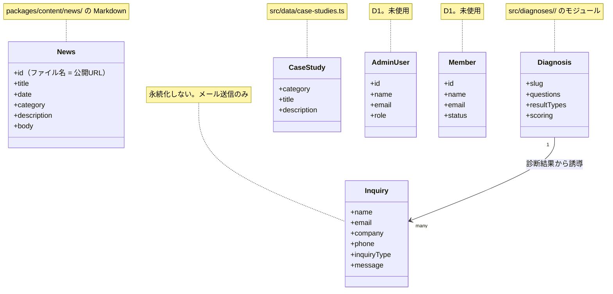

# 01-domain-model.md — ドメインモデルテンプレート

## このセクションの目的

プロダクトの業務概念をエンティティ単位で整理し、共通言語を確立する。**標準ドメインモデル（コンテンツ主体サイト + 軽量管理画面の雛形）** を含み、本テンプレート内の他文書のサンプル値はすべて本書 §1 の構造をベースにしている。

> 本テンプレートは 00_README §0-1 の**パターン A**（コンテンツ主体サイト + 軽量な管理画面）を前提とする。マルチテナント・多階層ロール・サブスク課金・チャットの標準モデルは持たない（単一運営・少数ロール前提）。

## 0-H. ハイブリッド編集ガイド（要点）

- 推奨モード: Hybrid（AI 整理 + PdM / Tech Lead レビュー）
- 人間確認必須: 用語の意味、責務境界、将来拡張との整合、営業用語との衝突

---

## 1. 標準ドメインモデル（テンプレート雛形）

コンテンツ主体サイト + 軽量管理画面の典型として、以下の単一運営者標準構造を採用する。**本節が標準ドメインモデルの正本**であり、他文書（PRD-02 / PRD-03 / DEV 各書）のサンプル値はこの構造を前提とする。

### 1-1. 階層モデル

```
Site（運営: 1 サイト・1 運営チーム。マルチテナントではない）
  ├─ AdminUser（管理画面ログインユーザー。ロール: admin / editor）
  ├─ Post（ブログ・お知らせ記事）
  │   ├─ Category
  │   └─ Tag
  ├─ Page（固定ページ。CMS で管理する場合のみ — 会社概要等は Astro の静的ページで十分な場合が多い）
  ├─ Media（アップロード画像等。実体は R2、DB にはメタデータのみ）
  ├─ Inquiry（お問い合わせフォームの送信記録）
  ├─ Member（マイページ機能採用時のみ。一般利用者のアカウント。AdminUser とは完全に別系統）
  └─ Order（軽量 EC 採用時のみ。カート/チェックアウト程度、在庫同期は持たない。Member への任意紐付け可、ゲスト注文も許容）
```

> **アプリ間のエンティティ所有**: モノレポ内の `apps/admin` / `apps/public`（DEV-01 §1「リポジトリ構成」参照）では、AdminUser・活動監査ログは `apps/admin` の関心事、Member・Order は `apps/public` の関心事になる。Post/Category/Tag/Media/Inquiry は `apps/admin` が書き込み、`apps/public` が読み取る（D1/R2 は両アプリで共有、マイグレーションは `apps/admin` からのみ実行、スキーマ定義自体は `packages/schema` に一元化）。

### 1-2. ロール構造（単一階層・少数ロール）

Platform / Organization の 2 階層は使わない。管理画面ログインユーザーに **単一階層の少数ロール** を持たせる。

| ロール | 概要 |
| --- | --- |
| `admin` | 管理画面の全権（他 AdminUser の管理、公開設定、Inquiry 対応含む） |
| `editor` | コンテンツ作成・編集のみ（Post/Page/Media）。公開権限は案件次第 |

> ロールが 1 つで十分な小規模案件（運営者 1〜2 名）では `editor` を省略し `admin` のみでも構わない。3 ロール以上が必要になった場合は、本テンプレートの適用範囲を 00_README §0-1 で再確認する。

**Member（マイページ機能採用時のみ）は AdminUser とは無関係の別系統**であり、上記のロール構造を持たない（単一種別、権限段階なし）。認証テーブル・セッション（クッキー名）・パスワードハッシュの実装は AdminUser 用と共有せず別に用意する（DEV-02 参照）。信頼レベルが異なる（社内の少数スタッフ vs 不特定多数の一般利用者）ため、意図的に分離する。

### 1-3. 標準エンティティの役割

| 概念 | 役割 | 例 |
| --- | --- | --- |
| Site | サイト運営全体（自社 or 受託先クライアント 1 件）。マルチテナントではなく単一運営 | 1 つのコーポレートサイト |
| AdminUser | 管理画面にログインする運営メンバー | 広報担当者、制作会社の運用担当 |
| Post | ブログ・お知らせ記事（プロダクト固有コンテンツの標準形） | ブログ記事、ニュースリリース |
| Page | 固定ページ（会社概要・サービス紹介等） | 会社概要ページ |
| Media | アップロードされた画像・PDF 等 | 記事のアイキャッチ画像 |
| Inquiry | お問い合わせフォームの送信 1 件 | 「資料請求」フォームの送信 |
| Member | マイページ機能採用時の一般利用者アカウント（AdminUser とは別系統） | EC サイトの会員 |
| Order | 軽量 EC 採用時の注文 1 件（在庫同期・複雑な承認フローなし。Member への紐付けは任意） | 商品 1 点の注文 |

### 1-4. 案件別の命名指針

業種・案件によって呼び方を変える：

| 標準 | 業種別命名例 |
| --- | --- |
| Post | 「ブログ」「お知らせ」「導入事例」「コラム」 |
| Page | 「サービス紹介」「会社概要」「採用情報」 |
| Inquiry | 「お問い合わせ」「資料請求」「見積依頼」 |
| Member | 「会員」「マイページ」「ログイン顧客」（採用時のみ） |
| Order | 「注文」「申込」（軽量 EC/申込フォーム採用時のみ） |

---

## 2. ドメインモデル図

<!-- TEMPLATE: §1 の標準構造をベースに、プロダクト固有のエンティティを追加 -->
naturaling.jp のドメインは小さい。**公開サイトのコンテンツは D1 に一切載っておらず**、Markdown（お知らせ）とリポジトリ内の TypeScript（導入事例・診断）で表現されている。D1 側のエンティティはテンプレート由来で、現時点ではどれも行を持たない。



---

## 3. 主要エンティティ定義

### 3-1. 標準エンティティ（コンテンツ主体サイトの雛形）

これらはコンテンツ主体サイトでほぼ必須のエンティティ。テンプレとして必ず含める。属性の型表現・一意制約は PRD-02 §6-1 を正とする。

| エンティティ | 責務 | 主要属性 |
| --- | --- | --- |
| AdminUser | 管理画面にログインする運営メンバー | name, email, role, status |
| Post | ブログ・お知らせ記事 | title, slug, body, status, authorId, publishedAt |
| Category | Post の分類 | name, slug |
| Tag | Post のタグ（任意） | name, slug |
| Media | アップロードされた画像・PDF 等 | key（R2 オブジェクトキー）, mimeType, sizeBytes |
| Inquiry | お問い合わせフォームの送信 1 件 | name, email, message, status, submittedAt |

### 3-2. プロダクト固有エンティティ

<!-- TEMPLATE: プロダクトの中核となるエンティティを定義。PRD-02 §6-2 のサンプル（Page / Order / Member 等、いずれも採用時のみ）と同じ粒度で、エンティティ名 + 責務 + 主要属性（状態を持つ場合は列挙値も）を記述する -->
<!-- TEMPLATE: マルチテナント前提の organizationId は付与しない（パターン A は単一運営が前提のため、PRD-02 §2 参照） -->
| エンティティ | 責務 | 主要属性 | 置き場所 |
| --- | --- | --- | --- |
| News（お知らせ） | 会社からの告知 1 件。**ファイル名がそのまま公開 URL** | title, date, category, description, body | `packages/content/news/*.md` |
| Diagnosis（診断） | リード獲得用の自己診断 1 本。設問・判定・結果表示を自己完結で持つ | slug, questions, resultTypes, scoring | `src/diagnoses/<slug>/` |
| CaseStudy（導入事例） | 実績の紹介 1 件。表示専用で判定ロジックを持たない | category, title, description, icon, gradient | `src/data/case-studies.ts` |
| Inquiry（お問い合わせ） | フォーム送信 1 件。**永続化せず、メールとしてのみ存在する** | inquiryType, name, email, company, phone, message | — |

診断は 2 本（`business` = 業務課題かんたん診断、`ai-dx` = AI・DX 浸透診断）あり、**判定方式が異なるため共通のエンジンを持たない**（`CLAUDE.md` が正本）。`business` は最大スコアのタイプ + タイブレーク、`ai-dx` は合計スコアの閾値判定 + 軸別内訳。

---

## 4. ユビキタス言語定義

| 用語 | 定義 | 使用文脈 | 禁止言い換え |
| --- | --- | --- | --- |
| お知らせ / News | 会社からの告知 1 件。`/news/<ファイル名>/` で公開される | 全画面・全仕様書 | ブログ、記事、Post（D1 の投稿テーブルと紛らわしいため） |
| 診断 / Diagnosis | `/diagnosis/<slug>/` の自己診断 1 本 | 全画面 | 診断ツール、アセスメント |
| 結果タイプ / ResultType | 診断の判定結果 1 種。`/diagnosis/<slug>/result/<type>/` に対応 | 診断まわり | 診断結果（回答者個人の結果を指すため区別する） |
| 導入事例 / CaseStudy | `/cases/` に載せる実績 1 件 | 公開サイト | 実績、ケース |
| お問い合わせ / Inquiry | フォーム送信 1 件 | 全画面 | メッセージ、問合せ（表記ゆれ） |
| お問い合わせ項目 / inquiryType | フォームの選択肢 7 種。`lib/contact/inquiry-types.ts` が唯一の定義元 | フォーム・診断からの誘導 | カテゴリ（News の category と混同するため） |

事業カテゴリの呼称はサイト表記に揃える: **システム開発** / **AI・DX支援** / **自社サービス**（`/development/`・`/ai-dx/`・`/products/`）。

---

## 5. 境界コンテキスト定義

<!-- TEMPLATE: 境界コンテキストを列挙する。標準コンテキスト（Content Management / Inquiry / Access）は維持し、プロダクト固有のコンテキスト（Order / AI 等）は実際のエンティティ名に置き換える -->
| コンテキスト名 | 対象範囲 | 主責任 | 他コンテキストとの接点 |
| --- | --- | --- | --- |
| Content | News, CaseStudy | 公開コンテンツの提供。git で更新し、ビルド時に解決する | なし（読み取り専用） |
| Diagnosis | Diagnosis（2 本） | 設問提示・判定・結果表示。判定はクライアント側で完結する | Inquiry（結果からフォームへ誘導） |
| Inquiry | Inquiry | フォーム送信の受付とメール送信 | Diagnosis |
| Access | AdminUser, 認証 | 誰が管理画面を操作できるか | 全コンテキスト。**未使用** |
| Member Access | Member, 認証 | 誰がマイページを利用できるか（Access とは別系統） | **未使用** |

Order / AI Services は不採用。Content Management（Post/Page/Category/Tag/Media の管理画面）も現時点では存在しない — お知らせを開発者が git で更新する限り不要なため（GOV-01 D-008）。

---

## 6. モデリング判断ルール

- **マルチテナント境界は原則不要**：本テンプレは単一運営（自社 or クライアント 1 サイト）が前提。`organization_id` のようなテナント列は持たせない（00_README §0-1・§2-2）
- **UI の見え方ではなく業務上の意味でエンティティを切る**
- **将来機能を見越しすぎて過剰抽象化しない**：MVP では使わない属性は持たせない
- **PRD-03 の機能 ID と結びつけて責務を説明できる**
- **状態遷移を持つエンティティは PRD-01 で状態一覧を提示し、DEV-09 で遷移を詳細化**
- **ロールは少数（1〜2 種）を基本とする**：3 ロール以上が必要になった場合はパターン適合性を再確認する（§1-2）

---

## 7. 状態を持つエンティティの状態一覧

エンティティが状態を持つ場合、ここで一覧化し、遷移詳細は DEV-09 状態遷移仕様に記述する。

| エンティティ | 状態名 | 説明 |
| --- | --- | --- |
| News | —（状態を持たない） | git にコミットされた時点で公開。取り下げはファイルの削除にあたる |
| Inquiry | new | 新規受信・未対応。**現状は行が発生しない**（メール送信のみ） |
| Inquiry | in_progress | 対応中 |
| Inquiry | resolved | 対応完了 |
| Member | active | 有効。**未使用** |
| Member | suspended | 利用停止。**未使用** |

Post / Order は不採用（DEV-09 §2-2・§2-5）。診断と導入事例も状態を持たない。

> 状態遷移ルールの詳細は DEV-09 を参照。

---

## 8. 記入時チェックポイント

- 標準エンティティ（AdminUser / Post / Category / Media / Inquiry 等）が含まれているか
- ロール構造が少数（1〜2 種）で記述され、DEV-02 §2 と整合しているか。3 ロール以上必要なら 00_README §0-1 で適合性を再確認したか
- プロダクト固有エンティティが業務観点で定義されているか
- ユビキタス言語がチーム内で統一されているか
- 境界コンテキストが過剰でも過小でもないか
- 状態を持つエンティティの状態一覧が DEV-09 と整合しているか
- マルチテナント前提（`organization_id` 等）が紛れ込んでいないか（本テンプレは単一運営が前提）
- エンティティ名が PRD-02 §6 / DEV-07 と一致しているか
- Member（採用時のみ）が AdminUser のロール構造と混同されていないか（§1-2）
