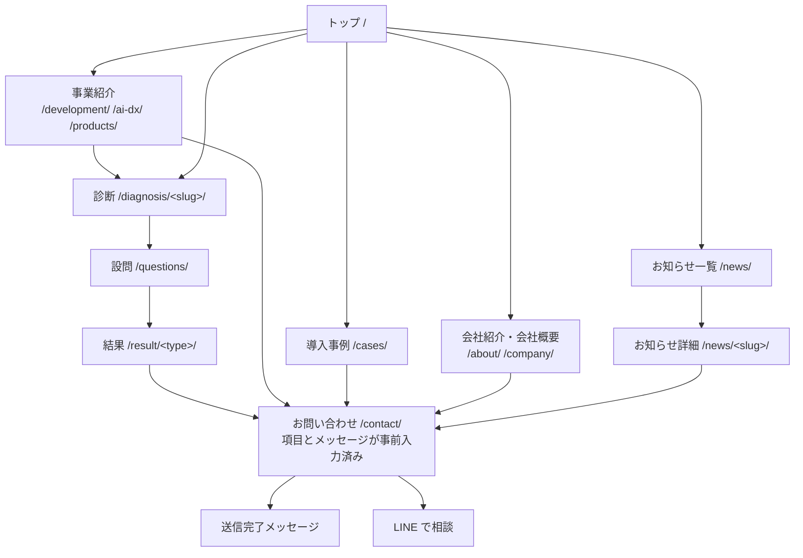
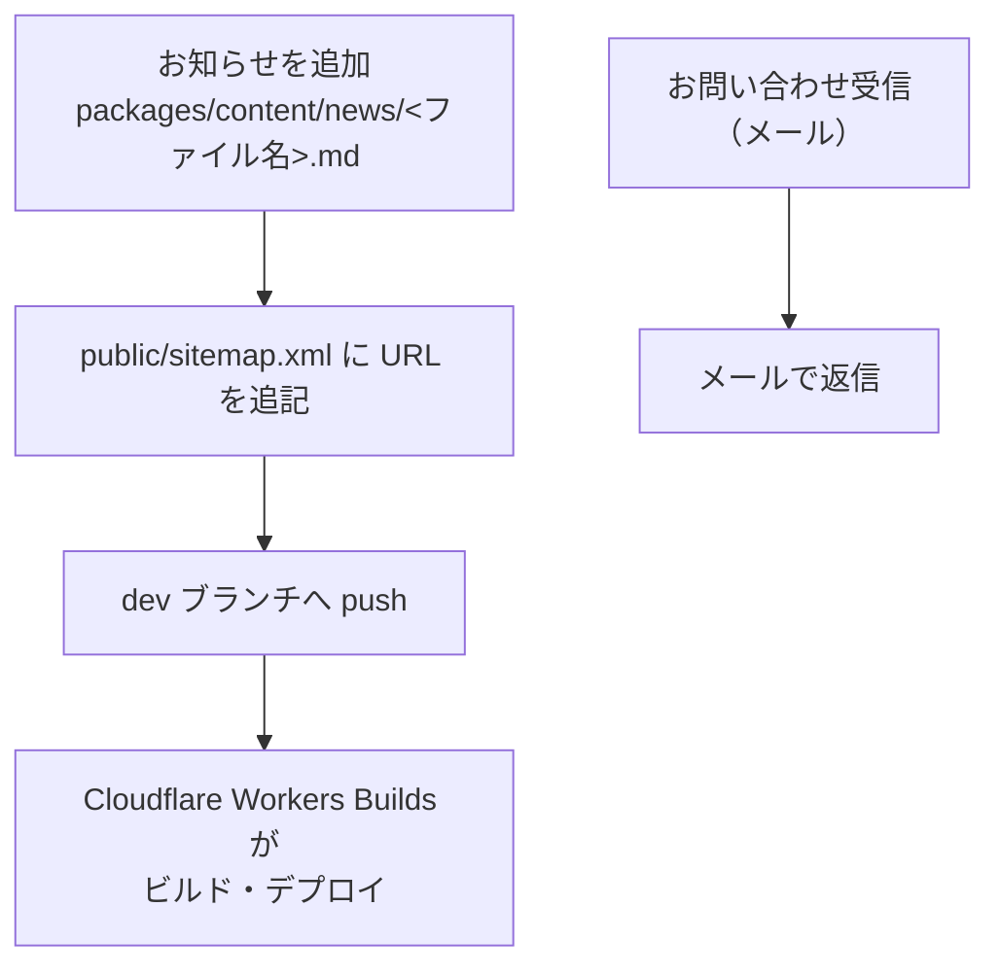
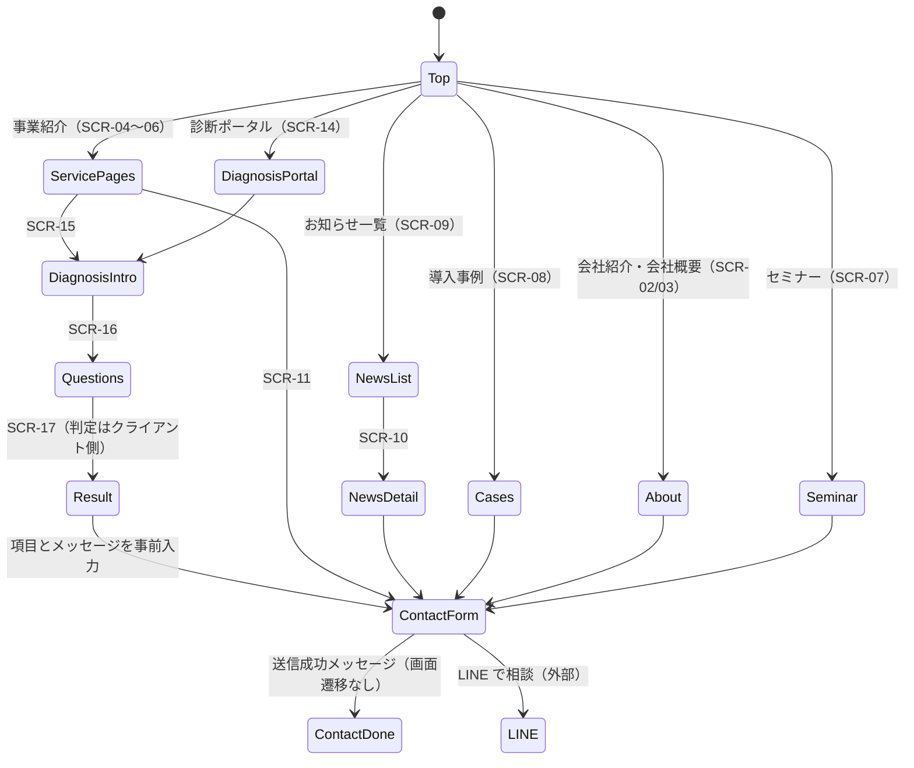

# 04-ui-ux-design.md — UI/UX 設計テンプレート

## このセクションの目的

このドキュメントは、プロダクト体験の設計思想、主要導線、画面一覧、**管理画面の標準構成**、コンポーネント方針、アクセシビリティ基準を定義します。デモ品質を決定づける管理画面のテンプレ化を含みます。

> 本テンプレートは 00_README §0-1 の**パターン A**（コンテンツ主体サイト + 軽量な管理画面）を前提とする。管理画面は少数ロール（admin / editor）向けの軽量 CMS であり、マルチテナント SaaS（Organization 階層、Platform 管理画面）の管理画面ではない（PRD-01 §1-2、PRD-03）。

## 0-H. ハイブリッド編集ガイド（要点）

- 推奨モード: Hybrid（AI 構造化 + Designer 確定）
- 人間確認必須：体験原則、主要導線、管理画面の情報設計、アクセシビリティ
- AI 下書き可：画面一覧整形、フロー図初稿、コンポーネント分類

詳細は 00_README.md §7（文書ステータス）と §8（AI 運用ガイド）を参照。

---

## 1. 設計思想・デザイン原則

実装から読み取れる原則。デザイントークンは `apps/public/src/styles/global.css` の `@theme` が正本。

| 原則名 | 内容 |
| --- | --- |
| 明快さ優先 | 1 画面 1 目的。各ページは「ヒーロー + パンくず」→「本文セクション」→「共通 CTA」の一定の型を取る |
| 行動起点 | 全ページの末尾に `ContactBanner`（お問い合わせ導線）がレイアウトから自動で入る。ページ側で再度書かない |
| 一貫性 | `<head>` は `BaseLayout` が props から組み立て、ページが独自に書かない。ボタンは `.btn-more` 系に統一 |
| 温度感 | `natural-*` パレット（ティール + ピーチ + クリーム）、ぼかした装飾円（`blob`）とドットパターン、AOS によるスクロール表示。杜の都・国際色というブランドに合わせた柔らかいトーン |
| 診断は没入させる | 診断フローだけはグローバルナビを外した `DiagnosisLayout` を使い、離脱要因を減らす |

デザインの実装規約（`@layer` の扱い、`scroll-mt-24`、アイコンのサイズ指定）は `CLAUDE.md` と DEV-06 §6 が正本。

### 1-1. 公開画面と管理画面の設計トーン

| 領域 | 設計トーン | 重視する体験 |
| --- | --- | --- |
| 公開画面（サイト訪問者） | 親しみやすい、温度感のある UI | 滞在時間、読みやすさ、また訪れたくなる印象 |
| 管理画面（admin / editor） | 機能的、効率重視、整然 | 操作時間短縮、一覧性、ミスを起こさない |

---

## 2. ユーザーフロー定義

最低 3 導線を Mermaid で記述：「初回オンボーディング」「日常利用」「管理者運用」。

### 2-1. 初回オンボーディング

**該当なし。** 管理画面を運用しておらず AdminUser も発行していないため、オンボーディング導線が存在しない（PRD-03 FG-04）。公開側も会員登録を持たない。

サイトの実質的な「初回導線」は 2-2（訪問者の日常利用）と同一。

> 本テンプレートは公開側の会員登録を前提としない（PRD-02 §9：公開側は原則認証不要）。オンボーディングの主体は管理画面へログインする AdminUser であり、SaaS 型の「新規登録 → Organization 作成」は発生しない（マイページ機能・FG-07 採用時の会員登録導線は例外であり、AdminUser のオンボーディングとは無関係。2-4 を参照）。

### 2-2. 日常利用



全ページ末尾の `ContactBanner` から `/contact/` へ入れるため、実際にはどのページからも I へ遷移できる。

> 「日常利用」は本テンプレートでは主にサイト訪問者（公開側）の導線を指す。管理側の日常運用は 2-3 を参照。マイページ機能採用時の会員導線は 2-4 を参照。

### 2-3. 管理者運用

**管理画面は未運用。** 現在の運用は、開発者がリポジトリを更新して反映するかたち。



**ファイル名がそのまま公開 URL** になるため、公開後のリネームはリンク切れを生む（GOV-01 D-008）。sitemap.xml は手書きなので追記を忘れやすい（GOV-02 TBD-06）。

### 2-4. 会員利用（マイページ機能採用時のみ）

**未提供。** 会員登録の導線が無く、`/login/`・`/mypage/` はサイトのどこからもリンクされていない（PRD-03 FG-07、GOV-01 D-007）。採否は GOV-02 TBD-01。

> マイページ機能（FG-07）を採用しない場合は本フロー自体を削除する。Member の認証は AdminUser の認証・セッションとは別系統（PRD-01 §1-2）であり、2-3「管理者運用」の導線とは接続しない。注文履歴（F）は軽量 EC（FG-05）も採用している場合のみ表示する。

### 2-5. 診断プラットフォーム（設計済み・未実装 — BIZ-04）

一般公開版・営業版・15 分解説・有料診断・パートナー版・案件の 12 本のフローは **PRD-08 §1〜§2 が正本**（Mermaid）。本書では画面 ID との対応だけを持つ（§3-1・§3-2）。Phase 3 でマイページ（2-4）は「有料診断の申込者」向けに実際に提供される。

---

## 3. 画面一覧

公開画面（サイト訪問者向け）と管理画面（admin / editor 向け）を分けて管理する。

### 3-1. 公開画面（サイト訪問者）

**ルートはすべて末尾スラッシュ付き**（DEV-06 §1-2）。SCR-01〜SCR-16 は全て prerender される。

| 画面 ID | 画面名 | ルート | 主目的 | 関連機能 |
| --- | --- | --- | --- | --- |
| SCR-01 | トップページ | `/` | 事業紹介・最新お知らせ・導入事例への誘導 | F-02-01 |
| SCR-02 | 会社紹介 | `/about/` | Mission / Vision / Value・社長メッセージ | F-02-02 |
| SCR-03 | 会社概要 | `/company/` | 基本情報・拠点・ISMS 認証 | F-02-03 |
| SCR-04 | システム開発 | `/development/` | 受託開発のサービス内容・強み・流れ | F-02-04 |
| SCR-05 | AI・DX 支援 | `/ai-dx/` | 支援内容・支援の流れ・診断への誘導 | F-02-04, F-08-02 |
| SCR-06 | 自社サービス | `/products/` | 自社プロダクトの紹介 | F-02-04 |
| SCR-07 | セミナー | `/seminar/` | 開催テーマ・開催実績（お知らせから自動抽出） | F-02-05 |
| SCR-08 | 導入事例 | `/cases/` | 実績 5 件の一覧 | F-02-06 |
| SCR-09 | お知らせ一覧 | `/news/` | 全件を新しい順に表示 | F-02-07 |
| SCR-10 | お知らせ詳細 | `/news/<ファイル名>/` | 本文の閲覧 | F-02-08 |
| SCR-11 | お問い合わせ | `/contact/` | フォーム送信・LINE 導線 | F-09-01 〜 F-09-07 |
| SCR-12 | プライバシーポリシー | `/privacy-policy/` | 個人情報の取扱いの明示 | F-02-09 |
| SCR-13 | サイトマップ | `/sitemap/` | 全ページの一覧 | F-02-10 |
| SCR-14 | 診断ポータル | `/diagnosis/` | 診断 2 本の一覧 | F-08-01 |
| SCR-15 | 診断イントロ | `/diagnosis/<slug>/` | 所要時間・概要の提示 | F-08-02 |
| SCR-16 | 診断 設問 | `/diagnosis/<slug>/questions/` | 設問回答・進捗表示 | F-08-03 |
| SCR-17 | 診断 結果 | `/diagnosis/<slug>/result/<type>/` | 判定結果と相談への誘導 | F-08-04, F-08-05 |
| SCR-18 | 404 / 500 | — | エラー時の案内 | F-02-11 |
| SCR-19 | 会員ログイン | `/login/` | Member 認証。**未提供・noindex** → Phase 3 で有料診断申込者のログインとして提供（`BaseLayout` のデザインを当てる） | F-07-02 |
| SCR-20 | マイページ | `/mypage/` | 会員情報の確認。**未提供・noindex** → Phase 3 で「自分の有料診断」一覧に | F-07-04 |

SCR-15〜SCR-17 のみ `DiagnosisLayout`（グローバルナビなし）を使い、それ以外の公開画面は `BaseLayout` を使う。SCR-19 / SCR-20 はテンプレート同梱の `Layout.astro`（素の骨格）のままで、サイトのデザインは当たっていない。

**診断プラットフォームで追加する公開画面（設計済み・未実装。PRD-08 §4 で予約した ID を正式化）**

| 画面 ID | 画面名 | ルート | 主目的 | レイアウト / 描画 | 関連機能 | Phase |
| --- | --- | --- | --- | --- | --- | :---: |
| SCR-15〜17（v2） | 診断イントロ / 設問 / 結果 | 既存 URL。`?t=` / `?p=` / `?v=2` / `?from=` を受ける | ロック撤廃、判定理由・強み・最初の一歩、3 分岐 CTA、営業版・パートナー版 CTA の切替 | `DiagnosisLayout` / prerender（トークン処理はクライアント JS） | F-08-07〜15, F-10-05, F-13-06 | 2a / 2b / 4 |
| SCR-31 | 診断 入口（トークン） | `/d/<token>/` | キャンペーン別文言・匿名保存 / 共有同意の説明 → 設問へ | `DiagnosisLayout` / **SSR**、noindex | F-10-03, F-13-05 | 2b / 4 |
| SCR-21 | 有料診断 案内 | `/diagnosis/pro/` | 内容・向いている企業・流れ・価格・規約 | `BaseLayout` / prerender、sitemap 掲載 | F-12-01 | 3 |
| SCR-22 | 有料診断 申込 | `/diagnosis/pro/apply/` | 企業情報・連絡先・支払方法・同意 → 申込完了 | `BaseLayout` / prerender（送信は API）、noindex | F-12-01 | 3 |
| SCR-23 | 有料診断 回答 | `/mypage/diagnosis/<id>/answer/` | 48 問を分野ごと 6 ページで回答・途中保存・提出 | `DiagnosisLayout` / SSR（本人確認） | F-12-03 | 3 |
| SCR-24 | 有料診断 結果 | `/mypage/diagnosis/<id>/` | 承認済み結果の Web 表示・PDF ダウンロード・報告会日程 | `BaseLayout` / SSR | F-12-09 | 3 |
| SCR-25 | パートナー ログイン | `/partner/login/` | `partner_session` 発行 | 専用の簡易レイアウト / SSR、noindex | F-13-01 | 4 |
| SCR-26 | パートナー ダッシュボード | `/partner/` | 自社の顧客・案件・診断状況の一覧 | 同上 | F-13-02 | 4 |
| SCR-27 | 顧客登録・一覧・詳細 | `/partner/customers/`、`/partner/customers/<id>/` | 顧客 CRUD、同意記録、URL 発行 | 同上 | F-13-03〜05 | 4 |
| SCR-28 | パートナー版 結果 | `/partner/customers/<id>/results/<id>/` | 全文結果・簡易優先順位・次に確認すべきこと・簡易 PDF・パートナー版 CTA | 同上（結果本文は SCR-17 の部品を再利用） | F-13-06, F-13-07 | 4 |
| SCR-29 | 案件登録・一覧・詳細 | `/partner/deals/`、`/partner/deals/<id>/` | 予定区分・チェックリスト・提出・確定結果の閲覧 | 同上 | F-14-01, F-14-02, F-14-07 | 4 |
| SCR-30 | 15 分解説 予約（自前の場合） | `/diagnosis/briefing/` | **外部予約ツール採用（GOV-01 D-011）のため作らない**。ID は欠番として保持 | — | F-11-01 | — |

`/partner/**`・`/mypage/**`・`/d/**`・`/diagnosis/pro/apply/` は `X-Robots-Tag: noindex`（middleware の `PRIVATE_ROUTES` に追加 — DEV-11 §9）。パートナー画面のレイアウトは `BaseLayout` ではなく `DiagnosisLayout` を拡張した簡易ヘッダー（パートナー名・ログアウト）付きのものを新設し、公開サイトのグローバルナビを出さない。

公開画面は shadcn-svelte を使わず、プレーン Tailwind + `global.css` の `@theme` で実装する（DEV-01 §1）。

### 3-2. 管理画面（admin / editor）

**管理画面は未運用**（PRD-03 FG-04）。実在するのは ADM-00 と ADM-01 の骨組みのみ。

| 画面 ID | 画面名 | ルート | 実装状況 | 関連機能 |
| --- | --- | --- | --- | --- |
| ADM-00 | ログイン | `/` | **実装済み**（`/` 自体がログイン画面。`/login` へは分離しない） | F-01-01 |
| ADM-01 | 管理ダッシュボード | `/dashboard/` | 骨組みのみ。セッション検証の参照実装 | F-04-01 |
| ADM-04 | メディアライブラリ | `/media/` | 未実装（API のみ存在） | F-04-04 |
| ADM-06 | お問い合わせ一覧 / 対応 | `/inquiries/` | 未実装（API のみ存在。**書き込み元が無いため常に空**） | F-04-06 |
| ADM-07 | 管理者管理 | `/admin-users/` | 未実装 | F-04-07 |
| ADM-08 | サイト設定 | `/settings/` | 未実装 | F-04-08 |

ADM-02 / ADM-03 / ADM-05（Post / Page / 分類の管理）と ADM-09（注文）、ADM-10（会員一覧）は**不採用**。お知らせは git で更新し（GOV-01 D-008）、固定ページは `.astro` で持つため。

**診断プラットフォームで追加する管理画面（設計済み・未実装）**

| 画面 ID | 画面名 | ルート | 内容 | パターン（§4-2） | 関連機能 | Phase |
| --- | --- | --- | --- | --- | --- | :---: |
| ADM-01（拡張） | ダッシュボード | `/dashboard/` | 診断 KPI カード（完了数・完了率・15 分解説・有料申込・商談化・成約額）と直近のリード・案件 | ダッシュボード | F-04-14 | 2b〜 |
| ADM-12 | キャンペーン・トークン・回答・リード | `/campaigns/`、`/campaigns/<id>/`、`/responses/`、`/leads/`、`/leads/<id>/`、`/briefings/` | キャンペーン CRUD、トークン一括発行と CSV、回答一覧（匿名 / 紐付き）、リード詳細と遷移、15 分解説の記録 | 一覧 + 詳細 + フォーム | F-04-09, F-04-10, F-10-*, F-11-* | 2b |
| ADM-11 | 有料診断 案件 | `/diagnoses/`、`/diagnoses/<id>/` | 案件一覧（状態別）、詳細タブ（申込情報 / 回答 / ロジック結果 / AI 分析（版）/ ヒアリング / PDF / 履歴）、遷移ボタン、AI 分析エディタ | 一覧 + 詳細 + フォーム | F-04-11, F-12-* | 3 |
| ADM-14 | 定義・プロンプト | `/definitions/`、`/prompts/` | 定義スナップショット一覧、プロンプト版の作成・有効化 | 一覧 + フォーム | F-04-12 | 3 |
| ADM-13 | パートナー・案件・手数料 | `/partners/`、`/partners/<id>/`、`/deals/`、`/deals/<id>/`、`/commissions/` | パートナー CRUD・ユーザー招待、案件一覧（提出待ち / 進行中 / 確定待ち）、案件詳細（チェックリスト・回答・金額・確定操作）、支払記録 | 一覧 + 詳細 + フォーム + 危険操作の確認モーダル | F-04-13, F-14-* | 4 |

サイドナビの項目順（Phase 4 時点）: ダッシュボード / キャンペーン / 回答・リード / 有料診断 / パートナー / 案件・手数料 / お問い合わせ / 定義・プロンプト / 管理者 / 設定。

> ADM-00（ログイン）の画面例は既存の `apps/admin/src/pages/index.astro`（`/` 自体がログイン画面。`/login` への分離は行わない）+ `apps/admin/src/lib/components/login-form.svelte`（DEV-06 §4-4）。**バックエンド（`POST /api/v1/auth/login`・セッション発行・ロックアウト）と UI の結線は実装済み**で、成功時は ADM-01（`/dashboard`）へ遷移する。ADM-00 / ADM-01 に残るのは見た目の作り込みのみ（DEV-06 §4-4 参照）。ADM-09 は軽量 EC（FG-05）を採用しない場合は削除する。

> **ADM-10 は本テンプレートの標準画面ではない（デフォルトでは実装しない、任意追加）。** マイページ機能（FG-07）採用時、サポート担当が会員からの問い合わせ対応で登録情報や注文履歴（Order 採用時）を参照する必要がある場合にのみ追加を検討する。参照専用（一覧・詳細の表示のみ）とし、Member の新規作成・編集・削除・状態変更・ロール付与等は持たせない — Member は AdminUser と完全に別系統のアカウントであり（PRD-01 §1-2）、AdminUser 側に会員の管理機能（変更権限）を持たせると意図的な分離方針に反するため。追加しない場合、Member はマイページ（SCR-09）でのみ自身の情報を確認・編集する。

> **旧 3-3「プラットフォーム管理画面（super_admin 専用）」は削除した。** Platform / Organization の 2 階層構造自体が本テンプレートに存在しないため（PRD-01 §1-2、00_README §2-2）。管理画面は上表の ADM-00〜10 のみであり、super_admin 専用の別階層画面は作らない。

---

## 4. 管理画面の標準構成

### 4-1. 共通レイアウト

管理画面は **サイドナビ + ヘッダー + コンテンツエリア** の 3 ペイン構造を標準とする。

```
┌──────────────────────────────────────────────────────────┐
│ Header: ロゴ / 検索 / 通知 / ユーザーメニュー              │
├────────────┬─────────────────────────────────────────────┤
│            │                                               │
│  Sidebar   │   Content Area                                │
│  (ナビ)    │   - ページタイトル                             │
│            │   - アクションボタン                           │
│  - ホーム  │   - フィルタ / 検索                            │
│  - 記事    │   - メインコンテンツ                           │
│  - 固定ページ│    （テーブル / フォーム / カード）          │
│  - メディア│                                               │
│  - お問い合わせ│                                           │
│  - 管理者  │                                               │
│  - 設定    │                                               │
│            │                                               │
└────────────┴─────────────────────────────────────────────┘
```

### 4-2. 必須画面パターン（管理画面に必ず含めるべき 5 タイプ）

| パターン | 必須要素 | 例 |
| --- | --- | --- |
| **ダッシュボード** | KPI カード × 4〜6、グラフ 1〜2（任意）、直近イベント一覧 | ADM-01 |
| **一覧画面** | 検索、フィルタ、ソート、ページネーション、一括操作、行ごとの詳細/編集リンク | ADM-02 記事一覧 |
| **詳細画面** | タイトル、ステータス、メタ情報、アクション、関連データタブ | ADM-06 お問い合わせ詳細 |
| **フォーム画面** | 段階入力、バリデーション、保存 / キャンセル、確認ステップ | ADM-02 記事編集 |
| **設定画面** | カテゴリ別タブ、変更時の保存ボタン、危険操作の確認モーダル | ADM-08 サイト設定 |

### 4-3. ASCII モックアップ例

> **以下はテンプレート由来の参考例であり、本サイトに存在する画面ではない。** 管理画面は未運用で、実在するのは ADM-00（ログイン）と ADM-01（骨組み）のみ（§3-2）。例に出てくる記事・固定ページ・カテゴリの管理は**不採用**（PRD-03 FG-04）。実際に管理画面を作る際は、この型を出発点にしつつ対象を Media / Inquiry に読み替えること。

#### 4-3-1. ダッシュボード（ADM-01）
```
┌──────────────────────────────────────────────────────────────┐
│ [サイト名]                       🔍 検索  🔔 (3)  👤 管理者  │
├────────────┬─────────────────────────────────────────────────┤
│            │  ダッシュボード                                   │
│ ⊞ ホーム   │  ── ── ── ── ── ── ── ── ── ── ── ── ── ──     │
│            │                                                   │
│ 📝 記事    │  ┌─────────┐ ┌─────────┐ ┌─────────┐ ┌─────────┐│
│            │  │公開記事数│ │下書き数 │ │今月のお問│ │本日の   ││
│ 📄 固定ページ│ │   42    │ │    5    │ │い合わせ │ │アクセス ││
│            │  │         │ │         │ │  12     │ │  1,204  ││
│ 🖼 メディア │  └─────────┘ └─────────┘ └─────────┘ └─────────┘│
│            │                                                   │
│ ✉ お問い合わせ│ ┌─ 直近の記事 ──────────────────────────────┐  │
│            │  │ • [記事タイトル A]（公開・3 時間前）        │  │
│ 👤 管理者  │  │ • [記事タイトル B]（下書き）                 │  │
│            │  └────────────────────────────────────────────┘  │
│ ⚙ 設定     │                                                   │
│            │  ┌─ 直近のお問い合わせ ───────────────────────┐  │
│            │  │ • [氏名 A] より「[件名]」(未対応・1 時間前) │  │
│            │  │ • [氏名 B] より「[件名]」(対応済み)          │  │
│            │  └────────────────────────────────────────────┘  │
└────────────┴─────────────────────────────────────────────────┘
```

#### 4-3-2. 一覧画面（ADM-02 記事一覧）

```
┌──────────────────────────────────────────────────────────────┐
│ 記事管理                                     [+ 新規記事]     │
│ ── ── ── ── ── ── ── ── ── ── ── ── ── ── ── ── ── ── ── ──│
│                                                                │
│ [🔍 タイトル検索]  カテゴリ: [すべて ▼]  ステータス: [すべて ▼]│
│                                                                │
│ [☐ 一括選択]      [一括操作 ▼]                                │
│                                                                │
│ ┌─────────────────────────────────────────────────────────┐  │
│ │ ☐ │ タイトル       │ ステータス │ 公開日     │ カテゴリ│操作│  │
│ ├─────────────────────────────────────────────────────────┤  │
│ │ ☐ │ [記事タイトルA] │ 公開      │ 2026-08-01 │ お知らせ│ ⋯  │  │
│ │ ☐ │ [記事タイトルB] │ 下書き    │ —          │ ブログ  │ ⋯  │  │
│ │ ☐ │ [記事タイトルC] │ 公開      │ 2026-07-20 │ ブログ  │ ⋯  │  │
│ │ ...                                                       │  │
│ └─────────────────────────────────────────────────────────┘  │
│                                                                │
│            << 前へ   1  2  3  ...  10   次へ >>                │
└──────────────────────────────────────────────────────────────┘
```

#### 4-3-3. 詳細・編集画面（フォームパターン、ADM-02 記事編集）

```
┌──────────────────────────────────────────────────────────────┐
│ ← 記事一覧へ戻る                                              │
│                                                                │
│ [記事タイトル]                             [公開] [下書き保存]│
│ ── ── ── ── ── ── ── ── ── ── ── ── ── ── ── ── ── ── ── ──│
│                                                                │
│ タイトル     [__________________________]                     │
│ スラッグ     [__________________________]                     │
│ カテゴリ     [お知らせ ▼]     タグ [ ＋タグを追加 ]           │
│ アイキャッチ [画像を選択 / メディアライブラリから選ぶ]        │
│                                                                │
│ 本文                                                           │
│ ┌────────────────────────────────────────────────────────┐   │
│ │ [リッチテキスト / Markdown エディタ]                      │   │
│ │                                                          │   │
│ └────────────────────────────────────────────────────────┘   │
│                                                                │
│ ステータス                                                     │
│   ◉ draft（下書き）                                           │
│   ○ published（公開）                                        │
│                                                                │
│ ⚠ 危険操作                                                    │
│   [この記事を削除]                                             │
└──────────────────────────────────────────────────────────────┘
```

### 4-3b. 診断プラットフォームの主要画面（ASCII モック、設計案）

#### SCR-17 v2 結果ページ（一般公開版、business の例）

```
┌──────────────────────────────────────────────────────────────┐
│ [ロゴ]                                          [サイトへ戻る]│
├──────────────────────────────────────────────────────────────┤
│  「日々の作業に追われて時間がない」— その根っこには…           │
│                 ◎ DIAGNOSIS RESULT                             │
│        あなたの会社は【アナログ業務型】の傾向があります         │
│                                                                │
│  ▼ 判定理由                                                    │
│   ・日常業務: 紙・Excel・電話・FAX での手作業が中心             │
│   ・書類作成: テンプレートはあるが転記や手直しが多い            │
│                                                                │
│  ▼ 課題度チャート（9 軸、%）        優先して解決したい課題 TOP3  │
│        [レーダー]                  1 業務デジタル化 ■■■■■ 80%  │
│                                    2 情報共有       ■■■   60%  │
│                                    3 定型作業       ■■    40%  │
│  ▼ 課題の説明 …                                                │
│  ▼ 強み: 発信力／集客導線 は問題が見当たりません               │
│  ▼ 放置した場合のリスク …                                      │
│  ▼ 一般的な改善の方向 …（全文公開）                             │
│  ▼ 自社でできる最初の一歩                                      │
│   ① 毎日発生する業務を 1 つ選び、1 件あたりの手作業時間を測る   │
│   ② 同じ情報を何回書き写しているか数える                       │
│  ℹ 今回の無料診断では…傾向が確認できました。ただし…異なります。 │
│                                                                │
│  ▼ 次の進路                                                    │
│   [ 業務のシステム化について相談する ]  ← 主 CTA               │
│   [ 15 分のオンライン結果解説を予約 ] [ 有料の IT・DX 現状診断 ]│
│   セミナー / 事例 / LINE で相談                                 │
│   あわせて検討したい課題: 社内情報分散型                         │
│  ─ AI・DX の現在地も確かめると着手順が決めやすくなります（2 分）│
└──────────────────────────────────────────────────────────────┘
```

#### SCR-31 診断入口（営業版 `/d/<token>/`）

```
┌──────────────────────────────────────────────────────────────┐
│ [ロゴ]                                                        │
│  ○○業の皆さまへ — 人手不足と手作業の課題を 2 分で整理           │  ← campaigns.intro_copy
│  業務課題かんたん診断（10 問・無料・登録不要）                   │
│                                                                │
│  ℹ ご回答は匿名で保存され、会社名・連絡先を入力いただいた       │
│    場合にのみ結果と結び付けます。                               │
│                                                                │
│               [ 診断をはじめる ]                               │
│  （期限切れ・無効な URL の場合はこの画面ではなく 404）           │
└──────────────────────────────────────────────────────────────┘
```

#### SCR-23 有料診断 回答（分野 2 / 6）

```
┌──────────────────────────────────────────────────────────────┐
│ [ロゴ]  IT・DX 現状診断  ● ● ○ ○ ○ ○  業務プロセス（2/6）      │
│ ─────────────────────────────────────────── 保存済み 10:42    │
│ P1 受発注・予約・顧客管理などの日常業務は？                     │
│   ◉ ほとんどが紙・電話・FAX                                    │
│   ○ Excel などで一部をデジタル管理                              │
│   ○ 主要な業務は専用ツールやシステム                            │
│   ○ ほぼすべてがシステム上で完結                                │
│   無料診断でのご回答: 「紙・Excel・電話・FAX での手作業が中心」  │
│ …                                                              │
│ P9 特に時間がかかっている業務を書いてください（任意）           │
│   [                                              ]             │
│                                                                │
│        [ ← 前の分野 ]   [ 保存して次へ → ]                      │
└──────────────────────────────────────────────────────────────┘
```

#### ADM-11 有料診断 案件詳細（AI 分析タブ）

```
┌──────────────────────────────────────────────────────────────┐
│ ← 案件一覧   株式会社サンプル / IT・DX 現状診断   状態: in_review│
│ [申込] [回答] [ロジック結果] [AI 分析 v2 ▼] [ヒアリング] [PDF]  │
│ ── ── ── ── ── ── ── ── ── ── ── ── ── ── ── ── ── ── ── ──│
│ 要約 (400 字)                                   [再生成 ▼]     │
│ ┌────────────────────────────────────────────┐ 根拠: P1, P3, Y1 │
│ │ 貴社は…                                      │ [回答を表示]    │
│ └────────────────────────────────────────────┘                 │
│ 優先課題 TOP5                    ↑↓ 並べ替え  [＋ 追加]         │
│  1 ■ 受発注の手作業 … 根拠 P1,P2,P9-T  緊急度 中  [編集][削除]  │
│  2 ■ バックアップ未実施 … 根拠 C2    緊急度 高 ⚠ 要確認         │
│ 矛盾候補（ロジック R-01 / AI 1 件）   ヒアリング確認事項 4 件   │
│ 推奨施策 [自社 2] [SaaS 2] [専門家 1] [開発 1]                  │
│ 90 日ロードマップ  0-30 / 31-60 / 61-90                        │
│ 信頼度: medium（systems 低） ⚠ 警告 1 件                       │
│                                                                │
│ [差戻し]  [承認（admin）]  [PDF プレビュー]  [納品]  修正履歴 ▾  │
└──────────────────────────────────────────────────────────────┘
```

#### ADM-13 案件詳細（手数料確定）

```
┌──────────────────────────────────────────────────────────────┐
│ ← 案件一覧   パートナー: ○○株式会社 / 顧客: △△工業   状態: paid│
│ 予定区分: 診断・販売支援（20%）   サービス: システム開発        │
│ 契約額 1,500,000  入金額 1,200,000（2026-11-30）                │
│ チェックリスト  ☑ 診断実施 ☑ 結果説明 ☑ 課題整理 ☑ 決裁者     │
│                 ☑ 予算感 ☑ 時期 ☑ 提案希望 ☑ 共有同意 ☑ 記録   │
│ 商談記録: …                                                     │
│ 既存顧客照合: 該当なし（2026-10-02 藤本）                        │
│                                                                │
│ 確定区分  (◉) 診断・販売支援 20%   ( ) 紹介 10%                 │
│ 手数料額（自動計算）: 240,000 円                                 │
│ [ 区分を確定する（admin） ] → 確認モーダル「取消は確定取消から」 │
└──────────────────────────────────────────────────────────────┘
```

### 4-4. 管理画面の操作原則

| 原則 | 内容 |
| --- | --- |
| 検索・フィルタは即時反映 | debounce 300ms、確定後 500ms 以内に結果反映 |
| 一括操作には確認ステップ | 削除等の不可逆操作は必ず確認モーダル |
| 危険操作の色分け | 削除・無効化等は赤系の色 + 確認文言 |
| 楽観的 UI 更新は避ける | 管理画面では保存完了まで状態を変えない |
| 操作完了はトースト | 成功・失敗を画面右上のトーストで通知 |
| キーボード操作対応 | テーブル行移動・モーダル開閉等は Tab / Enter / Esc で操作可能 |
| パンくず or 戻るリンク | 階層が深い画面では必ず戻り導線を提供 |

### 4-5. 管理画面のレスポンシブ方針

| ブレークポイント | 挙動 |
| --- | --- |
| デスクトップ（≥ 1280px） | 標準 3 ペイン |
| タブレット（768〜1279px） | サイドナビをアイコンのみに圧縮 |
| モバイル（≤ 767px） | サイドナビをドロワー化、コンテンツ全幅 |

管理画面はモバイル対応「最小限」（緊急対応・確認程度）。本格作業はデスクトップ前提とする。

---

## 5. 画面遷移図

画面 ID は §3-1 の SCR-NN に対応。



管理画面（ADM-NN）と会員（SCR-19/20）は未運用のため遷移図に含めない。全ページ末尾の `ContactBanner` から `ContactForm` へ入れるため、実際の遷移は上図より密である。診断プラットフォーム（SCR-21〜31、ADM-11〜14）の遷移は PRD-08 §1〜§2 のフローが正本。

---

## 6. コンポーネント設計方針

> 本節は管理画面（shadcn-svelte）を主対象とする。公開画面（マイページ機能を含む）はプレーン Tailwind を採用し、コンポーネントライブラリは導入しない（DEV-01 §1、PRD-04 §3-1）。

| 項目 | 方針 |
| --- | --- |
| 採用アプローチ | 管理画面は標準 UI コンポーネントライブラリ（DEV-01 §1、shadcn-svelte）を最優先で使用、不足分のみカスタムコンポーネント |
| 再利用対象 | データテーブル / フォーム入力 / カード / モーダル / ドロワー / トースト |
| 命名規則 | コンポーネント名は機能を表す（`PostListTable`、`InquiryStatusForm` 等） |
| 禁止事項 | 画面固有スタイルのベタ書き、同一意味の別名コンポーネント乱立 |
| デザイントークン | 色・余白・角丸・タイポグラフィをデザイントークンとして一元管理（実装方式は DEV-01 §1） |

---

## 7. アクセシビリティ方針

| 項目 | 方針 |
| --- | --- |
| 準拠基準 | WCAG 2.2 |
| 対応レベル | AA 相当 |
| キーボード操作 | 主要操作は Tab / Enter / Space / Esc で実行可能 |
| コントラスト | 通常テキスト 4.5:1、大きいテキスト 3:1 以上 |
| 代替テキスト | 意味を持つアイコン・画像に必ず付与 |
| フォーカスリング | `:focus-visible` を必ず可視化 |
| ステータス | 色のみで状態を表現しない（アイコン + 色 + テキストの 3 要素） |
| スクリーンリーダー | 主要なランドマーク（`<nav>`、`<main>`、`<aside>`）を使い分け |

---

## 8. ブランド・トーン

実装から抽出したもの。定義の正本は `apps/public/src/styles/global.css` の `@theme`。

| 項目 | 方針 |
| --- | --- |
| プライマリーカラー | ティール系。`natural-teal` `#4bad9f` / `natural-teal-dark` `#357a70` / `natural-teal-light` `#7ecfc7`。社名「ナチュラル」と杜の都という拠点に沿った色 |
| アクセントカラー | ピーチ系。`natural-peach-dark` `#d98c5f` / `natural-peach-mid` `#f2b180` / `natural-peach` `#f9e4d4`。副次的な CTA（`.btn-more-peach`）に使う |
| 背景・地色 | `natural-cream` `#fff8f0` / `natural-gray` `#f4f4f4`。フッターは `natural-forest` 系 |
| 文字色 | `natural-text` `#3a3a3a` / `natural-muted` `#888888` |
| フォント | Noto Sans JP（本文・日本語）+ Poppins（英字の見出し・ラベル）。ともに Google Fonts から読み込む |
| アイコン | Font Awesome（npm 同梱）。診断画面のみ Material Symbols（CDN） |
| 装飾 | ぼかした円（`blob`）とドットパターン（`dot-pattern`）、AOS によるスクロール表示、浮遊アニメーション |
| 言葉遣い | です・ます調。英語の小見出し（Section Label）+ 日本語の見出しという対で各セクションを立ち上げる |

管理画面（`apps/admin`）は別トーン。shadcn-svelte の既定テーマ（`admin.css`）をそのまま使っており、上記のブランド色は当てていない。

---

## 9. 記入時チェックポイント

- 公開画面と管理画面が分けて整理されているか
- 管理画面の必須 5 パターン（ダッシュボード / 一覧 / 詳細 / フォーム / 設定）が、実際の CMS 画面（記事・固定ページ・メディア・お問い合わせ・管理者・サイト設定）に対応づけて記述されているか
- 画面名と機能 ID（PRD-03 の F-NN-NN）が対応しているか
- アクセシビリティが後付けでなく原則として書かれているか
- 主要導線（オンボーディング / 日常利用 / 管理者運用 / 会員利用〈マイページ機能採用時〉）が説明されているか
- ASCII モックアップ等で「整った管理画面」が視覚的に伝わるか
- Organization 管理・プラットフォーム管理（super_admin 専用画面）等、マルチテナント SaaS 由来の画面が紛れ込んでいないか（本テンプレは単一運営の軽量 CMS 前提）
- マイページ機能（FG-07）採用時、Member 向け画面（SCR-07〜SCR-11）がプレーン Tailwind で設計され、shadcn-svelte や管理画面向けコンポーネントが誤って使われていないか（DEV-01 §1、PRD-04 §3-1・§6）
- Member 管理のための画面が AdminUser 側（ADM-NN）に意図せず追加されていないか。参照専用の任意画面（ADM-10 等）を追加する場合、その旨と参照専用である制限が明記されているか（§3-2）
