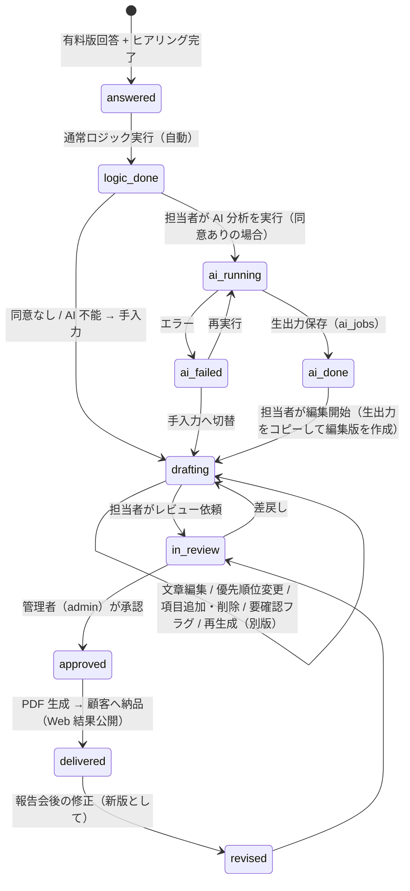

# 05-ai-feature-spec.md — AI 機能仕様（有料診断の AI 分析）

## ⚠️ 本書の状態

```
[x] 本プロジェクトで AI 機能を使う？
    └─ 採用候補（Phase 3 有料診断 MVP）。事業設計（BIZ-04）の承認待ち。
```

> **2026-09-24 時点で、サイトに LLM 連携は実装されていない。** 無料診断の判定は決定的なスコアリングのままであり、本書は Phase 3（BIZ-04 §16）で導入する **有料診断の「AI 分析」** の仕様案である。採用は GOV-01 に決定として記録し、DEV-01 §2 の標準（Vercel AI SDK、プロバイダは Claude / Gemini / ChatGPT のいずれか）に従う。2026-09-09 の「AI 機能なし」の判断（旧 §1-1）は本書で更新候補となる。

---

## 1. AI 機能採用の意思決定

### 1-1. 採否

| 項目 | 内容 |
| --- | --- |
| AI 機能採否 | **採用候補**（Phase 3、有料診断のみ。無料診断・営業版・パートナー版では使わない） |
| 決定者 | 藤本 翔太 |
| 決定日 | 未定（BIZ-04 承認時に GOV-01 へ記録） |
| 位置づけ | **補助**。価値の中心は「客観評価（ロジック）・個別分析（AI）・専門家確認・実行計画」の組み合わせであり、AI の使用自体を価値の中心にしない（BIZ-04 §13） |
| 呼称 | 対外的に「AI 分析」と呼ぶ。「AI 判定」「AI 診断」とは呼ばない |
| UI 上の性質 | 暗黙型（顧客が AI を直接操作しない）。当社の診断担当者が管理画面で結果を確認・編集する明示型 |
| 顧客の同意 | 有料診断の申込時に、回答・企業情報を AI（外部 LLM）へ送信することへの同意を必須にする（PRD-08 §3-3） |
| オプトアウト | 同意しない場合は AI 分析を省き、ロジック + 専門家分析のみで納品する（価格は同じ、納期は延びる旨を明示 — `Assumed`） |

### 1-2. 基本思想

**「ロジックが診断し、AI が深掘りし、人が責任を持つ」**（BIZ-04 §12-2）

---

## 2. 入力データ

### 2-1. 有料版の質問（分野・評価軸の再提案）

BIZ-04 §12-1 の 6 分野を評価軸とし、質問数は **合計 48 問（各分野 8 問）を基本案** とする（40〜60 問の中央。`Assumed`）。無料版 2 本の回答（合計 20 問）を引き継ぎ、重複する問いは有料版で **再確認扱い** にして質問数を増やさない。

| 分野 ID | 分野 | 選択式 | 記述式 | 無料版から引き継ぐ問い（重複を省く） | 評価する観点 |
| --- | --- | --- | --- | --- | --- |
| `strategy` | 経営・IT 戦略 | 6 | 2 | ai-dx q8 | 経営課題と IT 投資の接続、責任者、投資判断基準、目標、経営と現場の認識 |
| `process` | 業務プロセス | 8 | 1 | business q3〜q9、ai-dx q1・q10 | 紙・FAX・Excel、二重入力、定型作業、承認、属人化、手順書、問い合わせ、書類 |
| `systems` | システム・SaaS | 6 | 2（利用システム一覧、契約・費用） | なし | 利用システム、連携、費用把握、老朽化、ベンダー依存、データ出力、アカウント管理 |
| `data` | データ活用 | 6 | 1 | business q9、ai-dx q3・q4 | 経営数字、顧客・在庫・資金繰り、集計、分散、可視化、データに基づく判断 |
| `ai` | AI 活用 | 6 | 1（活用したい業務） | ai-dx q5・q6・q9 | 生成 AI 利用、ルール、候補業務、社内データ、セキュリティ、教育、効果、シャドー AI |
| `security` | IT 体制・セキュリティ | 8 | 1 | ai-dx q7 | IT 担当、アカウント、多要素認証、バックアップ、退職者、障害対応、外部ベンダー、情報資産、クラウド、復旧 |
| `profile` | 企業情報（採点しない） | — | 会社名・業種・従業員数・拠点数・年商帯・IT 予算帯・改善希望時期・決裁者 | — | AI の文脈情報。スコアには使わない |

選択式は原則 4 段階（0〜3 点）で ai-dx と同じ尺度にし、分野スコアは **満点に対する割合（0〜100%）** と **成熟度 5 段階** の両方を出す。各質問には `weight`（既定 1、重要項目 2）と `risk_flag`（例: バックアップ無し = 緊急度 高）を定義する。**具体的な質問文は Phase 3 着手時に PRD-07 と同じ粒度で別途起案**する（本書では分野・軸・件数のみ定める）。

### 2-2. AI 分析への入力（構造化）

| 入力 | 内容 | 個人情報 |
| --- | --- | --- |
| `company_profile` | 業種、従業員数帯、拠点数、年商帯、IT 予算帯、改善希望時期 | **会社名・氏名・連絡先は送らない**（プロファイルは属性のみ） |
| `free_answers` | 無料診断 2 本の回答（質問 ID + 選択肢 + 選択肢テキスト）と結果（タイプ、レベル、軸スコア） | なし |
| `paid_answers` | 有料版 48 問の回答（質問 ID + 選択肢テキスト + 記述式の本文） | 記述式に固有名詞が入りうる。送信前に **担当者が記述式をマスキング確認**（§8） |
| `logic_result` | 通常ロジックの出力（§3）: 総合スコア、分野別スコア・成熟度、緊急度、改善余地、リスク一覧、矛盾候補、優先課題候補 | なし |
| `interview_notes` | 60 分ヒアリングの記録（担当者が要点を箇条書きで入力。任意） | 固有名詞を含みうる。同上 |
| `service_catalog` | 当社サービスの一覧と「自社で / SaaS で / 専門家支援 / システム開発」の区分定義 | なし |
| `definition_version` | 有料版質問定義の版、無料版の版 | — |

---

## 3. 通常ロジック（AI に任せない判定）

同じ回答なら同じ結果。AI モデルの変更で変わらない。実装は純関数（Worker 内でもテストでも同じ結果）。

| 出力 | 算出 |
| --- | --- |
| 総合スコア | 全選択式の加重合計 / 加重満点（%） |
| 分野別スコア | 分野ごとの加重合計 / 満点（%） |
| 成熟度レベル | 総合 % を 5 段階（0-20 / 21-40 / 41-60 / 61-80 / 81-100）。ai-dx のレベル名称と揃えるかは Phase 3 で決める |
| 緊急度 | `risk_flag` 付き質問で低得点のものを 高 / 中 / 低 に分類（例: バックアップ無し = 高） |
| 改善余地 | 分野ごとの（満点 − 得点）。大きい順 |
| リスク | 緊急度 高・中の項目をリスク一覧に |
| 回答の矛盾候補 | ルール表で検出（例: 「ほぼ全業務がシステム化」と「請求書は毎回手作業」、「AI をルール付きで運用」と「利用ルール無し」、無料版と有料版で同じ問いの回答が 2 段階以上ずれる）。AI はこれを **補足** する立場で、ルール検出の結果を上書きしない |
| 優先課題候補 | 「改善余地 × 緊急度 × 経営課題（strategy の記述）との関連」で上位 8 件を候補化。AI はこの候補から **トップ 5 を選び理由を付ける** |

---

## 4. AI の役割と禁止事項

### 4-1. AI が行うこと（BIZ-04 §12-2）

企業情報を踏まえた現状要約、課題の因果関係、強み、回答間の矛盾（ルール検出の補足）、ヒアリング確認事項、優先課題トップ 5 候補（ロジック候補から選ぶ）、推奨施策案（4 区分）、AI 活用候補、90 日ロードマップ案、信頼度、警告。

### 4-2. AI が最終判断しないこと

最終スコア、成熟度レベル、法令違反の断定、セキュリティ事故の断定、補助金の対象可否、正確な導入費用、契約条件、最終的なサービス提案、経営判断。

システムプロンプトで明示的に禁止し、出力スキーマにこれらのフィールドを **持たせない**（持たせないことが最も確実な禁止）。費用は「概算費用帯」のカテゴリ（例: 〜30 万 / 30〜100 万 / 100〜300 万 / 300 万〜 / 要見積）のみ許容し、金額の数値生成はさせない。

### 4-3. 事実の捏造防止

- 各指摘（`strengths`、`priority_issues`、`contradictions`、`recommendations`、`ai_use_cases`、`roadmap` の各項目）に **`evidence_question_ids`（回答 ID の配列）を必須**とし、空配列を許さない。
- 後処理で、`evidence_question_ids` が入力に存在する質問 ID のみで構成されているかを検証する。存在しない ID を含む項目は `warnings` に移して担当者に表示し、そのまま納品候補にしない。
- 「回答に無い情報は推測しない。分からないことは `questions_for_interview` に入れる」をプロンプトで指示する。

---

## 5. 出力スキーマ案

構造化出力（JSON Schema）で生成する。自由文だけの生成はしない。フィールド名は BIZ-04 §12-2 の候補をそのまま採用。

```json
{
  "summary": "string（400 字以内。経営者向け。専門用語を避ける）",
  "strengths": [{ "title": "string", "detail": "string", "evidence_question_ids": ["string"] }],
  "priority_issues": [
    {
      "rank": 1,
      "title": "string",
      "why_now": "string",
      "impact": "high | medium | low",
      "urgency": "high | medium | low",
      "evidence_question_ids": ["string"],
      "related_logic_candidate_id": "string"
    }
  ],
  "contradictions": [{ "description": "string", "evidence_question_ids": ["string"], "how_to_confirm": "string" }],
  "questions_for_interview": [{ "question": "string", "purpose": "string", "evidence_question_ids": ["string"] }],
  "recommendations": [
    {
      "title": "string",
      "category": "self_service | saas | expert_support | system_development",
      "detail": "string",
      "difficulty": "low | medium | high",
      "duration_band": "1m | 3m | 6m | 12m+",
      "cost_band": "lt_300k | 300k_1m | 1m_3m | 3m_plus | quote_required",
      "evidence_question_ids": ["string"]
    }
  ],
  "ai_use_cases": [{ "task": "string", "expected_effect": "string", "prerequisites": "string", "evidence_question_ids": ["string"] }],
  "roadmap": {
    "days_0_30": [{ "action": "string", "owner": "customer | natural | both", "evidence_question_ids": ["string"] }],
    "days_31_60": [],
    "days_61_90": []
  },
  "confidence": { "overall": "high | medium | low", "reason": "string", "low_confidence_areas": ["strategy | process | systems | data | ai | security"] },
  "warnings": ["string"]
}
```

- `priority_issues` は必ず 5 件、`related_logic_candidate_id` はロジックの候補 8 件のいずれか。候補外を選んだ場合は後処理で `warnings` に落とす。
- `recommendations` の `category` は 4 区分すべてを少なくとも 1 件ずつ含むよう指示する（「何でもシステム開発へ誘導しない」）。
- `cost_band` はカテゴリのみ。金額の生成は禁止。
- スキーマは `prompts` テーブルの版と一緒に管理する（§9）。

---

## 6. 矛盾検出・信頼度

| 項目 | 方針 |
| --- | --- |
| 矛盾検出 | 一次: ロジックのルール表（§3）。二次: AI が `contradictions` に追加。両者を管理画面で並べて表示し、担当者がヒアリングで確認する |
| 信頼度 | `confidence.overall` と分野別 `low_confidence_areas`。記述式の未記入が多い分野、無料版と有料版の回答ずれが多い分野、q5 型の「把握していない」回答が多い分野を低信頼にするよう指示。**信頼度 low の分野は PDF に「要ヒアリング確認」の注記を必ず付ける** |
| 顧客への表示 | 信頼度の数値は顧客に見せない。担当者の確認を経て「確認済み」「要追加確認」の 2 状態で表す |

---

## 7. エラー処理・再生成・フォールバック

| 状況 | 挙動 |
| --- | --- |
| API エラー（429 / 5xx / ネットワーク） | DEV-10 §1-2 の共通ルール（指数バックオフ 3 回）。`ai_jobs.status = failed` を記録し、担当者に通知 |
| スキーマ不一致 | 1 回だけ「スキーマに従って修正せよ」で再生成。再失敗は `failed` |
| 根拠 ID 不正 | 該当項目を `warnings` へ移し、ジョブは `completed` |
| 安全性による拒否（`refusal`） | `failed` として記録し、プロンプト・入力を担当者が確認。記述式の内容が原因なら該当部分をマスキングして再実行 |
| 再生成 | 担当者は管理画面から何度でも再生成できる。各実行は新しい `ai_jobs` 行（版・モデル・トークン・所要時間を記録）。**編集済みの分析を上書きしない**（再生成結果は別版として並べ、採用を選ぶ） |
| AI が利用不能（障害・予算超過・同意なし） | ロジック結果 + 担当者が管理画面のテンプレート（空の出力スキーマ）を手入力して納品する。**AI 無しでも納品できる**ことを MVP の要件にする |
| モデルの提供終了 | `ai_jobs.model_id` に完全なモデル ID を記録しているため、過去の分析の再現条件は残る。新モデルは staging で比較してから切替（PRD-05 旧 §4-3 の方針を維持） |

---

## 8. データ保護・ログ・コスト

### 8-1. データ保護

| 項目 | 方針 |
| --- | --- |
| 送信しない情報 | 会社名、氏名、メール、電話、住所。プロファイルは属性帯のみ |
| 記述式のマスキング | 送信前に担当者が管理画面で記述式回答・ヒアリング記録を確認し、固有名詞を伏せ字にできる（自動マスキングは Phase 3 では持たない — `Assumed`） |
| 同意 | 申込時に「回答・企業属性を AI 分析のため外部の AI サービスへ送信すること」「送信先・保持期間・学習利用の有無」を明示して同意（PRD-08 §3-3） |
| ベンダー側の学習利用・保持・リージョン | **契約前に各社の最新規約で確認する**（§10）。「API 経由の入力を学習に使わない」「保持期間」「処理リージョン」を利用規約・プライバシーポリシーに転記する（GOV-02 TBD-18） |
| 保存 | 入力（送信した JSON）と出力（生の JSON）を `ai_jobs` に保存。保持期間は有料診断の契約終了後 1 年で削除（DEV-07 §10 の Inquiry と揃える — `Assumed`） |
| アクセス | 生出力は当社管理者・診断担当者のみ（PRD-08 §3-2） |

### 8-2. ログ

`ai_jobs`（DEV-07 §3-4）に: ジョブ種別、有料診断 ID、`prompt_version`、`model_id`、入力ハッシュ、入力・出力 JSON、`tokens_in` / `tokens_out`、所要時間、状態、エラー、実行者、実行日時。承認・編集・納品は `activity_log` に記録する。

### 8-3. コスト

1 社あたりの入力は無料版・有料版の回答 + ロジック結果 + ヒアリング記録で **1〜2 万トークン程度、出力は 0.5〜1 万トークン程度**と見込む（`Assumed`）。再生成を含めて 1 社 3〜5 回実行しても、現行の公表単価（§10）では **1 社あたり数百円〜千数百円**の範囲に収まる見込みで、価格（3〜5 万円）に対して無視できる。上限はサイト単位で月次に設定し（旧 §8-1 の方針）、超過時は AI を止めて手入力運用に切り替える（§7）。**単価は必ず契約時に公式価格表で再確認する。**

---

## 9. バージョン管理

| 対象 | 管理場所 | 記録するもの |
| --- | --- | --- |
| 質問定義（無料版・有料版） | リポジトリ（`src/diagnoses/<slug>/data.ts` に `version`）+ D1 `diagnosis_definitions`（公開時にスナップショット） | 版、公開日、定義 JSON のハッシュ |
| ロジック | リポジトリ（`scoring.ts`）。定義の版と対で扱う | — |
| プロンプト・出力スキーマ | D1 `prompts`（DEV-07 §3-4）。`prompt_id` + `version` | system、user template、schema、制約（temperature 等） |
| モデル | 環境変数（DEV-10 §5-3）。実行ごとに `ai_jobs.model_id` へ完全 ID を記録 | — |
| 分析結果 | `ai_analyses`（DEV-11 §5）。生出力 → 編集版 → 承認版の 3 段階を別レコード or 別列で保持 | 編集者、承認者、日時 |

回答レコードは「回答時点の定義の版」を必ず持つ。版が違う回答同士を集計しない。

---

## 10. モデル・ベンダー候補

DEV-01 §2 の制約: 統合レイヤーは Vercel AI SDK、プロバイダは Claude / Gemini / ChatGPT のみ。本節は **候補の整理**であり、契約・実装はしない。単価・規約は変動が速いため、**Phase 3 着手時に各社の公式ページで再確認**する。

| 観点 | Claude（Anthropic） | Gemini（Google） | ChatGPT（OpenAI） |
| --- | --- | --- | --- |
| Workers との相性 | `@ai-sdk/anthropic`（fetch ベース）で問題なし | `@ai-sdk/google` | `@ai-sdk/openai` |
| 構造化出力 | JSON Schema による構造化出力に対応（SDK の `generateObject` 相当） | 対応 | 対応 |
| 日本語の経営文書生成 | 長文の要約・因果整理に強い。本書の用途（1 社 1〜2 万トークン入力、根拠付き構造化出力）に適合 | 対応 | 対応 |
| 参考単価（要再確認） | `claude-opus-5`: 入力 $5 / 出力 $25 per 1M tokens、`claude-sonnet-5`: $2 / $10（2026-06 時点の公表値の転記。**契約時に再確認**） | 公式価格表で確認 | 公式価格表で確認 |
| データの学習利用 | API 経由の入出力は既定で学習に使わない旨が公表されている（**契約時に商用規約で確認**） | API の有償利用では学習に使わない旨（**要確認**） | API 経由は既定で学習に使わない旨（**要確認**） |
| データ保持 | 既定 30 日程度の保持。ゼロ保持は申請制で、最上位モデルは対象外（**要確認**） | 要確認 | 要確認 |
| 処理リージョン | リクエスト単位で推論地域を指定できるパラメータあり（**対応モデル・可否を要確認**） | リージョン指定は Vertex AI 経由で可（**要確認**） | データレジデンシーの提供あり（**要確認**） |
| 推奨 | **第一候補**。理由: 統合レイヤーの標準例が Claude、根拠付き構造化出力と長文要約の適性、DEV-01 §2 の制約内。分析本体は `claude-opus-5`、矛盾候補の前処理や下書きなど軽い工程は `claude-sonnet-5` を検討 | 第二候補（コスト比較用） | 第二候補（コスト比較用） |

**選定は GOV-02 TBD-28**。MVP では単一プロバイダ固定（旧 §4-2 Phase 1 の方針）。フォールバックチェーンは持たず、AI 不能時は §7 の手入力運用に倒す。

---

## 11. 専門家確認・承認フロー（管理画面 ADM-11）



管理画面で提供する操作（BIZ-04 §12-2）: AI 分析確認、根拠回答表示（`evidence_question_ids` から回答本文をポップアップ）、文章編集、優先順位変更、項目追加・削除、要確認フラグ、再生成、PDF プレビュー、承認、納品、修正履歴。**承認者と編集者は別人を推奨**（1 人運用の場合は同一人物でよいが、承認操作を明示的に分ける — `Assumed`）。

---

## 12. UX 原則（旧 §6-3 を継承）

| 原則 | 本機能での適用 |
| --- | --- |
| AI を明示 | 顧客向け PDF・Web 結果に「本レポートは AI 分析を基に専門家が確認・修正したものです」を明記。項目単位で AI アイコンは付けない（専門家の成果物として納品） |
| 確信度の可視化 | 低信頼分野に「要ヒアリング確認」注記 |
| エラーハンドリング | AI 不能でも納品できる（§7） |
| 編集可能性 | すべての AI 出力は担当者が編集できる |

---

## 13. テスト戦略（DEV-03 §3-2 に従う）

| レイヤー | 方法 |
| --- | --- |
| 通常ロジック | 純関数の単体テスト。全分野の満点・0 点・境界値、矛盾ルールの全件 |
| AI 呼び出し | AI SDK のモックで固定 JSON を返し、後処理（根拠 ID 検証、候補外の優先課題の警告化、スキーマ検証）をテスト |
| 状態遷移 | §11 の遷移関数の単体テスト。承認前に納品できないこと |
| 実 LLM | `AI_LIVE_TEST=true` 時のみの smoke test（任意） |
| 評価 | モニター 5〜10 社の分析について、担当者の編集量（変更文字数・削除項目数）を記録し、プロンプト改善の指標にする |

---

## 14. 環境変数（採用時に DEV-08 §8-3 へ追加）

`ANTHROPIC_API_KEY`（Secret）、`AI_MODEL_ANALYSIS`（完全なモデル ID。例 `claude-opus-5`）、`AI_MODEL_LIGHT`（例 `claude-sonnet-5`）、`AI_MONTHLY_JOB_LIMIT`。他プロバイダ採用時はそのキー。未設定時は AI 分析を無効にし、手入力運用のみにする（fail closed ではなく機能無効。DEV-02 §7 のロックアウトとは性質が異なる）。

---

## 15. 記入時チェックポイント

- AI が最終判断しない項目（§4-2）が出力スキーマに含まれていないか
- すべての指摘に `evidence_question_ids` が必須になっているか
- 会社名・個人名が AI へ送信される経路が無いか
- AI 不能時の納品経路（§7）があるか
- プロバイダが DEV-01 §2 の範囲内で、モデル ID が完全形で環境変数管理されているか
- 単価・規約の転記値に「要再確認」が付いているか
