# 08-diagnosis-flows-and-access.md — ユーザーフロー・情報開示／権限マトリクス

## このセクションの目的

4 つの利用モード（BIZ-04 §6）と手数料制度（BIZ-04 §10）を、**登場人物ごとのユーザーフロー**（§1・§2）と、**誰がどの情報を見られるか**（§3）の 2 面で定義する。図は Mermaid（既存文書と同形式）。画面 ID は PRD-04 の SCR-NN / ADM-NN を継承し、本書で新規に予約する（§4）。

---

## 1. ユーザーフロー（無料診断・15 分解説・有料診断）

### 1-1. 一般公開版（`public`）

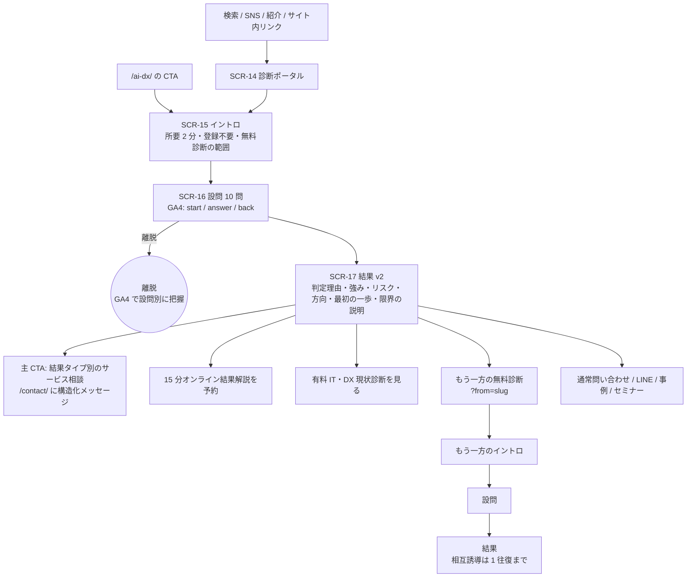

- 回答はサーバーへ送らない（現行維持）。GA4 イベントのみ（PRD-07 §4）。
- 結果 URL は共有可能。`?v=2` 以降のパラメータで結果の再現に必要な情報を持つ（PRD-07 §1-3）。

### 1-2. フォーム営業版（`outbound`、フォーム送信経由）

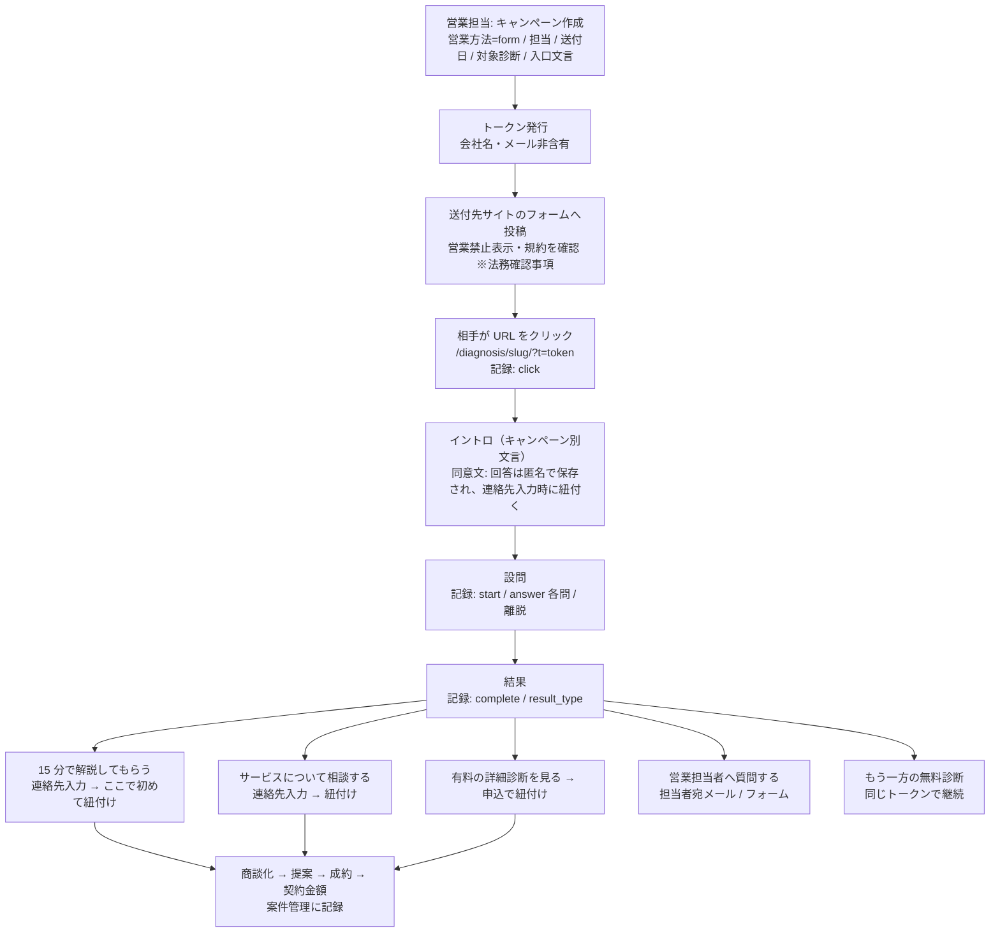

**紐付けのルール**（BIZ-04 §6-2）

| 時点 | 記録するもの | 特定企業との関係 |
| --- | --- | --- |
| トークン発行 | キャンペーン、営業方法、担当、送付日、（宛先単位発行なら）宛先 ID | 宛先 ID は「送付先」であり「回答者」ではない |
| クリック・回答・完了 | トークンに紐づく匿名の回答レコード | 宛先候補として保持。**画面上で企業名と結合表示しない** |
| 連絡先入力 + 同意（15 分解説 / 相談 / 有料申込 / 問い合わせ） | 入力された会社名・氏名・メール、同意日時 | ここで **確定紐付け**（`confirmed_at`）。以後は案件として扱う |

### 1-3. メール営業版（`outbound`、メール送付経由）

フォーム営業版と同じ流れ。差分のみ記す。

| 項目 | メール営業版の差分 |
| --- | --- |
| 営業方法 | `email` |
| 送付単位 | 宛先メールアドレス単位でトークンを発行するのが自然。**トークンは推測不能な乱数**とし、メールアドレスやその派生値を使わない |
| 配信停止 | メール本文に配信停止の受付（返信 or リンク）を必ず載せる。停止依頼は送付先リストに反映し、以後のキャンペーンから除外する（※法務確認事項 — GOV-02 TBD-13） |
| 開封 | 開封追跡（ピクセル）は行わない案を推奨。クリック（URL 到達）のみ記録する |
| 継続 | 相手が後日別の経路（検索）で診断を受けても紐付かない。それでよい（確定紐付けは連絡先入力時のみ） |

### 1-4. 15 分オンライン結果解説

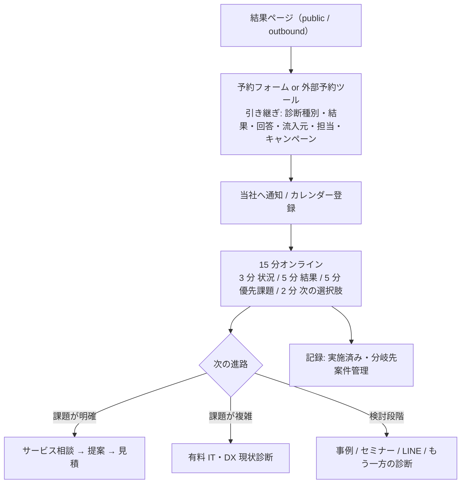

- 事前の詳細分析・AI 分析・正式提案は行わない（BIZ-04 §9）。
- 予約手段（外部ツール / 自前）は GOV-02 TBD-25。外部ツールの場合、引き継ぎ情報は予約 URL のクエリまたは予約フォームの備考欄に **個人情報を含めない形**（結果 URL + 診断 ID）で渡す。

### 1-5. 無料診断 → 直接サービス相談

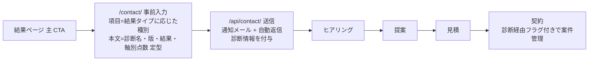

有料診断を経由しない。契約後の「診断経由」の識別は問い合わせ本文の定型（診断 ID）で行う（Phase 2）。案件管理を D1 に持つ場合はそこで紐付ける（Phase 3〜4）。

### 1-6. 無料診断 → 有料診断

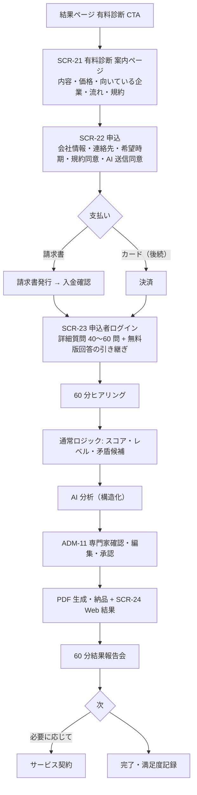

### 1-7. 有料診断 直接購入（無料診断を経由しない）

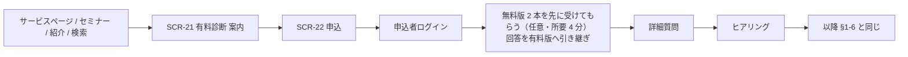

無料版の受診は任意だが、詳細質問の重複を減らすため申込直後に勧める。

### 1-8. 有料診断 → サービス契約

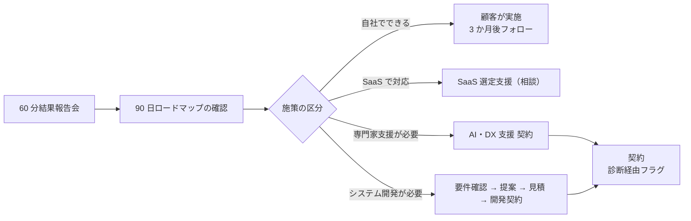

「何でもシステム開発へ誘導しない」（BIZ-04 §13）。報告会では 4 区分すべてを提示する。

---

## 2. ユーザーフロー（ビジネスパートナー）

### 2-1. パートナー対面診断

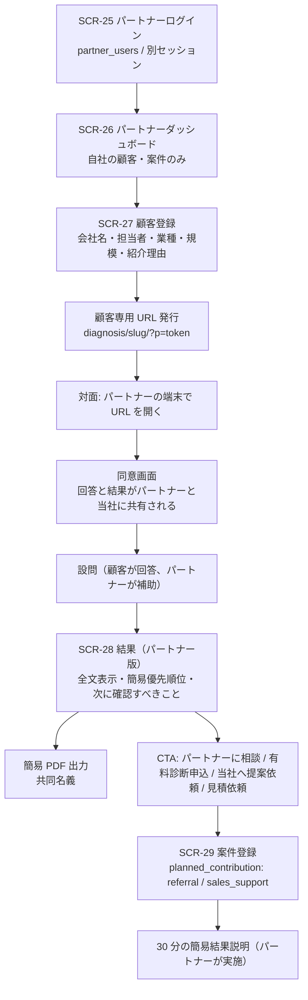

### 2-2. パートナー URL 送付（事前回答）

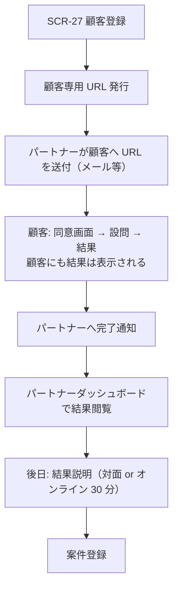

- 顧客専用 URL のトークンは顧客登録レコードに紐づく。**この時点で回答は特定顧客に紐付く**（一般公開版・営業版と異なる）。だから **診断開始前に同意を取る**（BIZ-04 §6-3）。
- 顧客が URL を第三者に転送した場合の回答も同じ顧客レコードに入る。トークンの有効期限（例 30 日）と回答回数上限（例 3 回、最新を採用）を設ける（`Assumed`）。

### 2-3. 紹介案件（10%）

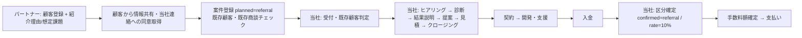

### 2-4. 診断・販売支援案件（20%）

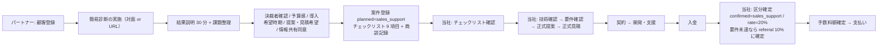

- 案件登録時の `planned_contribution` は宣言であり、`confirmed_contribution` と `commission_rate` は **当社が入金後に確定**する（BIZ-04 §10-2）。
- 区分を下げる（20% → 10%）判断は理由を記録し、パートナーに通知する。

---

## 3. 情報開示・権限マトリクス

### 3-1. 凡例

| 記号 | 意味 |
| --- | --- |
| ○ | 閲覧可（編集可否は備考） |
| △ | 条件付き（条件を備考に記す） |
| ✕ | 閲覧不可 |
| — | その情報が存在しない |

**登場人物**: 回答者（一般 / 営業送付先 / パートナーの顧客 / 有料申込者）、ビジネスパートナー（自社登録分のみ）、当社管理者（`admin`）、診断担当者（当社の専門家。`admin_users.role` の新ロール候補 `analyst`、または `editor` の流用 — DEV-11 §7）。

### 3-2. モード × 情報 × 閲覧者

| 情報 | 一般公開 回答者 | 営業送付 回答者 | パートナー 顧客 | 有料 申込者 | ビジネス パートナー | 当社 管理者 | 診断 担当者 | 備考 |
| --- | :---: | :---: | :---: | :---: | :---: | :---: | :---: | --- |
| 質問（無料版） | ○ | ○ | ○ | ○ | ○ | ○ | ○ | 公開コンテンツ |
| 質問（有料版 40〜60 問） | ✕ | ✕ | ✕ | ○ | ✕ | ○ | ○ | 申込者のみ。パートナーには問題文を見せない（有料版の価値保護） |
| 回答（無料版） | 本人のみ（保存なし） | 本人 + 匿名レコード | ○（本人） | ○ | △ 自社顧客分のみ | ○ | ○ | 営業送付: 確定紐付け前は企業名と結合表示しない |
| 回答（有料版） | — | — | — | ○ | △ 顧客が同意した場合のみ | ○ | ○ | 同意は申込時に別チェック |
| 簡易結果（無料版の結果ページ） | ○ | ○ | ○ | ○ | △ 自社顧客分のみ | ○ | ○ | パートナー版は全文表示 + 簡易優先順位 |
| 詳細結果（有料版 Web 結果） | — | — | — | ○ | △ 顧客同意時のみ、**承認済み版のみ** | ○ | ○ | 承認前の版はパートナー不可 |
| AI 分析（生出力） | — | — | — | ✕ | ✕ | ○ | ○ | 顧客・パートナーには承認済みの編集後のみ。生出力は納品しない |
| 専門家コメント | — | — | — | ○（承認後） | △ 顧客同意時 | ○ | ○（編集） | — |
| PDF（簡易・パートナー版） | — | — | ○ | — | ○（出力・保存） | ○ | ○ | 共同名義 |
| PDF（有料版 正式） | — | — | — | ○ | △ 顧客同意時 | ○ | ○ | パートナー版簡易 PDF とは別物 |
| 顧客情報（会社名・担当者・連絡先） | 本人 | 本人（入力後） | 本人 | 本人 | △ 自社登録分のみ（編集可） | ○ | △ 担当案件のみ | パートナー間は完全分離 |
| 商談情報（ヒアリング内容・提案・見積） | — | ✕ | ✕ | △ 自社分の見積のみ | △ 自社案件の**要約**のみ（見積金額の内訳は不可） | ○ | △ 担当案件 | パートナーには契約条件を確約させないため内訳非開示 |
| 契約情報（契約額・契約日） | — | — | — | ○（本人の契約） | △ 自社案件の**手数料計算に必要な対象売上のみ** | ○ | ✕ | — |
| 手数料情報（区分・率・額・支払状況） | — | — | — | ✕ | △ 自社案件のみ（閲覧のみ、確定は当社） | ○（確定権限） | ✕ | 顧客には手数料の存在を契約書で開示するか法務確認（TBD-17） |
| 他パートナーの顧客・案件 | — | — | — | — | ✕ | ○ | △ | Service 層で `partner_id` を必ず条件に含める |
| キャンペーン・営業担当・送付リスト | ✕ | ✕ | ✕ | ✕ | ✕ | ○ | ✕ | 営業内部情報 |
| GA4 集計 | ✕ | ✕ | ✕ | ✕ | ✕ | ○ | ○ | — |
| 監査ログ | ✕ | ✕ | ✕ | ✕ | ✕ | ○ | ✕ | 承認・区分確定・PDF 納品・同意取得を記録 |

### 3-3. 同意の取得点

| 同意 | 取得点 | 対象 | 記録 |
| --- | --- | --- | --- |
| プライバシーポリシー同意 | 連絡先入力時（既存フォームと同じ） | 全モード | 送信レコード |
| 回答の匿名保存 | 営業版イントロ（注記で説明。チェック必須にするかは TBD-18） | outbound | トークンレコード |
| パートナーとの共有 | パートナー版の診断開始前（**チェック必須**） | partner | 顧客レコードに同意日時 |
| AI への送信 | 有料版申込時（**チェック必須**。送信先・保持期間・目的を明示） | paid | 申込レコード |
| 有料結果のパートナー共有 | 有料版申込時（任意チェック。後から撤回可） | paid（パートナー経由） | 申込レコード |
| 営業メール配信停止 | メール本文 | outbound | 送付先リスト |

### 3-4. ロールと実装上の分離（DEV-02 への要求）

| 主体 | 認証系統 | 備考 |
| --- | --- | --- |
| 当社管理者 / 診断担当者 | `apps/admin` の `admin_users`（既存）。ロールは `admin` / `editor` に `analyst` を足すか `editor` を流用（DEV-11 §7） | 3 ロール以上は 00_README §0-1 の適合性再確認が必要（テンプレ標準は 2 ロール） |
| ビジネスパートナー | `apps/public` 側の **新系統**（`partner_users` / `partner_sessions`）。`members` を流用するか新設するかは DEV-11 §7 | AdminUser とテーブル・クッキー・コードを共有しない（DEV-02 §1-2 の原則を踏襲） |
| 有料申込者 | `apps/public` 側。`members` の用途として採用するのが自然（TBD-01 の答えになる） | パートナーと同じテーブルにするか分けるかは DEV-11 §7 |
| 営業送付先・パートナー顧客 | ログイン無し。トークンで識別 | トークンは推測不能・期限付き |

---

## 4. 画面 ID の予約（PRD-04 §3 の続番）

PRD-04 は SCR-01〜20、ADM-00〜10 を使用済み。以下を本書で予約する（実装時に PRD-04 へ転記）。

| 画面 ID | 名称 | ルート（案） | モード | Phase |
| --- | --- | --- | --- | --- |
| SCR-15〜17 | 診断イントロ / 設問 / 結果（既存を v2 化。営業版・パートナー版は同じ画面をトークン付きで使う） | `/diagnosis/<slug>/…?t=` / `?p=` | public / outbound / partner | 2 / 4 |
| SCR-21 | 有料診断 案内 | `/diagnosis/pro/`（名称確定後に決定。`/diagnosis/<slug>/` と衝突しないスラグ） | paid | 3 |
| SCR-22 | 有料診断 申込 | `/diagnosis/pro/apply/` | paid | 3 |
| SCR-23 | 申込者ログイン・詳細質問 | `/mypage/diagnosis/…`（既存 `/mypage/` を活用） | paid | 3 |
| SCR-24 | 有料診断 Web 結果 | `/mypage/diagnosis/<id>/` | paid | 3 |
| SCR-25 | パートナーログイン | `/partner/login/` | partner | 4 |
| SCR-26 | パートナーダッシュボード | `/partner/` | partner | 4 |
| SCR-27 | 顧客登録・一覧 | `/partner/customers/` | partner | 4 |
| SCR-28 | パートナー版 結果（全文 + PDF） | `/partner/customers/<id>/results/<id>/` | partner | 4 |
| SCR-29 | 案件登録・一覧 | `/partner/deals/` | partner | 4 |
| SCR-30 | 15 分解説 予約（自前の場合） | `/diagnosis/briefing/` | public / outbound | 2（外部ツールなら不要） |
| ADM-11 | 有料診断 案件一覧・AI 分析確認・編集・承認・納品 | `/diagnoses/` | admin | 3 |
| ADM-12 | キャンペーン・トークン管理 | `/campaigns/` | admin | 2 |
| ADM-13 | パートナー・案件・手数料管理 | `/partners/`、`/deals/` | admin | 4 |
| ADM-14 | 診断定義・プロンプトのバージョン閲覧 | `/definitions/` | admin | 3 |

`/partner/`・`/mypage/`・`/diagnosis/pro/` は既存 URL と衝突しない。`X-Robots-Tag: noindex` の対象に `/partner` と `/diagnosis/pro/apply` 以降を加える（DEV-11 §9）。

---

## 5. 記入時チェックポイント

- 各フローの「紐付け」が BIZ-04 §6-2 の原則（クリックだけで特定企業と結合しない）を守っているか
- パートナー版の同意が診断開始前に取られているか
- マトリクスで「他パートナーの顧客」が ✕、「手数料の確定」が当社のみになっているか
- 有料版の AI 生出力が顧客・パートナーに渡らないか
- 画面 ID が PRD-04 と重複していないか
