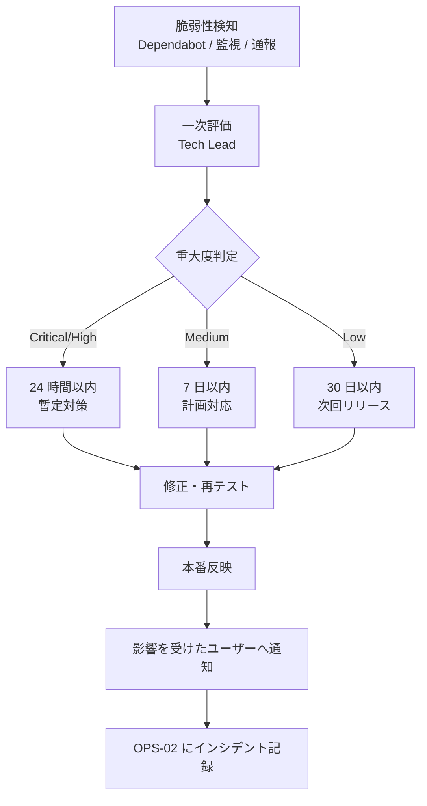

# 02-security-policy.md — セキュリティポリシーテンプレート

## このセクションの目的

認証・認可・暗号化・脆弱性対応・機密情報保護に関する方針を集約する正仕様書。ロール権限管理は **単一階層・少数ロール（`admin` / `editor` の 2 ロール）** を標準とする（構造の正本は PRD-01 §1-2）。3 ロール以上が必要になった場合は、本テンプレートの適用範囲を 00_README §0-1 で再確認する。マルチテナント境界（Organization 単位のデータ分離）の概念も本テンプレートには存在しない。

## 0-H. ハイブリッド編集ガイド（要点）

- 推奨モード: Hybrid（AI 草案 + Tech Lead / PdM（兼務前提）確認。個人情報・開示条件は必要に応じ法務確認）
- 人間確認必須: 認証・認可、個人情報、開示条件、鍵管理
- 詳細は 00_README.md §6〜8

---

## 1. 認証・認可モデル

### 1-1. 認証方式（AdminUser・確定済み）

認証方式は DEV-01 §1・§2 で決定済み（Confirmed）。`jose` / JWT は不採用 — 用途がステートレス API ではなく管理画面ログインのみのため、失効可能な D1 セッション方式を採用する。いずれも `admin_users`（DEV-07 §4-1）に紐づく認証であり、管理画面ログイン以外の公開側ログイン機構（Member、§1-2 参照）とは完全に別系統（DEV-01 §2「API 提供（認証）」）。

| 経路 | 認証方式 | セッション / トークン保持 |
| --- | --- | --- |
| 管理画面（Web） | D1 の `admin_sessions` テーブル（DEV-07 §3-1）でセッションを管理し、`httpOnly` + `Secure` + `SameSite=Lax` クッキー（クッキー名 `admin_session`）でセッション ID を保持する（クッキー属性の正本は本表。DEV-04 §2 はこれを参照する）。**クッキー値の署名は行わない**: セッション ID は 32 バイトの CSPRNG 値（`crypto.getRandomValues`）で、正当性は毎リクエストの `admin_sessions` 照合そのものが担保する。署名を足しても DB 照合を省けるわけではないため、鍵管理を増やさない判断（HMAC を使うのは下記の招待・リセットトークン）。JWT は使わない（DEV-01 §2） | D1（`admin_sessions`）。ログアウト・強制失効は行削除で即時反映される |
| API（採用時） | 管理画面と同じ D1 セッション機構を使う（`admin_sessions` テーブルのセッション ID をクッキーまたは `Authorization` ヘッダで受け渡す）。`jose` による JWT 発行/検証は行わない（ステートレス API を主目的としないため。DEV-01 §2） | D1（`admin_sessions`）。未採用時は API 自体が対象外 |
| メール認証 | **Open**（案件実装時に確定）。招待制の管理画面（admin が editor を追加する運用、F-01-04）では自己登録がないため本人確認（メール確認）自体が不要なことも多い。暫定方針: AdminUser は不要 [Assumed]、Member（FG-07）採用時に再検討。確定時は GOV-01 に記録する | 要否決定後に確定 |
| パスワードリセット | 自前実装（`password_reset_tokens` テーブル、DEV-07 §3-1）。リセットリンクのトークンは Web Crypto の HMAC 署名（`crypto.subtle.sign`）で発行・検証する。`jose` は使わない（DEV-01 §2） | リンク 60 分有効 |
| パスワードハッシュ化 | Web Crypto API の PBKDF2（`crypto.subtle`）。Workers ランタイムに標準実装済みで追加パッケージ不要。`@node-rs/argon2` 等のネイティブ Node アドオン系ライブラリは Workers で動作しないため不採用（DEV-01 §1・§3） | — |
| OAuth（任意） | Arctic（DEV-01 §2） | Google / GitHub 等 |
| SAML / OIDC | **本テンプレ標準対象外** | エンタープライズ要件が発生した場合のみ派生プロジェクトとして個別対応 |

> メール認証の要否のみ **Open**。その他（セッション方式・パスワードハッシュ方式）は DEV-01 で決定済みのため、この表の内容に従って実装してよい。

### 1-2. Member 認証（マイページ機能採用時のみ）

PRD-03 FG-07（会員登録・マイページ）採用時のみ有効。**AdminUser とは完全に別系統の認証**であり、テーブル・クッキー名・セッション実装・パスワードハッシュのコードパスをすべて分離する（PRD-01 §1-1・§1-2、DEV-01 §2）。信頼レベルが異なる（社内の少数スタッフ vs 不特定多数の一般利用者）ことに加え、このモノレポ構成（CLAUDE.md の D1/R2 共有ルール）では AdminUser 認証が `apps/admin`、Member 認証が `apps/public` に存在し、そもそも同一アプリのコードベースに両方が存在しない。

| 項目 | AdminUser（§1-1） | Member（本節） |
| --- | --- | --- |
| テーブル | `admin_users` / `admin_sessions` | `members` / `member_sessions`（DEV-07 §3-6・§4-6・§4-7 で定義済み。別テーブル、共有しない） |
| クッキー名 | `admin_session` | `member_session`（AdminUser と異なる名前。同一クッキー名の使い回しは禁止） |
| セッション実装 | D1 セッション + httpOnly クッキー（値は無署名の CSPRNG トークン — §1-1） | 同じ技術（D1 セッション + httpOnly クッキー）だが、**実装コードは別**（`apps/public/src/lib/server/` 配下に置き、`apps/admin` の AdminUser 用とは共有しない） |
| パスワードハッシュ | Web Crypto PBKDF2 | 同じ技術（Web Crypto PBKDF2）。ハッシュ関数自体の共通ヘルパー化は可だが、認証フロー・セッション管理コードは分離する |
| 権限モデル | `admin` / `editor` の 2 階層（§2） | ロール階層なし。「ログイン済み Member か否か」のみを判定する単純な認可（PRD-01 §1-2）。マイページ・注文履歴（FG-07）は「本人の Member か」の所有者チェックのみで、ロール検証は不要 |
| 招待・リセットトークン | Web Crypto HMAC 署名 | 同じ技術（Web Crypto HMAC 署名）。パスワード再設定（F-07-06）で使用 |

> **禁止事項**: AdminUser と Member が同一のセッションテーブル・同一のクッキー名・同一の認証コードパスを共有すること。これは実装の手間を惜しんだ結果の見落としではなく、意図的な多重防御（一方の認証システムに脆弱性があっても他方に波及しない）である。レビュー時は §11・§14 のチェックリストで確認する。
> マイページ機能を採用しない場合は本節を削除する。**本サイトでは Phase 3（有料診断の申込者ログイン）で採用する**（DEV-11 §7、GOV-02 TBD-01）。

### 1-3. ビジネスパートナー認証（診断プラットフォーム Phase 4 — 設計済み・未実装）

第 3 の認証系統。`partner_users` / `partner_sessions`（DEV-07 §5-13・§5-16）、クッキー名 `partner_session`、実装コードは `apps/public/src/lib/server/partner/auth/session.ts`（Member 用とも別ファイル）。パートナーは**他社の顧客情報を扱う**ため、Member（本人情報のみ）より広い範囲に触れる。そのぶん分離を厚くする。

| 項目 | AdminUser（§1-1） | Member（§1-2） | Partner（本節） |
| --- | --- | --- | --- |
| テーブル | `admin_users` / `admin_sessions` | `members` / `member_sessions` | `partner_users` / `partner_sessions` |
| クッキー名 | `admin_session` | `member_session` | `partner_session` |
| 権限モデル | `admin` / `editor` | 本人チェックのみ | **自パートナーのスコープ**のみ（`partner_id` 一致）。ロール階層なし。全 Service 関数の入口で `requirePartnerScope(session, row.partnerId)` を通し、不一致は **404**（存在を明かさない） |
| ロックアウト | KV カウンタ（§7） | 同じ仕組み | 同じ仕組み。KV キーの接頭辞を `auth-lock:partner:` に分ける（同一 IP からの管理者ログイン失敗と混ざらない） |
| パスワード | PBKDF2（共有ヘルパー） | 同 | 同 |
| 招待・再設定 | Web Crypto HMAC トークン | 同 | 同。招待は `admin` が `POST /api/v1/partners/{id}/users/` で発行 |
| 停止 | `status = inactive` | `suspended` でセッション削除 | `partners.status = suspended` で**会社単位**に全ユーザーのセッションを削除（DEV-09 §2-11） |

> **禁止事項（追加）**: パートナーの Service 関数に `partner_id` を条件に含めない読み取り・書き込みを書くこと。単体テストは必ず「別パートナーの ID で 404」を含める（DEV-03 §3-1）。

---

## 2. ロールモデル（単一階層・少数ロール）

権限管理を **単一階層・2 ロール（`admin` / `editor`）** で標準化する（構造の正本は PRD-01 §1-2）。Platform / Organization のような多階層構造は持たない。

### 2-1. 階層構造

```
AdminUser（管理画面ログインユーザー。単一階層 — admin_users.role で付与、DEV-07 §4-1）
  ├─ admin   ← 管理画面の全権（他 AdminUser の管理、Inquiry 対応、サイト設定含む）
  └─ editor  ← コンテンツ作成・編集のみ（Post/Page/Media/Category/Tag）。公開権限は案件次第（§2-3 ※1）
```

> この単一階層ロールは、spatie/laravel-permission のような専用ライブラリを使わず、D1 のテーブル設計（`admin_users.role`）と、Service 層に置く認可チェック関数（`requireRole(session, "admin")` のような、ロールを検証する関数 — DEV-05 参照）で表現する（DEV-01 §1「Permission」・§4「認可チェックの徹底」）。

### 2-2. 標準ロール定義

<!-- TEMPLATE: プロジェクトに応じてロール名は変えるが、単一階層・少数ロールの構造は維持する（3 ロール以上必要なら 00_README §0-1 で適合性を再確認） -->
| ロール | 概要 | 主な権限 |
| --- | --- | --- |
| `admin` | 管理画面の全権管理者 | 他 AdminUser の管理、Media の全操作、Inquiry 対応、サイト設定 |
| `editor` | コンテンツ担当メンバー | Media の作成・編集。Inquiry と AdminUser 管理には触れない |

> **現状、管理画面は運用されていない**（GOV-01 D-007）。ロール定義はテンプレート標準のまま残してあるが、実際に AdminUser を発行するのは管理画面を使い始めてからになる。お知らせは開発者が git で更新するため、コンテンツ編集に `editor` は要らない（DEV-06 §1-1）。
>
> **診断プラットフォームでの読み替え（Phase 2b 以降）**: `editor` = **診断担当者・営業担当**（キャンペーン運用、リード対応、有料診断の分析・編集、案件の進行）、`admin` = **承認・確定権限**（入金確認、AI 分析の承認、手数料区分の確定、パートナー管理、プロンプト有効化）。3 ロール目（`analyst`）は作らない（GOV-02 TBD-29）。

### 2-3. 権限マトリクス（標準テンプレート）

<!-- TEMPLATE: 主要操作 × ロールの ○/×/△ マトリクス。プロジェクトの機能に応じてカスタマイズ。FG-04（PRD-03）の画面構成をベースにしている -->
実装済みの操作のみを記す。Post / Page / Category / Tag は本サイトに存在しない（お知らせは Content Collections — DEV-06 §1-1）。

| 操作 | admin | editor | 実装状況 |
| --- | :---: | :---: | --- |
| ログイン / ログアウト | ○ | ○ | 実装済み（`apps/admin/src/pages/api/v1/auth/`） |
| 管理ダッシュボード閲覧 | ○ | ○ | 骨組みのみ（`/dashboard/`） |
| Media アップロード・削除 | ○ | ○ | API のみ実装。画面なし。R2 は未設定 |
| Inquiry 一覧・対応状況変更 | ○ | ✕ | API のみ実装。画面なし。**書き込み元がないため常に空**（GOV-01 D-005） |
| AdminUser 追加・ロール変更・無効化 | ○ | ✕ | 未実装 |
| サイト設定 | ○ | ✕ | 未実装 |
| 監査ログ閲覧（`activity_log`） | ○ | ✕ | 未実装 |
| **診断プラットフォーム（設計済み・未実装）** | | | |
| キャンペーン作成・編集・トークン発行・失効（ADM-12） | ○ | ○ | Phase 2b |
| 回答・リード一覧、リードの状態遷移・担当・メモ | ○ | ○ | Phase 2b |
| 15 分解説の予約・実施記録 | ○ | ○ | Phase 2b |
| 有料診断: 請求書送付・回答差戻し・ヒアリング記録・分析開始・終了（ADM-11） | ○ | ○ | Phase 3 |
| 有料診断: **入金確認・取消（入金後）** | ○ | ✕ | Phase 3 |
| AI 分析: 編集・再生成・レビュー依頼・改訂・PDF 生成 | ○ | ○ | Phase 3 |
| AI 分析: **承認・差戻し・承認取消・納品** | ○ | ✕ | Phase 3 |
| プロンプト・定義の閲覧 | ○ | ○ | Phase 3 |
| プロンプトの新版作成・有効化 | ○ | ✕ | Phase 3 |
| パートナー登録・停止・ユーザー招待（ADM-13） | ○ | ✕ | Phase 4 |
| 案件: 提案開始・失注 | ○ | ○ | Phase 4 |
| 案件: **受付・受付不可・契約・入金・手数料区分確定・確定取消** | ○ | ✕ | Phase 4 |
| 手数料支払の登録・実行・取消 | ○ | ✕ | Phase 4 |
| 全パートナーの顧客・案件の横断閲覧 | ○ | ○ | Phase 4 |
| 診断 KPI ダッシュボード | ○ | ○ | Phase 2b〜 |

公開・非公開の承認フローに関する **Open** は、Post/Page 自体を持たないため本サイトでは発生しない。有料診断の承認フロー（AI 分析 → 承認 → 納品）は DEV-09 §2-7 が正本。

### 2-4. 受託案件向けのロール命名指針

受託案件では、クライアントの業界用語に合わせてロール名を変える：

| 標準ロール | 業界別の命名例 |
| --- | --- |
| `admin` | 「管理者」「運営者」「サイト管理者」「オーナー」 |
| `editor` | 「編集者」「執筆者」「広報担当」「スタッフ」 |

---

## 3. 認可チェックの徹底

マルチテナント境界（Organization 単位のデータ分離）は本テンプレートに存在しない（単一運営が前提。00_README §0-1・§2-2）。その代わりに徹底すべきは、管理系操作が `admin` / `editor` のいずれのロールに許可されているかを Service 層で確実に検証すること（DEV-01 §4「認可チェックの徹底」）。

### 3-1. 権限チェック方針

| 対象 | 実装方法 |
| --- | --- |
| 管理系操作全般 | Service 層の入口で `requireRole(session, ...)` のようなロール検証関数を必ず通す（DEV-01 §4） |
| admin 専用操作 | AdminUser 管理・サイト設定・Inquiry 対応は `admin` ロールのみ許可（§2-3） |
| editor の操作範囲 | Post/Page/Media/Category/Tag の作成・編集に限定。削除・公開権限の扱いは §2-3 の権限マトリクスと ※1 の案件判断に従う |
| セッション/トークンとロールの紐付け | ログイン時に `admin_users.role`（DEV-07 §4-1）をセッション/トークンに埋め込み、リクエストごとに検証する（§1-1 の決定に従う） |

### 3-2. 権限チェック漏れ防止のコーディング規約

D1 には Eloquent の Global Scope のような自動適用機構がないため、Service 層の入口で明示的にロールを検証する（DEV-01 §4「認可チェックの徹底」）。

```ts
// ❌ Bad: ロール検証なしで admin 専用操作を実行
async function deactivateAdminUser(db: D1Database, targetId: number) {
  return db.prepare("UPDATE admin_users SET status = 'inactive' WHERE id = ?").bind(targetId).run();
}

// ✅ Good: Service の入口で必ずロールを検証し、無効化と同時にセッションを失効させる
async function deactivateAdminUser(db: D1Database, session: Session, targetId: number) {
  requireRole(session, "admin"); // admin 以外は例外をスローし、以降の処理を実行しない
  // status の更新だけでは既存の admin_sessions 行が生き残る。失効は行削除で即時反映する
  // のが §1-1 の原則なので、必ず同一トランザクション（batch）でセッションも削除する。
  return db.batch([
    db.prepare("UPDATE admin_users SET status = 'inactive' WHERE id = ?").bind(targetId),
    db.prepare("DELETE FROM admin_sessions WHERE admin_user_id = ?").bind(targetId),
  ]);
}

// requireRole の実装例（apps/admin/src/lib/server/services/ 配下）
function requireRole(session: Session, role: "admin" | "editor") {
  // admin は editor 専用操作も実行できる（上位ロールが下位ロールの権限を包含する）
  const allowed = role === "editor" ? ["admin", "editor"] : ["admin"];
  if (!allowed.includes(session.role)) {
    throw new ForbiddenError();
  }
}
```

### 3-2b. スコープ検証（診断プラットフォーム）

ロール検証（`requireRole`）に加えて、**行の所有者**を検証する関数を 2 つ持つ。どちらも Service 関数の入口で呼ぶ。

```ts
// apps/public/src/lib/server/partner/auth/session.ts
// 不一致は 403 ではなく 404。「他社の案件が存在する」こと自体を明かさない。
export function requirePartnerScope(session: PartnerSession, partnerId: number): void {
  if (session.partnerId !== partnerId) throw new NotFoundError();
}

// apps/public/src/lib/server/auth/session.ts（Member）
export function requireOwner(session: Session, memberId: number): void {
  if (session.memberId !== memberId) throw new NotFoundError();
}
```

- パートナーの一覧系クエリは `where(eq(table.partnerId, session.partnerId))` を**必ず**含める。ID 指定の取得は行を取ってから `requirePartnerScope` を通す（WHERE に含めるだけだと 404 の理由が曖昧になるため両方）。
- 営業版のトークン検証は所有者概念が無い代わりに、`diagnosis_tokens.status = active` かつ期限内かつ `use_count < max_uses` を 1 つの関数 `resolveActiveToken(db, token)` に閉じ、失敗はすべて 404。
- AI 分析の生出力（`ai_analyses.raw_json`、`ai_jobs.output_json`）を返す Service は `apps/admin` にしか置かない。`apps/public` の Service は `status in (approved, delivered)` の `edited_json` だけを返す（PRD-08 §3-2）。

### 3-3. 権限チェック漏れの検出

- テスト（Vitest — DEV-01 §1「Testing」）で、admin 専用操作（AdminUser 管理・Inquiry 対応・サイト設定）の Service 関数が必ず `requireRole(session, "admin")` を通ることを検証する
- Pull Request レビューで「admin 専用操作に `requireRole` があるか？」を必須チェック項目に
- 監査ログ（`activity_log`、DEV-07 §4-4）で管理操作を記録し、誰がどのロールでどの操作を行ったかを事後追跡できるようにする

---

## 4. 入力検証

| 経路 | 検証方法 |
| --- | --- |
| Web | Astro API Route / Service 層の入口で Zod（DEV-01 §2、決定済み。Drizzle スキーマから `drizzle-zod` で導出）により検証する。フォーム値を検証せず直接 D1 へ書き込むことを禁止 |
| API | Service 層の入口で必ず検証を通す。リクエストボディを未検証のままハンドラの奥まで渡さない |
| AI 入力 | プロンプト入力に最大文字数制限、危険な文字列パターンの検出 |
| ファイルアップロード | MIME / 拡張子 / サイズ / 実バイトの 4 重チェック（保存先は Cloudflare R2、DEV-01 §1） |

---

## 5. 暗号化方針

| 項目 | 方針 |
| --- | --- |
| 通信時 | HTTPS 必須（TLS 1.2 以上） |
| 保存時（DB） | Cloudflare D1 標準の保存時暗号化（基盤側で提供。DEV-01 参照） |
| 保存時（ファイル） | Cloudflare R2 標準の保存時暗号化（DEV-01 参照） |
| 秘密情報 | ローカル開発は `.dev.vars`（gitignored）、本番は Cloudflare Workers Secrets（`wrangler secret put`）で管理。Git にコミット禁止 |
| 機密カラム | Eloquent の `encrypted` キャストに相当する仕組みは無い。アプリ層で暗号化してから D1 へ書き込む方式は **Open**（案件実装時に確定。標準テーブルに対象カラムはなく、案件で必要になった時点で暗号化アルゴリズム・鍵管理を決定して導入） |
| 鍵管理 | アプリ全体の単一鍵（Laravel の `APP_KEY` 相当）という概念は無い。単一運営（サイト 1 件）が前提のため鍵の単位もサイト単位でよく、Cloudflare Workers Secrets 単位で個別に管理し、ローテーション時は影響範囲を OPS-02 に記録する |

---

## 6. CSRF / XSS / SQL Injection 対策

| 攻撃区分 | 対策 |
| --- | --- |
| CSRF | Astro 組み込みの Origin チェック（`security.checkOrigin`、既定で有効。DEV-01 §2 で決定済み）で対応する。GET/HEAD/OPTIONS 以外かつ `Content-Type` が form 系または未指定のリクエストは Origin 不一致で自動的に 403 になる。追加ライブラリ・二重送信トークン等の自前実装は不要。API クライアントから呼ぶ場合は `Content-Type: application/json` を明示すること（未指定だと同一オリジンでない限り拒否される）。AdminUser・Member（採用時）はこの機構を共有してよい（アプリケーションではなく Astro 自体の機構のため、DEV-02 §1-2 の実装分離ルールの対象外） |
| XSS | Astro は `{式}` 展開でデフォルトエスケープ、Svelte も `{式}` 展開でデフォルトエスケープ。生 HTML を挿入する Astro の `set:html` ディレクティブ／Svelte の `{@html ...}` はサニタイズ済みの値以外に使用禁止（Blade の `{!! !!}` に相当） |
| SQL Injection | D1 へのアクセスは必ずプレースホルダ付きプリペアドステートメント（`env.DB.prepare(sql).bind(...)`）を使用。文字列連結による SQL 構築を禁止（DEV-01 §3） |
| ファイルアップロード | 宣言 MIME・拡張子・サイズ・**先頭バイトの署名**を検証する（`apps/admin/src/lib/server/services/media.ts`）。型も名前も呼び出し側が決められるため、署名の照合だけが「実行可能ファイルが `image/png` として届く」経路を塞ぐ。`image/svg+xml` は既定で不許可 — XML には署名が無く、スクリプトを埋め込めるため。採用する場合はアップロード時のサニタイズか、添付として配信する運用とセットにする。保存先は R2、キーはサーバー生成（DEV-10 §4-2） |
| マスアサインメント | Drizzle スキーマから `drizzle-zod` で導出した Zod スキーマを `.pick()` で書き込み可能列だけに絞る（`validation/*.ts`）。`status` や `public_id` のようなサーバー所有の列はリクエストボディに現れても落ちる（単体テストで検証済み）。Service 層で書き込み対象のフィールドを明示的にホワイトリスト指定する（リクエストボディを丸ごと D1 の INSERT/UPDATE に渡さない） |

---

## 7. レート制限

<!-- TEMPLATE: 標準的なレート制限値。プロジェクトの利用パターンで調整 -->
| 対象 | 制限 | 実装状況 |
| --- | --- | --- |
| ログイン失敗回数のロックアウト | `AUTH_LOCKOUT_MAX_ATTEMPTS` = 5 回 / `AUTH_LOCKOUT_MINUTES` = 15 分。アカウント単位と IP 単位の両方でカウント | **実装済み**（KV カウンタ。`packages/server-kit/src/auth/lockout.ts`） |
| お問い合わせフォーム送信 | Turnstile による都度検証 + ハニーポット | **実装済み**（アプリ側。`lib/server/services/contact.ts`） |
| IP ベースの汎用レート制限 | Cloudflare 側（WAF / Rate Limiting Rules）で実施し、アプリコードには実装しない | **未設定**（Cloudflare 側の設定が残っている — GOV-02 §2-5） |
| その他の API | — | 該当する API がまだ無い |

> ロックアウトは**ローカル開発で必ず踏む**。全リクエストが `127.0.0.1` から来るため、5 回失敗すると全アカウントが 15 分ロックされ、正しいパスワードでも 429 になる。解除方法は `CLAUDE.md` に記載。

実装方式は役割分担で確定済み（`Confirmed`）。**IP ベースの汎用レート制限は Cloudflare の WAF / Rate Limiting Rules**（Dashboard または Terraform でのエッジ設定。アプリケーションコードには実装しない — DEV-04 §2 と整合）。IP 単位のエッジ制限だけでは不十分な**アカウント単位のブルートフォース対策（下記）のみアプリ側で実装**する。

**ログイン等の認証コンポーネントへの実装（必須）**

ログイン / パスワード再設定など認証に関わるエンドポイントは、IP + アカウント単位で失敗回数を記録し、一定回数を超えたらロックアウトしてブルートフォース攻撃を防ぐこと。カウンタの保管先は **Cloudflare KV**（`Confirmed`。TTL 付きキーで自動失効させる）。参照実装: `packages/server-kit/src/auth/lockout.ts`（両アプリのログインルートで使用。閾値は各アプリの `wrangler.jsonc` の `AUTH_LOCKOUT_MAX_ATTEMPTS` / `AUTH_LOCKOUT_MINUTES`）。**未設定の場合は例外を投げて fail closed にする** — `Number(undefined)` は `NaN` になり、閾値比較がすべて false になってロックアウトが黙って無効化されるため（`packages/server-kit/tests/lockout.test.ts` で検証）。

- 失敗時: カウンタを加算し、上限（5 回 / 分 / IP を基準値とする）を超えたら一定時間ロックアウト
- 成功時: カウンタをリセット
- メール送信を伴う操作（パスワードリセット再送等）も同様に制限すること

---

## 8. 個人情報・機密情報の取扱い

### 8-1. 取得項目と保存期限

<!-- TEMPLATE: プロジェクトが扱う個人情報を一覧化。本テンプレの標準エンティティ（AdminUser / Inquiry、採用時は Order / AI）を起点にする -->
実際に取得している個人情報は**お問い合わせフォームの入力のみ**。

| データ項目 | 取得根拠 | 保存先・期限 | 第三者提供 |
| --- | --- | --- | --- |
| お問い合わせの氏名・メールアドレス・会社名・電話番号・本文 | お問い合わせ対応（`/contact/` でプライバシーポリシーへの同意を必須化） | **DB に保存していない。**Resend 経由で送信され、`CONTACT_NOTIFY_TO` のメールボックスと送信者本人の受信箱にのみ残る | Resend（送信委託）、Cloudflare Turnstile（送信元 IP をボット判定のために送信） |
| アクセス解析データ | サイト改善 | Google Analytics 4（測定 ID `G-74BTEE20D1`）の保持設定に従う | Google |
| AdminUser の氏名・メールアドレス | 管理画面アカウント発行 | 退職・契約終了後 1 年（DEV-07 §10）。**現在発行なし** | なし |
| Member のメールアドレス・パスワードハッシュ | 会員登録 | **会員機能は未提供**（GOV-01 D-007）。採用時は DEV-07 §10 に従う | なし |
| 操作ログ（`activity_log`） | サービス改善・障害調査 | **未使用** | なし |

決済情報・AI プロンプトはいずれも取得していない（軽量 EC・AI 機能ともに不採用）。

> **要確認**: お問い合わせ内容を DB に残さない現行方式が `/privacy-policy/` の記載と整合しているか（GOV-02 TBD-07）。保管期限の主体がメールボックス運用側に移っている点が、ポリシー文面で説明されているかを法務に確認する。

**診断プラットフォームで新たに取得する情報（設計済み・未実装。運用開始前にプライバシーポリシーへ追記 — GOV-02 TBD-18）**

| データ項目 | 取得根拠・同意 | 保存先・期限（DEV-07 §10） | 第三者提供 | Phase |
| --- | --- | --- | --- | --- |
| 無料診断の回答・判定（営業版・パートナー版・有料申込者） | 入口画面での説明（匿名保存）。個人情報とは連絡先入力時に結合 | D1 `diagnosis_responses`。匿名 2 年 | パートナー版は当該パートナーに共有（顧客の事前同意） | 2b / 4 |
| リードの会社名・氏名・メール・電話 | 連絡先入力時のプライバシーポリシー同意（必須チェック） | D1 `leads`。1 年 | 外部予約ツール（15 分解説の予約時、本人が入力） | 2b |
| 有料診断の企業情報・回答・記述・ヒアリング記録 | 申込時の規約同意 | D1 `paid_diagnoses` / `paid_answers`。納品後 1 年 | **AI ベンダー**（申込時の別チェックで同意。会社名・個人名は送らない — PRD-05 §8-1）、パートナー（顧客同意時） | 3 |
| AI 分析の入力・出力 | 同上 | D1 `ai_jobs` / `ai_analyses`。納品後 1 年 | AI ベンダーの保持ポリシーに従う（契約時確認） | 3 |
| PDF レポート | 同上 | R2（非公開）。納品後 1 年 | 顧客本人、同意時にパートナー | 3 / 4 |
| パートナーユーザーの氏名・メール・パスワードハッシュ | パートナー契約 | D1 `partner_users`。契約終了後 1 年 | なし | 4 |
| パートナー顧客の会社名・担当者・連絡先 | パートナーが顧客の同意を得て登録（`consent_share_at`） | D1 `partner_customers`。案件終了後 1 年で個人情報列を NULL 化 | パートナーと当社の間で共有（設計上の前提。同意文に明記） | 4 |
| 案件・手数料の金額 | パートナー契約 | D1 `deals` / `commission_payments`。会計記録として法定期間 | なし | 4 |

**取得しないもの**: 営業版でのメール開封（追跡ピクセルを使わない）、URL クリックと特定企業の確定的な結合（BIZ-04 §6-2）、パートナー顧客の回答者個人の氏名（会社と担当者のみ）。

### 8-2. LLM プロバイダへの送信（AI 機能ありの場合）

- LLM への送信は利用規約で同意を取得
- 各プロバイダ（Claude / ChatGPT / Gemini。DEV-01 §2「LLM 組み込み」）のデータ保持ポリシーを利用規約に明記
- 機密情報の自動マスキング処理を実装

**本サイト（有料診断 Phase 3）での適用**: 同意は申込時の独立したチェック（`paid_diagnoses.consent_ai_at`）。会社名・氏名・連絡先は入力 JSON に含めない設計（構造で担保）。記述式回答とヒアリング記録は送信前に担当者が管理画面で伏せ字にできる（自動マスキングは Phase 3 では持たない — PRD-05 §8-1）。同意が無い案件は AI を呼ばず手入力で納品する（GOV-02 TBD-32）。

### 8-3. プライバシー法令対応

| 法令 | 適用条件 | 対応 |
| --- | --- | --- |
| 個人情報保護法（日本） | 全プロジェクト | 必須 |
| GDPR | EU 圏ユーザー受付時 | 要対応（受付しない選択肢も） |
| 電気通信事業法（外部送信規律） | Cookie / 外部 API 連携時 | 要対応 |

---

## 9. AI 固有のセキュリティ考慮（AI 機能ありの場合）

| 観点 | 方針 |
| --- | --- |
| プロンプトインジェクション | システムプロンプトでロール固定、ユーザー入力のサニタイズ |
| 生成物の不適切コンテンツ | 後段フィルタ（NG ワード・違法表現検出） |
| トークン消費攻撃 | レート制限 + サイト単位の日次・月次上限（`ai_jobs` の集計、DEV-07 §6・PRD-05 §8-1。単一運営前提のため Organization 別の内訳は持たない） |
| 機密情報の漏出 | システムプロンプトに他の Inquiry の内容等の機密情報を含めない、ステートレス化 |
| SVG / HTML 等の構造化生成 | サーバー側サニタイズ。ライブラリ選定は **Open**（案件実装時に確定。`enshrined/svg-sanitize` の直接の代替は無し。Workers で動く HTML/SVG サニタイザ（例: DOMPurify 系、要 Workers 対応確認）を導入前に選定する） |

---

## 10. 脆弱性対応フロー



---

## 11. セキュリティレビュー基準（PR 時チェック）

- [ ] 認証・認可：Service 層のロール検証関数（`requireRole(session, "admin" | "editor")` 等）経由でアクセス制御しているか
- [ ] 認可チェック：admin 専用操作（AdminUser 管理・Inquiry 対応・サイト設定）に `requireRole(session, "admin")` があるか（§2-3・§3）
- [ ] 入力検証：Service 層の入口（または API Route）で検証を通しているか（§4）
- [ ] 機密情報：ログに個人情報・トークンが出ていないか
- [ ] SQL Injection：`env.DB.prepare(...).bind(...)` を使い、文字列連結の Raw SQL を使っていないか
- [ ] XSS：Astro の `set:html` / Svelte の `{@html}` を未サニタイズの値に使っていないか
- [ ] ファイル：MIME / 拡張子 / サイズ検証あるか（保存先 R2）
- [ ] AI：プロンプトに機密情報が混入しないか
- [ ] レート制限：新規エンドポイントに制限（エッジ設定 or アプリ側カウンタ、§7）が適用されているか
- [ ] Member 認証（マイページ機能採用時のみ）：AdminUser のセッションテーブル・クッキー名（`admin_session`）・認証コードと Member 側（`member_session`）が一切共有されていないか（§1-2）。誤って同じクッキー名や同じセッション読み取り関数を使い回していないか
- [ ] パートナー認証（Phase 4）：`partner_session` が他 2 系統と共有されていないか。パートナーの Service に `partner_id` 条件の無いクエリが無いか（§1-3・§3-2b）
- [ ] トークン：`diagnosis_tokens` に個人情報を書いていないか。無効トークンの応答がすべて 404 か（§3-2b）
- [ ] AI：生出力を返す Service が `apps/public` に無いか。入力 JSON に会社名・個人名が混入しないか（§8-2）
- [ ] 手数料：`commission_rate` / `commission_amount` がリクエストボディから書けないか（`.pick()` — §6）

---

## 12. 個人情報インシデント対応

OPS-02（運用ハンドブック）のインシデント対応と連動。

| 区分 | 対応内容 | 対応期限 |
| --- | --- | --- |
| 内部報告 | 検知者 → Tech Lead / PdM（兼務前提） | 検知後 24 時間以内 |
| 行政報告 | 個人情報保護委員会への報告（要件該当時） | 法令期限内 |
| 本人通知 | 影響を受けた利用者へメール通知 | 72 時間以内目安 |
| 再発防止 | OPS-02 に記録、原因分析・対策実装 | 30 日以内 |

---

## 13. プレリリース・セキュリティ監査

- `/security-review` スキルで自動チェック（PR 時）
- メジャーリリース前は本書 §11 の観点に基づく全体監査を実施
- 実装規約の正本: `CLAUDE.md`（技術固有のコーディングパターン・コード例はここに集約。DEV-01 §9 参照。Laravel 系プロジェクトによくある `.claude/rules/backend.md` のような分割ファイルはこのテンプレートには無い）

---

## 14. プライバシー対応チェックリスト

- [ ] 取得する個人情報の洗い出しが完了している
- [ ] 利用目的・保存期限・第三者提供の有無が §8-1 に記載されている
- [ ] ユーザーの権利行使（開示・訂正・削除・利用停止）に応じる手順が存在する
- [ ] Cookie 同意管理の実装方針が確定している
- [ ] 外部サービス（アナリティクス・決済・広告等）への情報送信が把握されている
- [ ] 個人情報インシデント発生時の報告先・対応期限が明確
- [ ] GDPR 対応要否が確認されている
- [ ] LLM プロバイダへの送信（AI 機能ありの場合）の同意取得方法が確定している

---

## 15. 記入時チェックポイント

- ロール構造が単一階層・少数ロール（`admin` / `editor`）で記述され、Platform / Organization のような多階層構造や `org_admin` 等の旧ロール名が残っていないか（§2、PRD-01 §1-2 と整合）
- `organization_id` によるテナントスコープの記述が残っていないか（§3、DEV-07 と整合）
- マイページ機能（FG-07）採用時、Member の個人情報（メールアドレス・パスワードハッシュ等）が §8-1 に記載され、AdminUser のセッション・クッキー・認証コードと決して同一視されていないか（§1-2）
- 認証方式（§1-1・§1-2）が DEV-01 §2 の決定と一致しているか（`jose`/JWT を再導入していないか）
- 入力検証（§4）が Zod に統一されているか（DEV-01 §2）
