# 07-database-schema.md — データベース物理設計テンプレート

## このセクションの目的

PRD-02（論理設計）を受けた物理 DB 設計。**コンテンツ主体サイトの標準テーブル（`admin_users` / `members` / `media` / `inquiries`）と、採用時のみ追加するオプションテーブル（軽量 EC / AI 機能）、プロダクト固有テーブルの並列構造** を提供する。本テンプレートは単一運営（マルチテナントではない）が前提のため、`organizations` / `memberships` / `invitations` / `subscriptions` / `payments` のようなテナント課金テーブルは持たない（00_README §0-1・§2-2、PRD-01 §6、PRD-02 §2）。

## 0-H. ハイブリッド編集ガイド（要点）

- 推奨モード: Hybrid（AI 下書き + Tech Lead 確定）
- 人間確認必須: 制約の妥当性、書き込み負荷影響、無停止変更可否

---

## 1. 全体方針

- **DBMS**: Cloudflare D1（SQLite 互換。バインディング名は必ず `DB`。選定理由は DEV-01 §1 参照）
- **文字コード**: SQLite は UTF-8 固定（`utf8mb4` のような明示指定は不要）
- **PK**: `INTEGER PRIMARY KEY AUTOINCREMENT`（SQLite の rowid エイリアス）
- **外部公開 ID**: `public_id TEXT`（ULID、26 文字）を URL・API に露出するテーブルにのみ付与
- **型の扱い**: SQLite は動的型付け（type affinity）。`VARCHAR(n)` の `n` は強制されないため、本書では列を `TEXT` で宣言し、想定される最大長は備考欄にコメントとして残す。真偽値は `INTEGER`（0/1）、日時は `TEXT`（ISO 8601、例 `strftime('%Y-%m-%dT%H:%M:%fZ','now')`）で統一する
- **タイムスタンプ**: `created_at` / `updated_at` を全テーブルに。SQLite に Eloquent の自動タイムスタンプ相当の機能はないため、`created_at` は `DEFAULT (strftime('%Y-%m-%dT%H:%M:%fZ','now'))` で付与し、`updated_at` は Service 層が更新時に明示的にセットする（自動更新が必要な場合は `AFTER UPDATE` トリガーを個別に用意する）。追記型テーブル（`stripe_event_logs` / `activity_log` 等のログ系）は `created_at` のみで可
- **論理削除**: 原則使わない（明示的な `status` カラムで管理）
- **スキーマ管理・ORM**: Drizzle（`drizzle-orm` + `drizzle-kit`、D1/SQLite dialect。決定は DEV-01 §1）を導入する。**本書（DEV-07）の Markdown テーブル定義がスキーマの正本**であり、直接 TypeScript の Drizzle スキーマを手書きしない。`schema-build` スキル（実装済み — DEV-01 §1・§9、`.claude/skills/schema-build/`）が本書の記述から Drizzle スキーマ（TypeScript、`packages/schema/src/schema.ts`）を生成し、そこから `drizzle-kit generate`（`pnpm run db:generate`）が migration SQL（§9）を生成する 2 段階パイプラインとする。本節で定めた型規約（`INTEGER PRIMARY KEY` / `TEXT` / 真偽値は `INTEGER` 0-1）は D1/SQLite dialect そのものであり、Drizzle 導入後も変わらない — Drizzle はこれらの規約に従う SQL を生成するツールになるだけで、人間が本書に書く内容は変わらない
- **マイグレーション**: 前方互換優先。`drizzle-kit generate` が生成する migration SQL（§9）、無停止で完了できる範囲の ALTER に限定する

---

## 2. ERD（Mermaid）

Drizzle（DEV-01 §1）の導入により、実体のスキーマ定義レイヤーは `packages/schema/src/schema.ts`（Drizzle の TypeScript スキーマ、`schema-build` スキルが本書から生成。実装済み。`apps/public`/`apps/admin` 双方から参照される共有パッケージ）に存在する。ただし本ブロックはそれとは別の**人間が読むための Markdown/Mermaid 表現**であり、生成元である本書（DEV-07）の記述として Tech Lead が直接更新する。生成方向は本書 → Drizzle スキーマ（TS）→ `drizzle-kit generate`（migration SQL、§9）の一方向であり、Drizzle スキーマ側からこのブロックへの逆生成は行わない（DEV-01 §1・§9 参照）。
GitHub / VSCode / Cursor で追加設定なしに描画されます。

```mermaid
erDiagram
    ADMIN_USER ||--o{ INQUIRY : handles
    ADMIN_USER ||--o{ MEDIA : uploads
    ADMIN_USER ||--o{ ADMIN_SESSION : has
    MEMBER ||--o{ MEMBER_SESSION : has

    ADMIN_USER {
        integer id PK
        text public_id UK "ULID"
        text name
        text email UK
        text role "admin/editor"
        text status "active/inactive"
        text created_at
        text updated_at
    }
    MEDIA {
        integer id PK
        text public_id UK "ULID"
        integer uploader_id FK
        text key UK "R2 object key"
        text mime_type
        integer size_bytes
        text alt_text
        text created_at
        text updated_at
    }
    INQUIRY {
        integer id PK
        text public_id UK "ULID"
        text name
        text email
        text message
        text status "new/in_progress/resolved"
        text created_at
        text updated_at
    }
    MEMBER {
        integer id PK
        text public_id UK "ULID"
        text name
        text email UK
        text password_hash
        text status "active/inactive"
        text last_login_at
        text created_at
        text updated_at
    }
    ADMIN_SESSION {
        integer id PK
        integer admin_user_id FK
        text session_token UK
        text expires_at
        text created_at
    }
    MEMBER_SESSION {
        integer id PK
        integer member_id FK
        text session_token UK
        text expires_at
        text created_at
    }

    %% ---- 診断プラットフォーム（§3-7・§5・§6-1。設計済み・未生成。Phase 2b 以降） ----
    DIAGNOSIS_DEFINITION ||--o{ DIAGNOSIS_RESPONSE : versions
    CAMPAIGN ||--o{ DIAGNOSIS_TOKEN : issues
    DIAGNOSIS_TOKEN ||--o{ DIAGNOSIS_RESPONSE : identifies
    LEAD ||--o{ DIAGNOSIS_RESPONSE : confirmed_as
    LEAD ||--o{ BRIEFING_REQUEST : requests
    MEMBER ||--o{ PAID_DIAGNOSIS : owns
    LEAD ||--o{ PAID_DIAGNOSIS : applies
    PAID_DIAGNOSIS ||--o{ PAID_ANSWER : has
    PAID_DIAGNOSIS ||--o{ AI_JOB : runs
    PROMPT ||--o{ AI_JOB : used_by
    PAID_DIAGNOSIS ||--o{ AI_ANALYSIS : produces
    AI_ANALYSIS ||--o{ REPORT : rendered_as
    PARTNER ||--o{ PARTNER_USER : has
    PARTNER_USER ||--o{ PARTNER_SESSION : has
    PARTNER ||--o{ PARTNER_CUSTOMER : registers
    PARTNER_CUSTOMER ||--o{ DIAGNOSIS_TOKEN : receives
    PARTNER_CUSTOMER ||--o{ DEAL : becomes
    DEAL ||--o{ DEAL_CHECKLIST : records
    DEAL ||--o{ COMMISSION_PAYMENT : settles
    DEAL o|--o| PAID_DIAGNOSIS : includes

    DIAGNOSIS_DEFINITION {
        integer id PK
        text slug
        integer version
        text definition_json
        text definition_hash
        text published_at
    }
    CAMPAIGN {
        integer id PK
        text public_id UK
        text channel "form/email/partner/other"
        text diagnosis_slug
        text status "draft/active/closed"
    }
    DIAGNOSIS_TOKEN {
        integer id PK
        text token UK
        text kind "outbound/partner"
        text recipient_ref "宛先の内部参照。個人情報を持たない"
        text status "active/expired/revoked"
        text expires_at
    }
    DIAGNOSIS_RESPONSE {
        integer id PK
        text public_id UK
        text mode "outbound/partner/paid"
        text answers_json
        text scores_json
        text result_id
    }
    LEAD {
        integer id PK
        text public_id UK
        text company
        text email
        text status "new/contacted/qualified/nurturing/converted/lost"
        text consent_privacy_at
    }
    BRIEFING_REQUEST {
        integer id PK
        text public_id UK
        text status "requested/scheduled/held/no_show/cancelled"
        text outcome "service/paid/nurture"
    }
    PAID_DIAGNOSIS {
        integer id PK
        text public_id UK
        text status "applied…delivered/closed/cancelled"
        text payment_method "invoice/card"
        integer amount
        text consent_ai_at
    }
    PAID_ANSWER {
        integer id PK
        text question_id
        integer option_index
        text text
    }
    PROMPT {
        integer id PK
        text prompt_key
        integer version
        text status "draft/active/retired"
    }
    AI_JOB {
        integer id PK
        text public_id UK
        text model_id
        text status "queued/running/completed/failed"
        integer tokens_in
        integer tokens_out
    }
    AI_ANALYSIS {
        integer id PK
        text public_id UK
        integer version
        text status "draft/in_review/approved/delivered/revised"
    }
    REPORT {
        integer id PK
        text public_id UK
        text kind "paid_full/partner_light"
        text r2_key UK
    }
    PARTNER {
        integer id PK
        text public_id UK
        text name
        text status "active/suspended"
    }
    PARTNER_USER {
        integer id PK
        text public_id UK
        text email UK
        text status "active/inactive"
    }
    PARTNER_SESSION {
        integer id PK
        text session_token UK
        text expires_at
    }
    PARTNER_CUSTOMER {
        integer id PK
        text public_id UK
        text company
        text consent_share_at
        text status "active/archived"
    }
    DEAL {
        integer id PK
        text public_id UK
        text planned_contribution "referral/sales_support"
        text confirmed_contribution
        integer commission_rate "10/20"
        text status "registered…commission_paid/lost/rejected"
        integer contract_amount
        integer paid_amount
        integer commission_amount
    }
    DEAL_CHECKLIST {
        integer id PK
        text item_key
        text checked_at
    }
    COMMISSION_PAYMENT {
        integer id PK
        text public_id UK
        integer amount
        text status "scheduled/paid/cancelled"
    }

    %% ACTIVITY_LOG / PASSWORD_RESET_TOKEN は関連が無い/単純なため省略（§4-4・§4-4）
    %% 採用時のみ追加するエンティティ（packages/schema/migrations/ の SQL と同期すること）
    %% POST / CATEGORY / TAG（ブログを D1 で持つ場合。開発者が更新するなら packages/content の
    %%   Content Collections を優先する — DEV-01 §1）
    %% PAGE（固定ページ管理、採用時） / ORDER（軽量 EC、採用時 — §3-5・§7。採用時は MEMBER への任意紐付けが可能 — orders.member_id は NULL 許容の FK。NULL のままならゲストチェックアウトを継続してサポート — §7-1、PRD-01 §1-3）
```

<!-- ERD:START -->



<!-- ERD:END -->

> **同期ルール**: 上記の `<!-- ERD:START -->` 〜 `<!-- ERD:END -->` ブロックは `packages/schema/migrations/` 配下の SQL と完全に対応すること。テーブル追加・カラム変更・リレーション変更があれば AI が両方を同時に更新する。

---

## 3. テーブル一覧

### 3-1. 認証関連（決定済み — DEV-01 §1・§2、DEV-02 §1-1・§1-2）

認証方式は DEV-01 §1・§2 で決定済み（Confirmed）。D1 セッション + httpOnly 署名クッキー方式とし、`jose`/JWT・Cloudflare KV 等の外部セッションストアは使わない。**AdminUser と Member は完全に別系統**（別テーブル・別クッキー名・別実装コード）とする（DEV-02 §1-2 の禁止事項）。

| テーブル | 役割 |
| --- | --- |
| `admin_sessions` | `admin_users` 向けセッション管理。`admin_session` クッキーで session token を保持する（DEV-02 §1-1）。列定義は §4-5 |
| `password_reset_tokens` | パスワードリセット（`admin_users` 向け）。トークンは Web Crypto の HMAC 署名（DEV-01 §2、DEV-02 §1-1） |
| `member_sessions` | `members` 向けセッション管理。`member_session` クッキーで session token を保持し、`admin_sessions` とテーブル・クッキー名・実装コードを一切共有しない（DEV-02 §1-2）。列定義は §4-7 |
| `partner_sessions` | `partner_users`（ビジネスパートナー）向けセッション管理。`partner_session` クッキー。AdminUser・Member のどちらともテーブル・クッキー名・実装コードを共有しない（DEV-02 §1-3）。列定義は §5-16。**Phase 4** |

> API 経路（採用時）は `admin_sessions` と同じセッション機構を再利用し、session token をクッキーまたは `Authorization` ヘッダで受け渡す（DEV-01 §2、DEV-02 §1-1）。別建ての Bearer トークン専用テーブル（旧候補 `api_tokens`）は持たない。
> 公開側ログインを持たない案件は、`member_sessions`（本節）と §3-6（`members`）を**初回 `pnpm db:generate` の前に**削除する。生成後に消すのは migration の作り直しになる。

### 3-2. 標準テーブル（コンテンツ主体サイトの雛形・必須）

コンテンツ主体サイト + 軽量管理画面でほぼ必須のテーブル（PRD-01 §3-1、PRD-02 §6-1 と一致）。

| テーブル | 役割 | 公開 ID |
| --- | --- | :---: |
| `admin_users` | 管理画面ログインユーザー（role: admin / editor） | ○ |
| `members` | 公開側ログインユーザー（§3-6） | ○ |
| `media` | アップロードファイルのメタデータ（実体は R2） | ○ |
| `inquiries` | お問い合わせフォームの送信記録。実装の参照実装（DEV-05 §2） | ○ |

> ブログ・お知らせを **開発者が更新する**なら D1 ではなく `packages/content` の Content
> Collections で持つ（DEV-01 §1）。DB 読み取りが発生せず、管理画面も不要になる。客先が更新する
> 場合に限り `posts` / `categories` / `tags` を §5 の手順で追加する。

### 3-3. 監査ログ（任意）

| テーブル | 役割 | 公開 ID |
| --- | --- | :---: |
| `activity_log` | 管理操作の監査ログ（自前テーブル — §4-4。単一運営前提のため `organization_id` は持たない） |  |

### 3-4. AI 機能テーブル（採用時のみ）

| テーブル | 役割 | 公開 ID |
| --- | --- | :---: |
| `ai_jobs` | 非同期 AI ジョブの実行履歴（AiJob。クエリ・応答の記録を含む） | ○ |
| `prompts` | プロンプトマスタ |  |
| `vector_embeddings` | ベクトル参照・メタデータ（embedding 本体は Vector DB（Cloudflare Vectorize — DEV-01 §2）側で管理。D1 側は Vectorize のベクトル ID 等の参照キーとメタデータのみ保持）。**本サイトでは不採用（RAG を使わない）** |  |
| `ai_analyses` | 有料診断の AI 分析結果（生出力 → 編集版 → 承認版）。本サイト固有の追加。列定義は §6-1。**Phase 3** | ○ |

本サイトでは `ai_jobs` / `prompts` / `ai_analyses` を Phase 3（有料診断 MVP）で採用する（PRD-05、GOV-02 TBD-28）。

> 旧 `ai_usages`（Organization 単位の利用量集計）は廃止。本テンプレは単一運営のため利用量上限はサイト単位の 1 本のみで、`ai_jobs` を集計すれば十分（Organization 別の内訳テーブルは不要。PRD-05 §8-1 参照）。

### 3-5. 軽量 EC テーブル（採用時のみ — PRD-03 FG-05 参照）

軽量 EC（カート/チェックアウト程度、在庫同期なし）を採用する場合のみ追加する。顧客アカウント（Member、§3-6）への紐付けは任意であり、Member 機能を採用しない/紐付けない場合はゲストチェックアウトとして扱う（`orders.member_id` が NULL、PRD-01 §1-1・§1-3）。詳細は §7。

| テーブル | 役割 | 公開 ID |
| --- | --- | :---: |
| `orders` | 注文 1 件（ゲストチェックアウト、在庫同期なし） | ○ |
| `order_items` | 注文明細（正規化する場合。単純な JSON 列 `orders.items` で代替も可。どちらを採るかは **Open** — 案件実装時に確定、軽量 EC 採用時に確定） |  |
| `stripe_event_logs` | Stripe Webhook 冪等性（決済採用時のみ） |  |

### 3-6. 会員機能テーブル（Member — 標準同梱）

公開側ログインは標準で同梱する（大半の案件が必要とし、後から足すのは設計作業だが外すのは削除で済むため）。AdminUser とは完全に別系統（ロール階層を持たない単一種別。DEV-02 §1-2）。セッションテーブルは §3-1 の `member_sessions` を参照。

| テーブル | 役割 | 公開 ID |
| --- | --- | :---: |
| `members` | 一般利用者アカウント。状態は active / suspended（PRD-01 §7） | ○ |

> 採用時、軽量 EC の `orders.member_id`（nullable FK、§7-1）から本テーブルへ任意で紐付けられる。ゲストチェックアウト（`member_id` が NULL）と会員紐付けチェックアウト（`member_id` を設定）の両方をサポートする（PRD-01 §1-1・§1-3）。列定義は §4-6。
> 公開側ログインを持たない案件は、本節・§3-1 の `member_sessions`、および `apps/public` の認証実装を削除する（削除対象の一覧は CLAUDE.md「Bootstrapping a new project」）。

### 3-7. プロダクト固有テーブル（診断プラットフォーム — BIZ-04 / DEV-11）

<!-- TEMPLATE: プロダクトの中核テーブルを列挙 -->
**2026-09-24 時点では 1 つも存在しない**（お知らせ・診断・導入事例は Content Collections とリポジトリ内 TypeScript — GOV-01 D-008、DEV-06 §1-1）。以下は診断プラットフォーム（BIZ-04）の**設計済み・未生成**テーブルで、フェーズごとに `schema-build` で追加する。無料診断の**質問定義自体は引き続きリポジトリ内 TypeScript**（`src/diagnoses/<slug>/data.ts`）が正本で、D1 の `diagnosis_definitions` は回答の版追跡のためのスナップショットにすぎない。

| テーブル | 役割 | 公開 ID | Phase | 列定義 |
| --- | --- | --- | :---: | --- |
| `diagnosis_definitions` | 診断定義（質問・配点・結果）の公開時スナップショット。回答が「どの版で答えたか」を持つための参照先 |  | 2b | §5-3 |
| `campaigns` | フォーム営業・メール営業のキャンペーン（営業方法・担当・対象診断・入口文言） | ○ | 2b | §5-4 |
| `diagnosis_tokens` | 営業版・パートナー版の入口トークン。**会社名・メールアドレスを持たない** |  | 2b / 4 | §5-5 |
| `diagnosis_responses` | 無料診断の回答（営業版・パートナー版・有料版申込者のみ保存。一般公開版は保存しない） | ○ | 2b | §5-6 |
| `leads` | 連絡先を入力し同意した見込み顧客（= 回答の確定紐付け先） | ○ | 2b | §5-7 |
| `briefing_requests` | 15 分オンライン結果解説の申込・実施記録（外部予約ツール採用時は最小限） | ○ | 2b | §5-8 |
| `paid_diagnoses` | 有料 IT・DX 現状診断の案件 1 件（申込〜納品） | ○ | 3 | §5-9 |
| `paid_answers` | 有料診断の回答（質問 ID ごと 1 行） |  | 3 | §5-10 |
| `reports` | 生成した PDF（有料版正式 / パートナー版簡易）のメタ情報。実体は R2 | ○ | 3 / 4 | §5-11 |
| `partners` | ビジネスパートナー（契約企業） | ○ | 4 | §5-12 |
| `partner_users` | パートナー側のログインユーザー | ○ | 4 | §5-13 |
| `partner_customers` | パートナーが登録した顧客。**パートナー間で完全分離** | ○ | 4 | §5-14 |
| `deals` | 紹介案件 / 診断・販売支援案件（区分・手数料率・金額。確定は当社） | ○ | 4 | §5-15 |
| `partner_sessions` | パートナーのセッション（§3-1） |  | 4 | §5-16 |
| `deal_checklists` | 20% 要件チェックリストの記録 |  | 4 | §5-17 |
| `commission_payments` | 手数料の支払記録 | ○ | 4 | §5-18 |
| `ai_jobs` / `prompts` / `ai_analyses` | AI 分析（§3-4） | ○ / — / ○ | 3 | §6-1 |

依存順（`schema-build` で追加する順序）: `diagnosis_definitions` → `campaigns` → `partners` → `partner_users` → `partner_sessions` → `partner_customers` → `diagnosis_tokens` → `leads` → `diagnosis_responses`（`leads` と相互参照するため `diagnosis_responses.lead_id` のみ FK にし、`leads.source_response_id` は FK なしの参照列にする） → `briefing_requests` → `paid_diagnoses` → `paid_answers` → `prompts` → `ai_jobs` → `ai_analyses` → `reports` → `deals` → `deal_checklists` → `commission_payments`。

固有テーブルを足す場合は §5 の書式に従い、まず本書に定義してから `schema-build` スキルで Drizzle スキーマとマイグレーションを生成する。

---

## 4. 標準テーブル定義

### 4-1. admin_users

| カラム | 型 | NULL | 備考 |
| --- | --- | --- | --- |
| id | INTEGER | NO | PK（AUTOINCREMENT） |
| public_id | TEXT | NO | UNIQUE（ULID, 26 文字） |
| name | TEXT | NO | 最大 255 文字を想定 |
| email | TEXT | NO | UNIQUE、最大 255 文字を想定 |
| password_hash | TEXT | NO | Web Crypto PBKDF2 でハッシュ化（決定済み。DEV-01 §2） |
| role | TEXT | NO | admin / editor（PRD-01 §1-2） |
| status | TEXT | NO | active / inactive |
| last_login_at | TEXT | YES | ISO 8601 |
| created_at | TEXT | NO | DEFAULT (strftime(...)) |
| updated_at | TEXT | NO | Service 層で更新時にセット |

**Index**: UNIQUE(`public_id`), UNIQUE(`email`), `role`, `status`

> セッション管理は §4-5 の `admin_sessions` を参照（DEV-02 §1-1）。`admin_users` 自体はセッショントークンを保持しない。

### 4-2. media

| カラム | 型 | NULL | 備考 |
| --- | --- | --- | --- |
| id | INTEGER | NO | PK |
| public_id | TEXT | NO | UNIQUE（ULID） |
| uploader_id | INTEGER | YES | FK → admin_users.id |
| key | TEXT | NO | UNIQUE。R2 のオブジェクトキー。`media/<ULID>` を**サーバーが生成**し、アップロードされたファイル名は使わない（DEV-10 §4-2）。管理 API は認証必須のためキーを返すが、バケットは公開読み取り不可のままにすること — カスタムドメインを付けるとキーがそのまま URL になる |
| mime_type | TEXT | NO |  |
| size_bytes | INTEGER | NO |  |
| alt_text | TEXT | YES | アクセシビリティ・SEO 用の代替テキスト |
| created_at | TEXT | NO |  |
| updated_at | TEXT | NO |  |

**Index**: UNIQUE(`public_id`), UNIQUE(`key`), `uploader_id`

### 4-3. inquiries

| カラム | 型 | NULL | 備考 |
| --- | --- | --- | --- |
| id | INTEGER | NO | PK |
| public_id | TEXT | NO | UNIQUE（ULID） |
| type | TEXT | YES | フォーム種別が複数ある場合のみ（お問い合わせ / 資料請求 等。PRD-02 §6-1） |
| name | TEXT | NO |  |
| email | TEXT | NO |  |
| message | TEXT | NO |  |
| status | TEXT | NO | new / in_progress / resolved（PRD-01 §7） |
| handled_by | INTEGER | YES | FK → admin_users.id（対応担当者） |
| created_at | TEXT | NO | PRD-02 の `submittedAt` に相当（フォーム送信記録は作成時刻と同一のため別列を持たない） |
| updated_at | TEXT | NO |  |

**Index**: UNIQUE(`public_id`), `status`, `handled_by`, `created_at`

### 4-4. activity_log（自前テーブル・任意 — DEV-01 §2）

専用パッケージ（spatie/laravel-activitylog 等）は使わず、以下の自前スキーマで監査ログを管理する（DEV-01 §2）。単一運営前提のため `organization_id` は持たない（DEV-01 §4「認可チェックの徹底」）。

| カラム | 型 | NULL | 備考 |
| --- | --- | --- | --- |
| id | INTEGER | NO | PK |
| log_name | TEXT | YES | ログ種別（content / inquiry 等） |
| description | TEXT | NO | 操作の説明 |
| subject_type | TEXT | YES | 操作対象の種別（`Post` 等） |
| subject_id | INTEGER | YES | 操作対象の ID |
| event | TEXT | YES | post.published / inquiry.resolved 等 |
| causer_type | TEXT | YES | 操作者の種別（通常 `AdminUser`） |
| causer_id | INTEGER | YES | 操作者の ID（システム処理時 NULL — DEV-05 §9-1 相当の節） |
| properties | TEXT | YES | JSON 文字列。変更前後（`old` / `attributes`）と ip_address / user_agent 等の付帯情報 |
| batch_id | TEXT | YES | 一括操作のグルーピング（UUID） |
| created_at | TEXT | NO |  |

**Index**: `subject_type, subject_id`、`causer_type, causer_id`、`log_name`

### 4-5. admin_sessions（決定済み — DEV-02 §1-1）

`admin_users` 向けセッション。ログアウト・強制失効は行削除で即時反映される（JWT のような自己完結トークンではなく D1 が正本のため取り消し可能。DEV-01 §2）。

| カラム | 型 | NULL | 備考 |
| --- | --- | --- | --- |
| id | INTEGER | NO | PK |
| admin_user_id | INTEGER | NO | FK → admin_users.id |
| session_token | TEXT | NO | UNIQUE。`admin_session` クッキーに保持する値（十分なエントロピーを持つランダム文字列） |
| expires_at | TEXT | NO | ISO 8601。期限切れ行の削除運用は §10 |
| created_at | TEXT | NO |  |

**Index**: UNIQUE(`session_token`), `admin_user_id`, `expires_at`

### 4-6. members（標準同梱 — PRD-01 §1-1〜§1-4・§7、§3-6）

公開側ログインは標準で同梱する（§3-6）。AdminUser とは無関係の別系統（ロール階層を持たない単一種別）。

| カラム | 型 | NULL | 備考 |
| --- | --- | --- | --- |
| id | INTEGER | NO | PK |
| public_id | TEXT | NO | UNIQUE（ULID） |
| name | TEXT | NO | 表示名。最大 255 文字を想定（マイページの登録情報編集 F-07-04 の対象。PRD-02 §6-2） |
| email | TEXT | NO | UNIQUE、最大 255 文字を想定 |
| password_hash | TEXT | NO | Web Crypto PBKDF2 でハッシュ化。ハッシュ関数は `packages/server-kit` で共有するが、**セッションのテーブル・クッキー・照合コードは共有しない**（DEV-01 §2、DEV-02 §1-2） |
| status | TEXT | NO | active / inactive（`admin_users` と揃える。停止は論理削除ではなくこの列で表す — §1） |
| last_login_at | TEXT | YES | 最終ログイン時刻 |
| created_at | TEXT | NO |  |
| updated_at | TEXT | NO |  |

**Index**: UNIQUE(`public_id`), UNIQUE(`email`), `status`

> セッション管理は §4-7 の `member_sessions` を参照（DEV-02 §1-2）。`members` 自体はセッショントークンを保持しない。公開側ログインを持たない案件は、本節・§4-7・§3-6・§3-1 の `member_sessions` 行を削除する。

### 4-7. member_sessions（標準同梱 — DEV-02 §1-2）

`members` 向けセッション。`admin_sessions`（§4-5）とテーブル・クッキー名・実装コードを一切共有しない（DEV-02 §1-2 の禁止事項）。

| カラム | 型 | NULL | 備考 |
| --- | --- | --- | --- |
| id | INTEGER | NO | PK |
| member_id | INTEGER | NO | FK → members.id |
| session_token | TEXT | NO | UNIQUE。`member_session` クッキーに保持する値（`admin_sessions` とは別実装） |
| expires_at | TEXT | NO | ISO 8601。期限切れ行の削除運用は §10 |
| created_at | TEXT | NO |  |

**Index**: UNIQUE(`session_token`), `member_id`, `expires_at`

### 4-8. password_reset_tokens（決定済み — DEV-02 §1-1）

`admin_users` 向けパスワードリセット。トークンは Web Crypto の HMAC 署名（`crypto.subtle.sign`）で発行し、`admin_sessions`（§4-5）と同様に値そのものを DB に保持する（`jose` は使わない。DEV-01 §2）。1 回使用したら `used_at` を記録し再利用を防ぐ。

| カラム | 型 | NULL | 備考 |
| --- | --- | --- | --- |
| id | INTEGER | NO | PK |
| admin_user_id | INTEGER | NO | FK → admin_users.id |
| token | TEXT | NO | UNIQUE。リセットリンクに埋め込む値 |
| expires_at | TEXT | NO | ISO 8601。発行から 60 分（DEV-02 §1-1） |
| used_at | TEXT | YES | 使用済みになった時刻。NULL の間のみ有効なリンクとして扱う |
| created_at | TEXT | NO |  |

**Index**: UNIQUE(`token`), `admin_user_id`, `expires_at`

---

## 5. プロダクト固有テーブル定義（テンプレート）

### 5-1. [主要エンティティ]（投稿型コンテンツの標準パターン例）

<!-- TEMPLATE: コンテンツ系プロダクトの典型テーブル。実際のエンティティ名・カラムに置き換えてください -->
投稿型コンテンツを D1 で持つ場合の雛形。**本サイトでは未使用**（§3-7 参照）。

| カラム | 型 | NULL | 備考 |
| --- | --- | --- | --- |
| id | INTEGER | NO | PK |
| public_id | TEXT | NO | UNIQUE |
| author_id | INTEGER | NO | FK → admin_users.id |
| title | TEXT | NO | 最大 255 文字を想定 |
| body | TEXT | NO |  |
| status | TEXT | NO | 状態値は DEV-09 と整合させる |
| created_at | TEXT | NO |  |
| updated_at | TEXT | NO |  |

**Index**: UNIQUE(`public_id`), `status`, `author_id`

### 5-2. [サブエンティティ]

親テーブルにぶら下がるサブエンティティの雛形。**本サイトでは未使用**。

| カラム | 型 | NULL | 備考 |
| --- | --- | --- | --- |
| id | INTEGER | NO | PK |
| parent_id | INTEGER | NO | FK → 親テーブル.id |
| created_at | TEXT | NO |  |
| updated_at | TEXT | NO |  |

**Index**: `parent_id, created_at`

### 5-3. diagnosis_definitions（Phase 2b）

無料診断・有料診断の定義（質問・選択肢・配点・結果文章・CTA）を**公開時にスナップショット**として保存する。正本はリポジトリ内 TypeScript（無料版 `src/diagnoses/<slug>/data.ts`、有料版 `src/diagnoses/pro/`）で、本テーブルは回答レコードの `definition_id` の参照先。行の更新はしない（版が上がれば行を追加する）。

| カラム | 型 | NULL | 備考 |
| --- | --- | --- | --- |
| id | INTEGER | NO | PK |
| slug | TEXT | NO | `business` / `ai-dx` / `pro` |
| version | INTEGER | NO | 定義側の `version` と同値 |
| definition_json | TEXT | NO | 定義の JSON 全文（質問・選択肢・配点・結果 ID・最大点） |
| definition_hash | TEXT | NO | JSON の SHA-256。デプロイ時に同 slug・同 version で hash が異なれば公開を止める（版番号の付け忘れ検知） |
| published_at | TEXT | NO | 公開日時 |
| created_at | TEXT | NO |  |

**Index**: UNIQUE(`slug`, `version`) → `uq_diagnosis_definitions_slug_version`

### 5-4. campaigns（Phase 2b）

| カラム | 型 | NULL | 備考 |
| --- | --- | --- | --- |
| id | INTEGER | NO | PK |
| public_id | TEXT | NO | UNIQUE（ULID） |
| name | TEXT | NO | 管理用名称（例「2026-10 製造業フォーム営業 A」） |
| channel | TEXT | NO | form / email / partner / other（PRD-01 §7） |
| diagnosis_slug | TEXT | NO | 送付先に受けてもらう診断（`business` / `ai-dx`） |
| intro_copy | TEXT | YES | イントロ差し替え文言（キャンペーン別）。NULL なら既定文言 |
| owner_admin_user_id | INTEGER | NO | FK → admin_users.id（営業担当） |
| status | TEXT | NO | draft / active / closed（DEV-09 §2-7） |
| sent_at | TEXT | YES | 送付日（手動入力） |
| notes | TEXT | YES | 送付方法・対象リストの所在などのメモ。**送付先の個人情報は書かない** |
| created_at | TEXT | NO |  |
| updated_at | TEXT | NO |  |

**Index**: UNIQUE(`public_id`), `status`, `owner_admin_user_id`, `channel`

### 5-5. diagnosis_tokens（Phase 2b / 4）

営業版（`outbound`）とパートナー版（`partner`）の入口トークン。**会社名・氏名・メールアドレスを一切持たない**（BIZ-04 §6-2）。宛先は `recipient_ref`（営業担当が管理する送付リスト上の行 ID 等、社外に意味を持たない文字列）で「候補」として保持し、企業名との結合表示は `diagnosis_responses.lead_id` が入ってからに限る（DEV-11 §8）。

| カラム | 型 | NULL | 備考 |
| --- | --- | --- | --- |
| id | INTEGER | NO | PK |
| token | TEXT | NO | UNIQUE。32 バイト CSPRNG の base64url（`@app/server-kit/auth` の `newSessionToken` と同じ生成器）。URL の `?t=` / `?p=` に載る |
| kind | TEXT | NO | outbound / partner |
| campaign_id | INTEGER | YES | FK → campaigns.id（outbound のとき必須。Service 層で検証） |
| recipient_ref | TEXT | YES | 送付先リスト上の参照。個人情報禁止 |
| partner_customer_id | INTEGER | YES | FK → partner_customers.id（partner のとき必須） |
| diagnosis_slug | TEXT | NO | このトークンで受ける診断 |
| expires_at | TEXT | NO | outbound 90 日 / partner 30 日（GOV-02 TBD-34）。Service 層が発行時に計算 |
| max_uses | INTEGER | NO | 回答保存の上限回数。既定 3 |
| use_count | INTEGER | NO | 既定 0。回答保存ごとに +1 |
| first_clicked_at | TEXT | YES | 初回到達（`GET /api/v1/diagnosis-tokens/{token}/`）時刻 |
| status | TEXT | NO | active / expired / revoked（DEV-09 §2-3） |
| created_at | TEXT | NO |  |
| updated_at | TEXT | NO |  |

**Index**: UNIQUE(`token`), `campaign_id`, `partner_customer_id`, `status`, `expires_at`

### 5-6. diagnosis_responses（Phase 2b）

無料診断 1 回分の回答。**一般公開版（`mode = public`）は保存しない**ため行が発生しない。営業版・パートナー版はトークン経由で、有料版は申込者が無料版を受けた場合に保存する。

| カラム | 型 | NULL | 備考 |
| --- | --- | --- | --- |
| id | INTEGER | NO | PK |
| public_id | TEXT | NO | UNIQUE（ULID）。結果 URL の共有・PDF・問い合わせ本文で参照する ID |
| definition_id | INTEGER | NO | FK → diagnosis_definitions.id（回答時点の版） |
| mode | TEXT | NO | outbound / partner / paid（PRD-01 §7。`public` は保存しないため値に含めない） |
| token_id | INTEGER | YES | FK → diagnosis_tokens.id |
| lead_id | INTEGER | YES | FK → leads.id。**連絡先入力 + 同意の時点でのみ設定**（確定紐付け） |
| partner_customer_id | INTEGER | YES | FK → partner_customers.id（partner のとき。トークンから複写して検索を単純化） |
| answers_json | TEXT | NO | `{ "q0": 3, "q1": 0, … }`（質問 ID → 選択肢番号）。有料版申込者の無料版回答も同形 |
| scores_json | TEXT | NO | business: `{ "A": 2, …, "na": ["b"] }` / ai-dx: `{ "axes": [2,1,0,3,2], "total": 8 }` |
| result_id | TEXT | NO | business の主タイプ小文字（`e`）/ ai-dx の `level-2` |
| secondary_result_id | TEXT | YES | business の副次タイプ |
| flags_json | TEXT | YES | 要確認フラグ（ai-dx q5 等） |
| user_agent_hash | TEXT | YES | 同一端末の重複回答を目視で判別するためのハッシュ。生の UA は保存しない |
| created_at | TEXT | NO | サーバー時刻（クライアント時刻は信用しない） |

**Index**: UNIQUE(`public_id`), `definition_id`, `token_id`, `lead_id`, `partner_customer_id`, `mode, created_at`（複合 `idx_diagnosis_responses_mode_created_at`）

### 5-7. leads（Phase 2b）

| カラム | 型 | NULL | 備考 |
| --- | --- | --- | --- |
| id | INTEGER | NO | PK |
| public_id | TEXT | NO | UNIQUE（ULID） |
| company | TEXT | NO | 会社名。最大 200 文字（`contactSchema` と揃える） |
| name | TEXT | NO | 担当者名 |
| email | TEXT | NO | 最大 254 文字。UNIQUE にしない（同一人物が別の目的で複数回入力しうる） |
| phone | TEXT | YES |  |
| purpose | TEXT | NO | briefing / service / paid / question（どの CTA から入力したか） |
| source_response_id | INTEGER | YES | 参照 → diagnosis_responses.id（**FK 制約なし**。相互参照を避ける — §3-7 依存順） |
| campaign_id | INTEGER | YES | FK → campaigns.id（トークン経由なら複写） |
| owner_admin_user_id | INTEGER | YES | FK → admin_users.id（担当。キャンペーンの担当を初期値に） |
| status | TEXT | NO | new / contacted / qualified / nurturing / converted / lost（DEV-09 §2-4） |
| consent_privacy_at | TEXT | NO | プライバシーポリシー同意日時 |
| consent_share_partner_at | TEXT | YES | パートナー共有同意（partner 経由のみ） |
| notes | TEXT | YES | 営業メモ |
| created_at | TEXT | NO |  |
| updated_at | TEXT | NO |  |

**Index**: UNIQUE(`public_id`), `email`, `status`, `campaign_id`, `owner_admin_user_id`, `created_at`

### 5-8. briefing_requests（Phase 2b）

15 分オンライン結果解説。予約自体は外部予約ツール（GOV-02 TBD-25 で決定）で行うため、本テーブルは**申込の記録と実施結果**を持つ。外部ツールの予約 ID を `external_ref` に控える。

| カラム | 型 | NULL | 備考 |
| --- | --- | --- | --- |
| id | INTEGER | NO | PK |
| public_id | TEXT | NO | UNIQUE（ULID） |
| lead_id | INTEGER | NO | FK → leads.id |
| response_id | INTEGER | YES | FK → diagnosis_responses.id（解説対象の結果） |
| external_ref | TEXT | YES | 外部予約ツールの予約 ID |
| scheduled_at | TEXT | YES | 予約日時（手動または外部ツールから転記） |
| held_at | TEXT | YES | 実施日時 |
| status | TEXT | NO | requested / scheduled / held / no_show / cancelled（DEV-09 §2-5） |
| outcome | TEXT | YES | service / paid / nurture（実施後の分岐。BIZ-04 §9） |
| notes | TEXT | YES | 担当者メモ |
| created_at | TEXT | NO |  |
| updated_at | TEXT | NO |  |

**Index**: UNIQUE(`public_id`), `lead_id`, `response_id`, `status`, `scheduled_at`

### 5-9. paid_diagnoses（Phase 3）

| カラム | 型 | NULL | 備考 |
| --- | --- | --- | --- |
| id | INTEGER | NO | PK |
| public_id | TEXT | NO | UNIQUE（ULID）。`/mypage/diagnosis/<public_id>/` |
| member_id | INTEGER | NO | FK → members.id（申込者ログイン。TBD-01 の採用） |
| lead_id | INTEGER | YES | FK → leads.id（無料診断・15 分解説から来た場合） |
| deal_id | INTEGER | YES | 参照 → deals.id（**FK 制約なし**。Phase 4 で `deals` が後から追加されるため。追加後に FK 化するかは §9-1 の手順で判断） |
| definition_id | INTEGER | NO | FK → diagnosis_definitions.id（有料版定義の版） |
| status | TEXT | NO | applied / awaiting_payment / paid / answering / answered / interviewed / analyzing / in_review / approved / delivered / closed / cancelled（DEV-09 §2-8） |
| payment_method | TEXT | NO | invoice / card（Phase 3 は invoice のみ — TBD-27） |
| amount | INTEGER | NO | 税抜金額（円）。申込時の価格をスナップショット |
| paid_at | TEXT | YES | 入金確認日時（手動） |
| consent_ai_at | TEXT | YES | AI 送信同意。NULL なら AI 分析を実行しない（PRD-05 §1-1） |
| consent_partner_share_at | TEXT | YES | 有料結果のパートナー共有同意（PRD-08 §3-3） |
| interview_at | TEXT | YES | 60 分ヒアリング日時 |
| interview_notes | TEXT | YES | ヒアリング記録（担当者入力。AI 入力の一部） |
| report_meeting_at | TEXT | YES | 60 分結果報告会日時 |
| delivered_at | TEXT | YES | 納品日時 |
| assignee_admin_user_id | INTEGER | YES | FK → admin_users.id（診断担当者） |
| created_at | TEXT | NO |  |
| updated_at | TEXT | NO |  |

**Index**: UNIQUE(`public_id`), `member_id`, `lead_id`, `definition_id`, `status`, `assignee_admin_user_id`, `created_at`

### 5-10. paid_answers（Phase 3）

| カラム | 型 | NULL | 備考 |
| --- | --- | --- | --- |
| id | INTEGER | NO | PK |
| paid_diagnosis_id | INTEGER | NO | FK → paid_diagnoses.id |
| question_id | TEXT | NO | 有料版定義の質問 ID（PRD-09） |
| option_index | INTEGER | YES | 選択式の選択肢番号（0 始まり） |
| text | TEXT | YES | 記述式の本文。最大 2,000 文字（Service 層で検証） |
| answered_at | TEXT | NO | 最終更新 |
| created_at | TEXT | NO |  |

**Index**: UNIQUE(`paid_diagnosis_id`, `question_id`) → `uq_paid_answers_paid_diagnosis_id_question_id`

途中保存は行の UPSERT で表す（`answered_at` を更新）。提出（`answering → answered`）後は Service 層が書き込みを拒否する。

### 5-11. reports（Phase 3 / 4）

| カラム | 型 | NULL | 備考 |
| --- | --- | --- | --- |
| id | INTEGER | NO | PK |
| public_id | TEXT | NO | UNIQUE（ULID） |
| kind | TEXT | NO | paid_full / partner_light |
| paid_diagnosis_id | INTEGER | YES | FK → paid_diagnoses.id（paid_full） |
| diagnosis_response_id | INTEGER | YES | FK → diagnosis_responses.id（partner_light） |
| ai_analysis_id | INTEGER | YES | FK → ai_analyses.id（paid_full。承認済み版） |
| r2_key | TEXT | NO | UNIQUE。`reports/<public_id>/v<version>.pdf`。サーバー生成、クライアント由来の名前を使わない（DEV-10 §4-2） |
| version | INTEGER | NO | 同一案件内の版 |
| size_bytes | INTEGER | NO |  |
| generated_by_admin_user_id | INTEGER | YES | FK → admin_users.id（パートナー生成時は NULL、`generated_by_partner_user_id` を使う） |
| generated_by_partner_user_id | INTEGER | YES | FK → partner_users.id |
| created_at | TEXT | NO |  |

**Index**: UNIQUE(`public_id`), UNIQUE(`r2_key`), `paid_diagnosis_id`, `diagnosis_response_id`, `ai_analysis_id`, `generated_by_admin_user_id`, `generated_by_partner_user_id`

配信は署名付き URL または認可済み API 経由の `env.BUCKET.get()`（DEV-10 §4-3）。バケットは非公開。

### 5-12. partners（Phase 4）

| カラム | 型 | NULL | 備考 |
| --- | --- | --- | --- |
| id | INTEGER | NO | PK |
| public_id | TEXT | NO | UNIQUE（ULID） |
| name | TEXT | NO | 会社名（PDF の共同名義に使う） |
| contact_name | TEXT | YES |  |
| contact_email | TEXT | YES |  |
| status | TEXT | NO | active / suspended（DEV-09 §2-11） |
| contract_signed_at | TEXT | YES | 「顧客紹介・販売支援業務提携契約書」締結日 |
| notes | TEXT | YES |  |
| created_at | TEXT | NO |  |
| updated_at | TEXT | NO |  |

**Index**: UNIQUE(`public_id`), `status`

### 5-13. partner_users（Phase 4）

AdminUser・Member と**別系統**（DEV-02 §1-3）。パスワードハッシュは `@app/server-kit/auth` の PBKDF2 を共有し、テーブル・クッキー・照合コードは共有しない。

| カラム | 型 | NULL | 備考 |
| --- | --- | --- | --- |
| id | INTEGER | NO | PK |
| public_id | TEXT | NO | UNIQUE（ULID） |
| partner_id | INTEGER | NO | FK → partners.id |
| name | TEXT | NO |  |
| email | TEXT | NO | UNIQUE |
| password_hash | TEXT | NO | Web Crypto PBKDF2 |
| status | TEXT | NO | active / inactive |
| last_login_at | TEXT | YES |  |
| created_at | TEXT | NO |  |
| updated_at | TEXT | NO |  |

**Index**: UNIQUE(`public_id`), UNIQUE(`email`), `partner_id`, `status`

### 5-14. partner_customers（Phase 4）

| カラム | 型 | NULL | 備考 |
| --- | --- | --- | --- |
| id | INTEGER | NO | PK |
| public_id | TEXT | NO | UNIQUE（ULID） |
| partner_id | INTEGER | NO | FK → partners.id。**すべての読み書きでこの列を条件に含める**（DEV-02 §3-4） |
| company | TEXT | NO |  |
| contact_name | TEXT | YES |  |
| contact_email | TEXT | YES |  |
| industry | TEXT | YES |  |
| employee_band | TEXT | YES | 1-5 / 6-20 / 21-50 / 51-100 / 101+ |
| referral_reason | TEXT | YES | 紹介理由・想定課題（10% 要件） |
| consent_share_at | TEXT | YES | 診断開始前の共有同意日時（診断開始 API がこれを要求する） |
| created_by_partner_user_id | INTEGER | NO | FK → partner_users.id |
| status | TEXT | NO | active / archived |
| created_at | TEXT | NO |  |
| updated_at | TEXT | NO |  |

**Index**: UNIQUE(`public_id`), `partner_id`, `created_by_partner_user_id`, `status`, `partner_id, company`（複合 `idx_partner_customers_partner_id_company`）

### 5-15. deals（Phase 4）

| カラム | 型 | NULL | 備考 |
| --- | --- | --- | --- |
| id | INTEGER | NO | PK |
| public_id | TEXT | NO | UNIQUE（ULID） |
| partner_id | INTEGER | NO | FK → partners.id |
| partner_customer_id | INTEGER | NO | FK → partner_customers.id |
| planned_contribution | TEXT | NO | referral / sales_support（パートナーが登録時に宣言） |
| confirmed_contribution | TEXT | YES | referral / sales_support（**当社が確定**。`confirm-commission` 遷移でのみ書く） |
| commission_rate | INTEGER | YES | 10 / 20（同上） |
| status | TEXT | NO | registered / reviewing / accepted / rejected / proposing / contracted / paid / commission_confirmed / commission_paid / lost（DEV-09 §2-9） |
| service_category | TEXT | YES | web / system / ai_dx / paid_diagnosis / other |
| contract_amount | INTEGER | YES | 契約金額（税抜・円） |
| paid_amount | INTEGER | YES | 顧客からの入金額（税抜・円）。手数料の計算基礎 |
| commission_amount | INTEGER | YES | `paid_amount × commission_rate / 100`（確定時に Service 層が計算して保存。以後の率変更に影響されない） |
| existing_customer_checked_at | TEXT | YES | 既存顧客・既存商談の照合を行った日時（10% / 20% 共通要件） |
| confirmed_by_admin_user_id | INTEGER | YES | FK → admin_users.id |
| confirmed_at | TEXT | YES |  |
| contracted_at | TEXT | YES |  |
| customer_paid_at | TEXT | YES |  |
| lost_reason | TEXT | YES |  |
| notes | TEXT | YES | 商談記録（20% 要件） |
| created_at | TEXT | NO |  |
| updated_at | TEXT | NO |  |

**Index**: UNIQUE(`public_id`), `partner_id`, `partner_customer_id`, `status`, `confirmed_by_admin_user_id`, `created_at`

### 5-16. partner_sessions（Phase 4）

| カラム | 型 | NULL | 備考 |
| --- | --- | --- | --- |
| id | INTEGER | NO | PK |
| partner_user_id | INTEGER | NO | FK → partner_users.id |
| session_token | TEXT | NO | UNIQUE。`partner_session` クッキー |
| expires_at | TEXT | NO | ISO 8601 |
| created_at | TEXT | NO |  |

**Index**: UNIQUE(`session_token`), `partner_user_id`, `expires_at`

### 5-17. deal_checklists（Phase 4）

20% 要件 9 項目（BIZ-04 §10-2）の記録。1 案件 × 1 項目 = 1 行。

| カラム | 型 | NULL | 備考 |
| --- | --- | --- | --- |
| id | INTEGER | NO | PK |
| deal_id | INTEGER | NO | FK → deals.id |
| item_key | TEXT | NO | diagnosis_done / result_explained / issues_organized / decision_maker_confirmed / budget_confirmed / timing_confirmed / proposal_requested / share_consent_obtained / meeting_recorded |
| checked_at | TEXT | YES | NULL = 未実施 |
| checked_by_partner_user_id | INTEGER | YES | FK → partner_users.id |
| note | TEXT | YES |  |
| created_at | TEXT | NO |  |
| updated_at | TEXT | NO |  |

**Index**: UNIQUE(`deal_id`, `item_key`) → `uq_deal_checklists_deal_id_item_key`, `checked_by_partner_user_id`

### 5-18. commission_payments（Phase 4）

| カラム | 型 | NULL | 備考 |
| --- | --- | --- | --- |
| id | INTEGER | NO | PK |
| public_id | TEXT | NO | UNIQUE（ULID） |
| deal_id | INTEGER | NO | FK → deals.id |
| amount | INTEGER | NO | 税抜・円 |
| invoice_no | TEXT | YES | パートナー発行の適格請求書番号（GOV-02 TBD-16） |
| scheduled_at | TEXT | YES | 支払予定日 |
| paid_at | TEXT | YES | 支払実行日 |
| status | TEXT | NO | scheduled / paid / cancelled（DEV-09 §2-10） |
| created_by_admin_user_id | INTEGER | NO | FK → admin_users.id |
| created_at | TEXT | NO |  |
| updated_at | TEXT | NO |  |

**Index**: UNIQUE(`public_id`), `deal_id`, `status`, `created_by_admin_user_id`

---

## 6. AI 機能テーブル（採用時）

詳細は PRD-05 参照。要点：

- `ai_jobs`: 非同期 AI ジョブの実行履歴。§3-4 の一覧と一致させる — `type` / `input` / `result` / `status`（queued / processing / completed / failed）/ `tokens_used`。クエリと応答のログ（ユーザー満足度フィードバック含む）もここに記録する
- `prompts`: System Prompt のバージョン管理
- 利用量上限はサイト単位の 1 本のみ（PRD-05 §8-1）。`ai_usages` のような Organization 別内訳テーブルは持たず、`ai_jobs` を月次で集計（`SELECT count(*) / sum(tokens_used) ... WHERE created_at >= ...`）すれば十分

### 6-1. 本サイトでの定義（Phase 3 — PRD-05）

#### prompts

| カラム | 型 | NULL | 備考 |
| --- | --- | --- | --- |
| id | INTEGER | NO | PK |
| prompt_key | TEXT | NO | `paid_analysis` 等 |
| version | INTEGER | NO |  |
| system | TEXT | NO | システムプロンプト |
| user_template | TEXT | NO | `{{variable}}` 形式 |
| output_schema_json | TEXT | NO | 構造化出力の JSON Schema（PRD-05 §5） |
| constraints_json | TEXT | YES | temperature 等 |
| status | TEXT | NO | draft / active / retired（同 key で active は 1 行のみ。Service 層で強制） |
| created_by_admin_user_id | INTEGER | NO | FK → admin_users.id |
| created_at | TEXT | NO |  |
| updated_at | TEXT | NO |  |

**Index**: UNIQUE(`prompt_key`, `version`) → `uq_prompts_prompt_key_version`, `status`, `created_by_admin_user_id`

#### ai_jobs

| カラム | 型 | NULL | 備考 |
| --- | --- | --- | --- |
| id | INTEGER | NO | PK |
| public_id | TEXT | NO | UNIQUE（ULID） |
| type | TEXT | NO | analysis / regenerate |
| paid_diagnosis_id | INTEGER | NO | FK → paid_diagnoses.id |
| prompt_id | INTEGER | NO | FK → prompts.id（実行時点の版） |
| model_id | TEXT | NO | プロバイダ公表の完全なモデル ID（PRD-05 §9） |
| input_json | TEXT | NO | 送信した入力（個人情報を含まない — PRD-05 §8-1） |
| input_hash | TEXT | NO | 同一入力の再実行検知 |
| output_json | TEXT | YES | 生出力 |
| tokens_in | INTEGER | YES |  |
| tokens_out | INTEGER | YES |  |
| duration_ms | INTEGER | YES |  |
| status | TEXT | NO | queued / running / completed / failed（DEV-09 §2-6） |
| error | TEXT | YES | 失敗理由（先頭 500 文字） |
| created_by_admin_user_id | INTEGER | NO | FK → admin_users.id（実行した担当者） |
| created_at | TEXT | NO |  |
| updated_at | TEXT | NO |  |

**Index**: UNIQUE(`public_id`), `paid_diagnosis_id`, `prompt_id`, `status`, `created_by_admin_user_id`, `created_at`

月次上限（PRD-05 §8-3）は `created_at` で集計する。

#### ai_analyses

| カラム | 型 | NULL | 備考 |
| --- | --- | --- | --- |
| id | INTEGER | NO | PK |
| public_id | TEXT | NO | UNIQUE（ULID） |
| paid_diagnosis_id | INTEGER | NO | FK → paid_diagnoses.id |
| ai_job_id | INTEGER | YES | FK → ai_jobs.id（AI 無しの手入力なら NULL） |
| version | INTEGER | NO | 同一案件内の版（再生成・改訂で +1） |
| raw_json | TEXT | YES | 生出力のコピー（編集の出発点。編集で変えない） |
| edited_json | TEXT | NO | 編集版（PRD-05 §5 のスキーマ + 担当者の追加項目） |
| status | TEXT | NO | draft / in_review / approved / delivered / revised（DEV-09 §2-7） |
| edited_by_admin_user_id | INTEGER | NO | FK → admin_users.id |
| approved_by_admin_user_id | INTEGER | YES | FK → admin_users.id（`admin` のみ） |
| approved_at | TEXT | YES |  |
| delivered_at | TEXT | YES |  |
| created_at | TEXT | NO |  |
| updated_at | TEXT | NO |  |

**Index**: UNIQUE(`public_id`), `paid_diagnosis_id`, `ai_job_id`, `status`, `edited_by_admin_user_id`, `approved_by_admin_user_id`, UNIQUE(`paid_diagnosis_id`, `version`) → `uq_ai_analyses_paid_diagnosis_id_version`

---

## 7. 軽量 EC テーブル定義（採用時のみ）

軽量 EC（PRD-03 FG-05。カート/チェックアウト程度、在庫同期なし）を採用する場合のみ埋める。顧客アカウント（Member、§3-6・§4-6）への紐付けは任意であり、Member 機能を採用しない、または紐付けない場合はゲストチェックアウトとして扱う（`orders.member_id` が NULL、PRD-01 §1-1・§1-3）。大半のプロジェクトが軽量 EC を採用しない場合は本節を削除する。

### 7-1. orders

| カラム | 型 | NULL | 備考 |
| --- | --- | --- | --- |
| id | INTEGER | NO | PK |
| public_id | TEXT | NO | UNIQUE（ULID）。注文確認ページ等、利用者に見せる ID はこれを使う |
| member_id | INTEGER | YES | FK → members.id（マイページ機能採用時のみ）。NULL はゲストチェックアウト、値ありは会員紐付けチェックアウト（PRD-01 §1-1・§1-3）。members テーブルを持たない構成では本カラムごと削除する |
| customer_name | TEXT | NO | ゲストチェックアウト時の入力値。会員紐付け時も注文時点のスナップショットとして保持する |
| customer_email | TEXT | NO |  |
| items | TEXT | YES | JSON 文字列。`order_items` テーブルを正規化しない場合はこちらを使う（併用不可） |
| amount | INTEGER | NO | 税込・単位は円（負数不可、Service 層でチェック） |
| status | TEXT | NO | pending / paid / fulfilled / cancelled（シンプルな 4 状態。複雑な承認フローは持たない） |
| stripe_payment_intent_id | TEXT | YES | UNIQUE |
| created_at | TEXT | NO |  |
| updated_at | TEXT | NO |  |

**Index**: UNIQUE(`public_id`), UNIQUE(`stripe_payment_intent_id`), `status`, `customer_email`, `member_id`

### 7-2. order_items（`orders.items` の JSON 列を正規化する場合のみ）

| カラム | 型 | NULL | 備考 |
| --- | --- | --- | --- |
| id | INTEGER | NO | PK |
| order_id | INTEGER | NO | FK → orders.id |
| product_name | TEXT | NO | 商品名（スナップショット。マスタ変更の影響を受けない） |
| unit_price | INTEGER | NO | 税込・単位は円 |
| quantity | INTEGER | NO |  |
| created_at | TEXT | NO |  |

**Index**: `order_id`

### 7-3. stripe_event_logs（決済採用時のみ）

| カラム | 型 | NULL | 備考 |
| --- | --- | --- | --- |
| id | INTEGER | NO | PK |
| stripe_event_id | TEXT | NO | UNIQUE |
| event_type | TEXT | NO |  |
| payload | TEXT | NO | JSON 文字列 |
| processed_at | TEXT | YES |  |
| created_at | TEXT | NO |  |

**Index**: UNIQUE(`stripe_event_id`)

> Webhook の冪等性確保は、単独の Stripe 連携でも重要（同一イベントの重複配信はプラットフォーム側の仕様上ありうる）。マルチテナントかどうかとは無関係に必要なテーブル。

---

## 8. インデックス設計方針

| 区分 | 方針 |
| --- | --- |
| 必須 | 外部キー全カラム、`public_id`、`status` |
| 複合インデックス | クエリパターンを `EXPLAIN QUERY PLAN` で確認しながら追加 |
| 過剰防止 | 書き込み多発テーブル（`activity_log` 等のログ系）は最小限に |
| 全文検索 | D1 の FTS5 virtual table を第一候補とする（DEV-01 §2）。対応状況は導入時に要確認。自前の `LIKE` 全文検索実装は避ける |

### 8-1. 標準命名規則

- `idx_<table>_<column>` ：単一カラム
- `idx_<table>_<col1>_<col2>` ：複合カラム
- `uq_<table>_<column>` ：UNIQUE
- 外部キーは SQLite の `FOREIGN KEY` 制約として定義（D1 は既定で外部キー制約が有効）

---

## 9. マイグレーション運用

| 項目 | 方針 |
| --- | --- |
| ツール | 手書きの migration SQL は作らない。**本書（DEV-07）のテーブル定義が正本** → `schema-build` スキル（実装済み — DEV-01 §1・§9、`.claude/skills/schema-build/`）が Drizzle スキーマ（TS、`packages/schema/src/schema.ts`）を生成 → `pnpm run db:generate`（`drizzle-kit generate`、`packages/schema` で実行）が migration SQL（`packages/schema/migrations/NNNN_<name>.sql`）を生成 → `pnpm db:migrate`（= `wrangler d1 migrations apply DB --local --persist-to ../../.wrangler-state`）で適用する、という 3 段階のパイプライン。`--persist-to` を落とすと `apps/public` と共有しているローカル D1 とは別の空データベースに適用される |
| 実行元 | `apps/admin` からのみ実行する（`CLAUDE.md` の D1/R2 ルール参照。`apps/public` から migration を作らない・適用しない）。`packages/schema` は 1 リポジトリ内の共有パッケージだが、migration の生成・適用は引き続き `apps/admin` 単独の責務とする |
| 命名規則 | `drizzle-kit generate` が振る連番プレフィックス + 内容を表す名前（`wrangler d1 migrations create` による空ファイル作成は使わない） |
| 環境差分 | 全環境で同一 migration を順に適用（drift 禁止） |
| 生成物の扱い | `packages/schema/migrations/` はテンプレートに同梱しない。各プロジェクトが初回に生成してコミットする。**消すときは `.wrangler-state/` もセットで消す** — 再生成でファイル名が変わり、`d1_migrations` の記録と食い違って次の適用が `table already exists` で失敗する。`.sql` だけ消すと `meta/` が残り、drizzle-kit は「変更なし」と判断して何も生成しない |
| ロールバック | D1 migrations は前方適用のみで自動ロールバックは無い。取り消しが必要な場合は、本書のテーブル定義を戻した上で `schema-build` → `drizzle-kit generate` を再実行し、打ち消し用の新しい migration を追加する |
| 大きな変更 | ALTER の実行時間を試算し、無停止で完了できる範囲に分割する（§9-1）。本書のテーブル定義もこの段階に合わせて分割して更新し、都度 `schema-build` → `drizzle-kit generate` を実行する |
| シーダー | 初期データ投入用の SQL/スクリプトを `apps/admin/scripts/` に用意する（Drizzle Kit / Wrangler 標準のシーダー機構は無い）。初期アカウントの投入は `pnpm --filter admin seed -- --table=admin_users|members --email=… --password=… --name=…` を実装済み（`apps/admin/scripts/seed-user.mjs`）。tsx 経由で実行し、実装済みの `hashPassword` / `ulid` をそのまま import するため、ハッシュ生成の重複実装は無い |

### 9-1. 無停止変更の段階的アプローチ

```
カラム追加：
1. 本書（DEV-07）に NULL 許容の列として追記 → schema-build → drizzle-kit generate で無停止の ALTER を生成
2. アプリケーションコードで値を書き込むよう変更
3. backfill バッチで既存レコードを埋める
4. NOT NULL 制約が必要な場合は、新テーブルを作って移行する
   （SQLite は列に NOT NULL を後付けする ALTER をサポートしないため、
   `CREATE TABLE new_xxx` → `INSERT ... SELECT` → リネームの手順が必要。
   本書のテーブル定義・Drizzle スキーマ双方をこの新テーブル定義に合わせて更新する）
```

---

## 10. データ保管期限の運用

**本サイトは現時点で D1 に一切書き込んでいない**（GOV-01 D-005・D-007）。したがって以下は、各テーブルを使い始めた時点で適用する方針であり、いま稼働している運用ではない。

| データ | 期限 | 削除方式 |
| --- | --- | --- |
| **お問い合わせ（現行）** | — | **D1 に保存していない。**送信内容はメールボックスにのみ残るため、保管期限はメール運用側の問題になる（GOV-02 TBD-07） |
| Inquiry（D1 保存を採用した場合） | 1 年 | 1 年経過後に物理削除（個人情報を含むため。PRD-02 §8） |
| AdminUser（退職/契約終了） | 1 年 | 1 年経過後に匿名化 or 削除 |
| admin_sessions（期限切れ） | 有効期限（`expires_at`）切れ後速やかに | 期限切れ行を日次バッチ等で物理削除。ログアウト・強制失効は即時の行削除で対応（DEV-02 §1-1） |
| Member（会員機能を採用した場合、退会/suspended） | 1 年、または法令・契約上必要な期間（PRD-01 §7、DEV-02 §8-1） | 1 年経過後に匿名化 or 削除。パスワードは PBKDF2 ハッシュのみ保存し平文は保持しない |
| member_sessions（期限切れ） | 有効期限（`expires_at`）切れ後速やかに | 期限切れ行を日次バッチ等で物理削除。`admin_sessions` とは別運用 |
| 添付ファイル（media、R2） | 参照が切れてから 90 日 | 孤立状態が続いたら日次バッチ（Cloudflare Cron Triggers — DEV-01 §2）で R2 オブジェクトと `media` 行を物理削除。**R2 は未使用** |
| 監査ログ（activity_log） | 永続 | 削除不可。**未使用** |
| diagnosis_tokens（期限切れ・失効） | `expires_at` から 90 日 | 日次バッチで物理削除。参照している `diagnosis_responses.token_id` は NULL に更新してから削除（回答自体は残す） |
| diagnosis_responses（`lead_id` が NULL の匿名回答） | 2 年 | 日次バッチで物理削除（集計は月次で別途集約しておく — GOV-02 TBD-33） |
| leads / briefing_requests | 最終更新から 1 年（`converted` は契約終了後 1 年） | 物理削除。紐づく `diagnosis_responses.lead_id` は NULL に戻す（回答は匿名化して残す） |
| paid_diagnoses / paid_answers / ai_jobs / ai_analyses / reports（paid_full） | 納品後 1 年（`closed` / `cancelled` から起算） | 物理削除。R2 の PDF も同時に削除（行を先に消す — DEV-04 §5-3） |
| partner_customers / deals / deal_checklists | 案件終了（`commission_paid` / `lost` / `rejected`）から 1 年。ただし手数料の会計記録（`commission_payments`）は法定保存期間（7 年目安 — 要確認）保持 | 顧客の個人情報列（contact_name / contact_email）を NULL 化し、金額と区分は残す |
| partner_users / partner_sessions | 契約終了後 1 年 / 期限切れ後速やかに | AdminUser と同じ扱い |
| prompts / diagnosis_definitions | 永続 | 削除不可（回答・分析の再現条件） |

Order（軽量 EC）は不採用のため対象外。診断プラットフォームの各期限は `Assumed`（GOV-02 TBD-33 で確定）。

---

## 11. D1 アクセス規約

- ORM は Drizzle（決定済み — `drizzle-orm` + `drizzle-kit`、D1/SQLite dialect。DEV-01 §1）。全クエリは Drizzle のクエリビルダ経由で発行し（内部でプレースホルダ付きのプリペアドステートメントにコンパイルされる）、文字列連結による SQL 構築を禁止する（DEV-01 §3）。Drizzle のクエリビルダで表現しづらい特殊なクエリに限り `env.DB.prepare(sql).bind(...)` の直書きを許容するが、この場合もプレースホルダ必須（文字列連結は禁止）とする
- ロール認可チェック（`admin` / `editor`）は Eloquent の Global Scope のような自動適用機構がないため、Service 層の共通ヘルパー（`requireRole(session, "admin")` 等）で明示的に強制する（DEV-01 §4「認可チェックの徹底」。単一運営前提のためテナント境界ではなくロール境界の強制）
- 型安全性は Drizzle が `$inferSelect` / `$inferInsert` から自動導出する TypeScript の型で確保する。クエリ結果の戻り値型を別途手書きしない。入力検証（Zod）も `drizzle-zod` でこの型から導出することを優先し、手書きの重複定義を避ける（DEV-01 §2）
- JSON 列は `json_extract()` / `json_set()` 等の SQLite JSON1 関数でアクセスし、アプリ側でのパース前提の設計にしない（Drizzle のクエリビルダから素通しで使えない場合は上記の直書き例外に従う）
- 状態（`status`）を持つテーブルは、遷移を単一の遷移関数経由に限定する（DEV-01 §4、DEV-09）
- Drizzle スキーマ（`packages/schema/src/schema.ts`）は本書の生成物であり、直接手で書き換えない。変更が必要な場合は必ず本書（DEV-07）のテーブル定義を先に更新し、`schema-build` スキルで再生成する（§1・§9）

---

## 12. 記入時チェックポイント

- 標準テーブル（§3-2: `admin_users` / `members` / `media` / `inquiries`）が全て揃っているか
- 命名・型・インデックスの機械的な規約は `packages/schema/tests/conventions.test.ts` が強制する（`pnpm --filter @app/schema test`）。新しいテーブルを通すために規約を緩めない — テーブルが間違っているか、規約自体が変わって本書も変わるかのどちらか
- `organizations` / `memberships` / `invitations` / `subscriptions` / `payments` のようなマルチテナント課金テーブルが紛れ込んでいないか（本テンプレは単一運営が前提）
- いずれのテーブルにも `organization_id` 列が残っていないか（`activity_log` を含む）
- テーブル名・カラム名が PRD-01（ドメインモデル）・PRD-02 §6（論理データモデル）と一致しているか
- 状態を持つテーブルの状態値が DEV-09 と整合しているか（`inquiries`、採用時は `orders` / `ai_jobs`）
- AI・軽量 EC のテーブル（§3-4〜§3-5）は、採用しない場合にセクション自体が削除されているか
- AI 機能を採用する場合、`ai_usages` のような Organization 別内訳テーブルを再作成していないか（§6、利用量はサイト単位で `ai_jobs` を集計）
- マイグレーション運用ルールが OPS-02（運用ハンドブック）と整合しているか
- 型が SQLite の affinity（INTEGER / TEXT）で一貫しているか（MySQL 型の書き残しがないか）
- AdminUser 用（`admin_sessions`）と Member 用（`member_sessions`）のセッションテーブルが分離されており、共有の `sessions` テーブルに統合されていないか（§3-1・§4-5・§4-7、DEV-02 §1-2 の禁止事項）
- Drizzle スキーマ（`packages/schema/src/schema.ts`）が本書のテーブル定義と完全に一致しているか（本書が正本。DEV-01 §1・§9、`schema-build` スキル実行後は差分がないことを確認する）
- マイページ機能（Member）を採用しない場合、§3-1 の `member_sessions` 行・§3-6・§4-6・§4-7・§7-1 の `orders.member_id` が一貫して削除されているか（片方だけ削除して不整合になっていないか）
