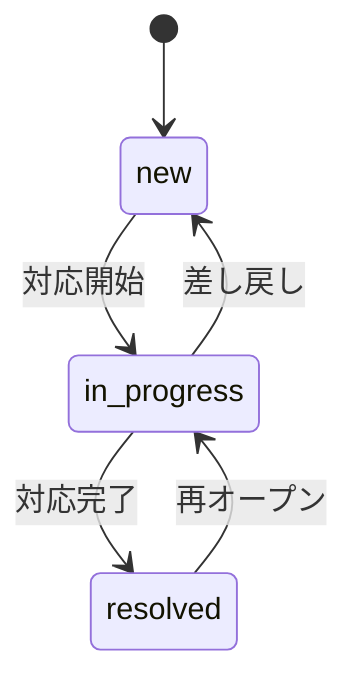
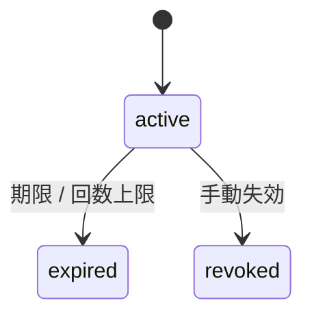
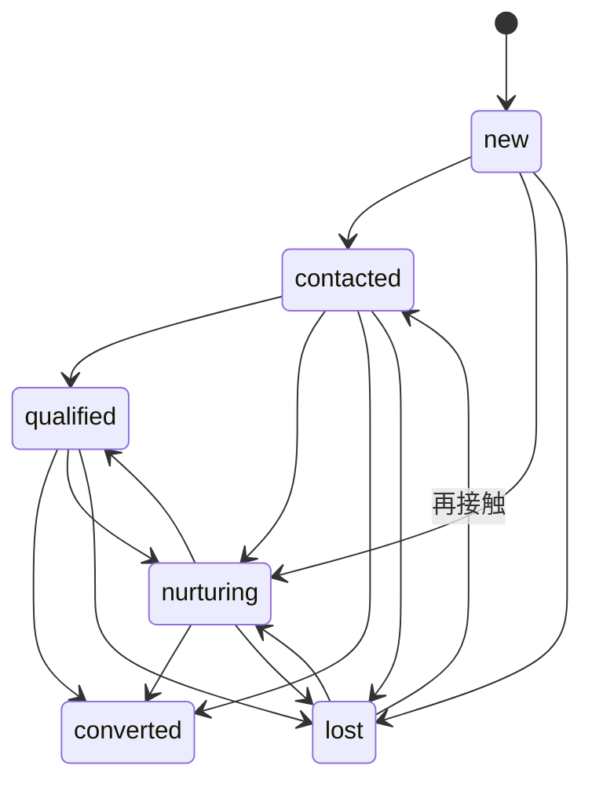
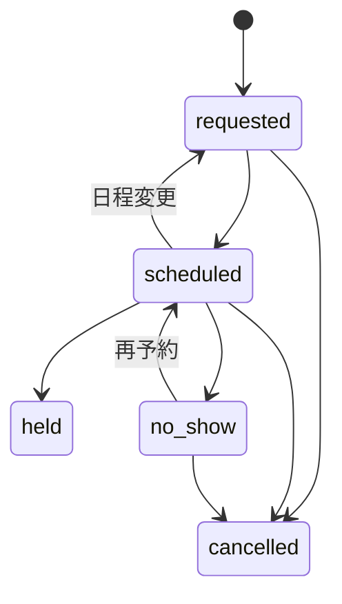
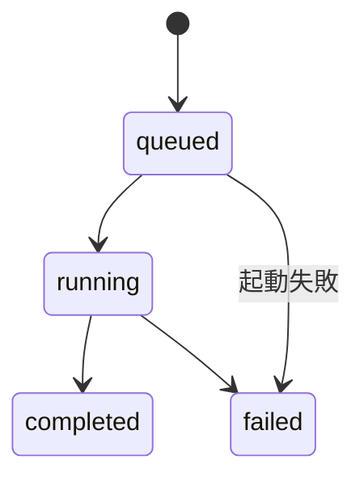
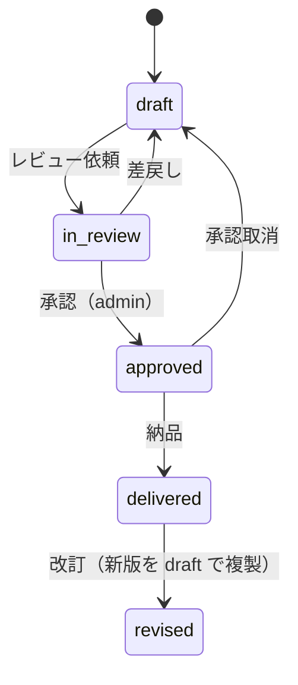
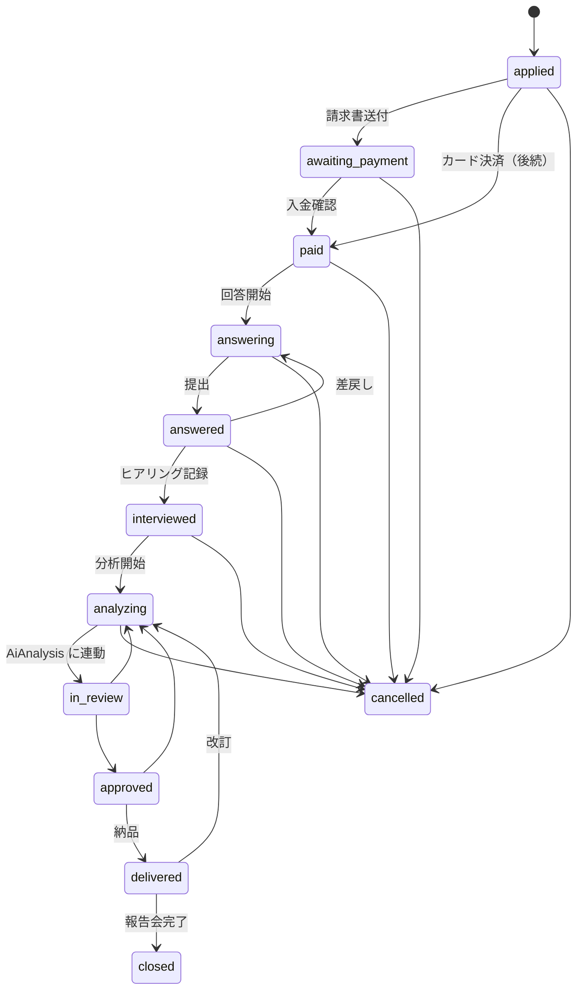
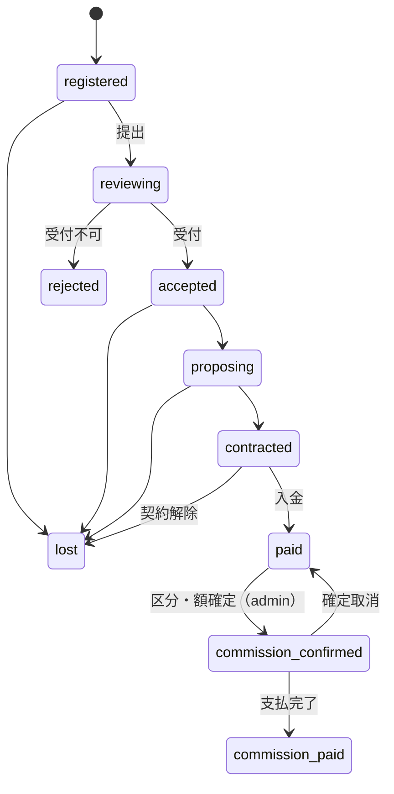
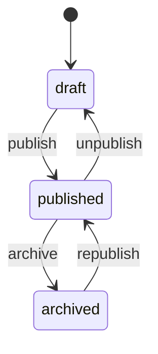

# 09-state-machine-spec.md — 状態遷移仕様テンプレート

## このセクションの目的

状態を持つエンティティの **状態一覧 / 遷移マトリクス / トリガー / 不正遷移時の挙動** を体系的に定義する。Service 層に集約する状態遷移関数の実装パターンも提供（DEV-01 §4「状態遷移の集約」参照）。

## 0-H. ハイブリッド編集ガイド（要点）

- 推奨モード: Hybrid（AI 整理 + Tech Lead レビュー）
- 人間確認必須: 遷移パスの妥当性、不正遷移時の挙動、監査ログ要件

---

## 1. 状態遷移を持つエンティティ一覧

PRD-01 §7 と整合させる。本テンプレート（パターン A）は単一運営・少数ロールが前提のため、Organization / Subscription / Invitation / Membership / Payment のようなマルチテナント SaaS 課金系のエンティティは存在しない（00_README §0-1・§2-2、PRD-01 §1）。標準エンティティ（Inquiry / Member）と、採用時のみ追加するオプションエンティティ（Post / AiJob / Order）を対象とする。参照実装は **Inquiry**（`apps/admin/src/lib/server/services/inquiries.ts`）。

<!-- TEMPLATE: PRD-01 §7 の状態一覧と対応 -->
| エンティティ | 状態数 | 主な遷移トリガー | 本サイトでの状況 |
| --- | --- | --- | --- |
| Inquiry | 3 | 対応開始・対応完了・差し戻し（管理者操作、PRD-01 §7）。**参照実装** | `apps/admin` に実装済み。ただし**書き込み元が無いため行が発生しない**（GOV-01 D-005） |
| Member | 2 | 利用停止・復帰（管理者操作、PRD-01 §7） | スキーマのみ。会員機能は未提供（GOV-01 D-007）。**有料診断の申込者ログインとして採用予定（Phase 3）** |
| DiagnosisToken | 3 | 期限到達（Cron）・失効（管理者 / パートナー） | **設計済み・未実装**（Phase 2b / 4） — §2-3 |
| Lead | 6 | 営業担当の操作・有料申込・案件成約 | 設計済み（Phase 2b） — §2-4 |
| BriefingRequest | 5 | 予約確定・実施・不参加・取消 | 設計済み（Phase 2b） — §2-5 |
| AiJob | 4 | 実行・完了・失敗（システム） | 設計済み（Phase 3） — §2-6 |
| AiAnalysis | 5 | 担当者の編集・レビュー依頼、管理者の承認、納品、改訂 | 設計済み（Phase 3） — §2-7 |
| Campaign | 3 | 営業担当の操作 | 設計済み（Phase 2b） — §2-7b |
| PaidDiagnosis | 12 | 申込・入金・回答・ヒアリング・分析・承認・納品・終了・取消 | 設計済み（Phase 3） — §2-8 |
| Deal | 10 | パートナーの登録・提出、当社の受付・確定、契約・入金・手数料 | 設計済み（Phase 4） — §2-9 |
| CommissionPayment | 3 | 支払予定・実行・取消 | 設計済み（Phase 4） — §2-10 |
| Partner | 2 | 契約停止・復帰 | 設計済み（Phase 4） — §2-11 |

Post / Order は**不採用**。お知らせは D1 ではなく Content Collections で持つため公開状態を持たず（GOV-01 D-008）、軽量 EC も採用していない。**診断プラットフォーム（BIZ-04）のエンティティは 2026-09-24 に設計を追加した（未実装）**。テーブル定義は DEV-07 §5・§6-1。

すべてのエンティティに共通する規約（§3）: `status` を書くのは `transition<Entity>()` 1 関数だけ、本体の UPDATE と `activity_log` の INSERT は同一 `db.batch()`、引数は `public_id` と `session`、遷移ごとに 1 ルート。パートナーが実行する遷移は `Session` の代わりに `PartnerSession`（DEV-02 §1-3）を受け取り、**`partner_id` の一致を遷移関数の入口で検証する**。

---

## 2. エンティティ別の状態遷移定義

### 2-1. Inquiry（参照実装）

`apps/admin/src/lib/server/services/inquiries.ts` に実装済み。他のリソースを起こす際の参照実装にあたる。ただし本サイトでは公開側からの書き込み経路を持たないため、実運用ではまだ動いていない（GOV-01 D-005）。

#### 2-1-1. 状態一覧

PRD-01 §7 / DEV-07 §4-3（`inquiries.status`）と一致させる。

| 状態 | 説明 |
| --- | --- |
| `new` | 新規受信・未対応 |
| `in_progress` | 対応中 |
| `resolved` | 対応完了 |

#### 2-1-2. 遷移マトリクス

| 遷移元 → 遷移先 | new | in_progress | resolved |
| --- | :---: | :---: | :---: |
| new | — | ✓ | ✗ |
| in_progress | ✓ | — | ✓ |
| resolved | ✗ | ✓ | — |

> 終端状態を持たない（`Confirmed` — 参照実装で確定）。誤って対応完了にした場合の復帰手段が無いと
> 運用が詰まるため、`resolved → in_progress` と `in_progress → new` を許可する。`new` への差し戻しは
> 担当を手放す操作であり、`handled_by` が NULL に戻る（§2-1-4）。

#### 2-1-3. 遷移トリガー

| 遷移 | トリガー | 実行者 |
| --- | --- | --- |
| new → in_progress | 対応開始（`POST /api/v1/inquiries/{id}/start`） | editor 以上 |
| in_progress → resolved | 対応完了（`POST /api/v1/inquiries/{id}/resolve`） | editor 以上 |
| in_progress → new | 差し戻し・担当解除（`POST /api/v1/inquiries/{id}/reopen`） | editor 以上 |
| resolved → in_progress | 再オープン（`POST /api/v1/inquiries/{id}/start`） | editor 以上 |

#### 2-1-4. 遷移時の副作用

| 遷移 | 副作用 |
| --- | --- |
| → in_progress | 操作者を `handled_by` に記録する（DEV-07 §4-3）。引き受けた者が担当になる |
| → new | `handled_by` を NULL に戻す（担当を手放す） |
| → resolved | `handled_by` は維持する。利用者への完了連絡を行うかは案件次第（**Open** — メール送信基盤が必要。PRD-03 FG-06 の受信時通知とは別の関心事） |

#### 2-1-5. Mermaid



### 2-2. Post（不採用）

お知らせは D1 ではなく Content Collections（`packages/content/news/`）で持つため、公開状態を持たない。git にコミットされた時点で公開され、取り下げはファイルの削除にあたる（GOV-01 D-008、DEV-06 §1-1）。

D1 の投稿テーブルへ切り替える場合は DEV-07 §5-1 の雛形から起こし、本節に状態遷移を定義する。

### 2-3. DiagnosisToken（Phase 2b / 4 — DEV-07 §5-5）

#### 2-3-1. 状態一覧

| 状態 | 説明 |
| --- | --- |
| `active` | 有効。`expires_at` 前かつ `use_count < max_uses` |
| `expired` | 期限到達、または回答回数の上限到達 |
| `revoked` | 営業担当 / パートナーが手動で失効させた（誤送付・顧客の依頼） |

#### 2-3-2. 遷移マトリクス

| 遷移元 → 遷移先 | active | expired | revoked |
| --- | :---: | :---: | :---: |
| active | — | ✓ | ✓ |
| expired | ✗ | — | ✗ |
| revoked | ✗ | ✗ | — |

終端 2 状態。再発行は新しいトークン行を作る（同じトークン文字列を復活させない）。

#### 2-3-3. 遷移トリガー

| 遷移 | トリガー | 実行者 |
| --- | --- | --- |
| active → expired | 日次 Cron（`expires_at < now`）、または回答保存で `use_count` が `max_uses` に達した瞬間（同一トランザクション内） | system |
| active → revoked | `POST /api/v1/campaigns/{id}/tokens/{token}/revoke`（admin 側）/ `POST /api/v1/partner/customers/{id}/tokens/{token}/revoke`（partner 側） | editor 以上 / 発行したパートナー |

#### 2-3-4. 副作用

| 遷移 | 副作用 |
| --- | --- |
| → expired / revoked | 以後 `GET /api/v1/diagnosis-tokens/{token}/` は 404（存在を明かさない）。既に保存済みの回答は残す |

#### 2-3-5. Mermaid



### 2-4. Lead（Phase 2b — DEV-07 §5-7）

#### 2-4-1. 状態一覧

| 状態 | 説明 |
| --- | --- |
| `new` | 連絡先入力直後。未連絡 |
| `contacted` | 当社から連絡済み（15 分解説の予約案内、メール返信など） |
| `qualified` | 商談化（提案・見積の対象）。案件管理（`deals` またはパートナー外の社内案件）へ |
| `nurturing` | 検討段階。セミナー・事例・LINE で接点維持 |
| `converted` | 契約成立、または有料診断購入 |
| `lost` | 失注・連絡不能・辞退 |

#### 2-4-2. 遷移マトリクス

| 遷移元 → 遷移先 | new | contacted | qualified | nurturing | converted | lost |
| --- | :---: | :---: | :---: | :---: | :---: | :---: |
| new | — | ✓ | ✗ | ✓ | ✗ | ✓ |
| contacted | ✗ | — | ✓ | ✓ | ✓ | ✓ |
| qualified | ✗ | ✓ | — | ✓ | ✓ | ✓ |
| nurturing | ✗ | ✓ | ✓ | — | ✓ | ✓ |
| converted | ✗ | ✗ | ✗ | ✗ | — | ✗ |
| lost | ✗ | ✓ | ✗ | ✓ | ✗ | — |

`converted` のみ終端。`lost` からは再接触で復帰できる。

#### 2-4-3. 遷移トリガー

| 遷移 | トリガー | 実行者 |
| --- | --- | --- |
| new → contacted | `POST /api/v1/leads/{id}/contact` | editor 以上 |
| → qualified | `POST /api/v1/leads/{id}/qualify` | editor 以上 |
| → nurturing | `POST /api/v1/leads/{id}/nurture` | editor 以上 |
| → converted | `POST /api/v1/leads/{id}/convert`。**有料診断の入金確認（PaidDiagnosis → paid）で自動的にも遷移**する | editor 以上 / system |
| → lost | `POST /api/v1/leads/{id}/lose` | editor 以上 |

#### 2-4-4. 副作用

| 遷移 | 副作用 |
| --- | --- |
| new →（任意） | 初回遷移で `owner_admin_user_id` が NULL なら操作者を担当に設定 |
| → converted | KPI-14〜16 の集計対象になる（集計は読み取りのみ） |

#### 2-4-5. Mermaid



### 2-5. BriefingRequest（Phase 2b — DEV-07 §5-8）

| 状態 | 説明 |
| --- | --- |
| `requested` | 申込あり（外部ツールで予約前、または予約 ID 未転記） |
| `scheduled` | 日時確定 |
| `held` | 実施済み。`outcome` 必須 |
| `no_show` | 不参加 |
| `cancelled` | 取消 |

| 遷移元 → 遷移先 | requested | scheduled | held | no_show | cancelled |
| --- | :---: | :---: | :---: | :---: | :---: |
| requested | — | ✓ | ✗ | ✗ | ✓ |
| scheduled | ✓（日程変更） | — | ✓ | ✓ | ✓ |
| held | ✗ | ✗ | — | ✗ | ✗ |
| no_show | ✗ | ✓（再予約） | ✗ | — | ✓ |
| cancelled | ✗ | ✗ | ✗ | ✗ | — |

トリガーは `POST /api/v1/briefing-requests/{id}/{schedule|hold|no-show|cancel}`（editor 以上）。`hold` は `outcome` を必須入力とし、`outcome = paid` なら Lead を `qualified` に、`outcome = service` なら同じく `qualified`、`nurture` なら `nurturing` に遷移させる（Lead の遷移関数を呼ぶ。同一 batch には載せない — 別エンティティの遷移は各自のトランザクション）。



### 2-6. AiJob（Phase 3 — DEV-07 §6-1）

| 状態 | 説明 |
| --- | --- |
| `queued` | 作成直後（`ctx.waitUntil()` で実行待ち） |
| `running` | プロバイダ呼び出し中 |
| `completed` | 生出力を `output_json` に保存済み |
| `failed` | エラー（`error` に理由） |

| 遷移元 → 遷移先 | queued | running | completed | failed |
| --- | :---: | :---: | :---: | :---: |
| queued | — | ✓ | ✗ | ✓ |
| running | ✗ | — | ✓ | ✓ |
| completed | ✗ | ✗ | — | ✗ |
| failed | ✗ | ✗ | ✗ | — |

すべて system トリガー（担当者は `POST /api/v1/paid-diagnoses/{id}/analyze` でジョブを**作る**だけ）。再実行は新しいジョブ行。`completed` の副作用: 後処理（根拠 ID 検証・候補外警告 — PRD-05 §4-3）を通した結果から `ai_analyses` を 1 行 `draft` で作る。`failed` の副作用: 担当者へメール通知（FG-06）。



### 2-7. AiAnalysis（Phase 3 — DEV-07 §6-1）

| 状態 | 説明 |
| --- | --- |
| `draft` | 担当者が編集中（`edited_json` を書き換え可） |
| `in_review` | レビュー依頼済み。編集不可 |
| `approved` | `admin` が承認。編集不可。PDF 生成可 |
| `delivered` | 顧客へ納品済み（Web 結果公開 + PDF） |
| `revised` | 納品後に改訂版として複製された旧版（読み取り専用の履歴） |

| 遷移元 → 遷移先 | draft | in_review | approved | delivered | revised |
| --- | :---: | :---: | :---: | :---: | :---: |
| draft | — | ✓ | ✗ | ✗ | ✗ |
| in_review | ✓（差戻し） | — | ✓ | ✗ | ✗ |
| approved | ✓（承認取消） | ✗ | — | ✓ | ✗ |
| delivered | ✗ | ✗ | ✗ | — | ✓ |
| revised | ✗ | ✗ | ✗ | ✗ | — |

| 遷移 | トリガー | 実行者 |
| --- | --- | --- |
| draft → in_review | `POST /api/v1/ai-analyses/{id}/request-review` | editor 以上 |
| in_review → draft | `POST …/reject`（理由必須） | admin |
| in_review → approved | `POST …/approve` | **admin のみ**。編集者と同一人物でも可（1 人運用） |
| approved → draft | `POST …/unapprove` | admin |
| approved → delivered | `POST …/deliver`（PDF 生成済みが前提。`reports` に承認版の行が無ければ 409） | admin |
| delivered → revised | `POST …/revise`。新しい `draft`（version + 1）を複製して作り、旧版を `revised` にする | editor 以上 |

副作用: `→ approved` で `approved_by` / `approved_at`、`→ delivered` で `delivered_at` と PaidDiagnosis を `delivered` に遷移、顧客へ納品メール（`ctx.waitUntil`）。**顧客・パートナーが閲覧できるのは `approved` 以降の版だけ**（PRD-08 §3-2）。



### 2-7b. Campaign（Phase 2b — DEV-07 §5-4）

`draft` → `active` → `closed`。`active → draft` は不可、`closed → active` は可（再開）。`closed` になるとそのキャンペーンのトークンは新規発行できない（既存トークンは有効期限まで生きる）。トリガー: `POST /api/v1/campaigns/{id}/{activate|close}`（editor 以上）。

### 2-8. PaidDiagnosis（Phase 3 — DEV-07 §5-9）

#### 2-8-1. 状態一覧

| 状態 | 説明 |
| --- | --- |
| `applied` | 申込受付（SCR-22 送信直後） |
| `awaiting_payment` | 請求書送付済み・入金待ち |
| `paid` | 入金確認済み。回答依頼メール送付 |
| `answering` | 申込者が詳細質問に回答中（途中保存あり） |
| `answered` | 回答提出済み |
| `interviewed` | 60 分ヒアリング実施済み（`interview_notes` 入力） |
| `analyzing` | 通常ロジック実行済み・AI 分析実行中または手入力中 |
| `in_review` | AiAnalysis がレビュー中 |
| `approved` | AiAnalysis 承認済み・PDF 生成待ち |
| `delivered` | 納品済み（Web 結果公開 + PDF）。報告会は日程列で管理 |
| `closed` | 結果報告会実施済み・完了 |
| `cancelled` | 申込取消（入金前）または返金対応済み（入金後。返金の可否は OPS-01 §4-3） |

#### 2-8-2. 遷移マトリクス

| 遷移元 → 遷移先 | awaiting_payment | paid | answering | answered | interviewed | analyzing | in_review | approved | delivered | closed | cancelled |
| --- | :---: | :---: | :---: | :---: | :---: | :---: | :---: | :---: | :---: | :---: | :---: |
| applied | ✓ | ✓（カード即時決済時） | ✗ | ✗ | ✗ | ✗ | ✗ | ✗ | ✗ | ✗ | ✓ |
| awaiting_payment | — | ✓ | ✗ | ✗ | ✗ | ✗ | ✗ | ✗ | ✗ | ✗ | ✓ |
| paid | ✗ | — | ✓ | ✗ | ✗ | ✗ | ✗ | ✗ | ✗ | ✗ | ✓ |
| answering | ✗ | ✗ | — | ✓ | ✗ | ✗ | ✗ | ✗ | ✗ | ✗ | ✓ |
| answered | ✗ | ✗ | ✓（差戻し） | — | ✓ | ✗ | ✗ | ✗ | ✗ | ✗ | ✓ |
| interviewed | ✗ | ✗ | ✗ | ✗ | — | ✓ | ✗ | ✗ | ✗ | ✗ | ✓ |
| analyzing | ✗ | ✗ | ✗ | ✗ | ✓（再ヒアリング） | — | ✓ | ✗ | ✗ | ✗ | ✓ |
| in_review | ✗ | ✗ | ✗ | ✗ | ✗ | ✓（差戻し） | — | ✓ | ✗ | ✗ | ✗ |
| approved | ✗ | ✗ | ✗ | ✗ | ✗ | ✓（承認取消） | ✗ | — | ✓ | ✗ | ✗ |
| delivered | ✗ | ✗ | ✗ | ✗ | ✗ | ✓（改訂） | ✗ | ✗ | — | ✓ | ✗ |
| closed | ✗ | ✗ | ✗ | ✗ | ✗ | ✗ | ✗ | ✗ | ✗ | — | ✗ |
| cancelled | ✗ | ✗ | ✗ | ✗ | ✗ | ✗ | ✗ | ✗ | ✗ | ✗ | — |

`closed` / `cancelled` が終端。`in_review` 以降は AiAnalysis の遷移に**連動**して動き、担当者が直接叩くルートは持たない（二重管理を避ける）。

#### 2-8-3. 遷移トリガー

| 遷移 | トリガー | 実行者 |
| --- | --- | --- |
| applied → awaiting_payment | `POST /api/v1/paid-diagnoses/{id}/invoice`（請求書送付を記録） | editor 以上 |
| applied / awaiting_payment → paid | `POST …/confirm-payment`（`paid_at` 必須） | admin |
| paid → answering | 申込者が最初の回答を保存（`PUT /api/v1/paid-diagnoses/{id}/answers/`） | Member 本人 |
| answering → answered | `POST /api/v1/paid-diagnoses/{id}/submit`（全必須問回答済みが条件。未回答があれば 422） | Member 本人 |
| answered → answering | `POST …/reopen-answers`（追加質問のため差し戻し） | editor 以上 |
| answered → interviewed | `POST …/mark-interviewed`（`interview_at` / `interview_notes` 必須） | editor 以上 |
| interviewed → analyzing | `POST …/analyze`（通常ロジック実行 → `consent_ai_at` があれば AiJob 作成、無ければ空の AiAnalysis `draft` を作る） | editor 以上 |
| analyzing → in_review | AiAnalysis `draft → in_review` に連動 | system |
| in_review → analyzing | AiAnalysis `in_review → draft` に連動 | system |
| in_review → approved | AiAnalysis `→ approved` に連動 | system |
| approved → analyzing | AiAnalysis `approved → draft` に連動 | system |
| approved → delivered | AiAnalysis `→ delivered` に連動 | system |
| delivered → analyzing | AiAnalysis `→ revised`（改訂開始）に連動 | system |
| delivered → closed | `POST …/close`（`report_meeting_at` 必須） | editor 以上 |
| → cancelled | `POST …/cancel`（理由必須。入金後は admin のみ） | editor 以上 / admin |

#### 2-8-4. 副作用

| 遷移 | 副作用 |
| --- | --- |
| → awaiting_payment | 申込者へ請求書メール（`ctx.waitUntil`） |
| → paid | `paid_at` 記録、申込者へ回答依頼メール（ログイン URL 付き）。紐づく Lead を `converted` に遷移 |
| → answered | 担当者へ通知メール |
| → analyzing | 通常ロジックの結果を `ai_analyses.edited_json` の初期値に埋める（PRD-05 §3） |
| → delivered | 申込者へ納品メール、`delivered_at` |
| → closed | 満足度アンケートの送付（任意・Phase 5） |
| → cancelled | 入金後なら返金処理を OPS-01 §4-3 に従い手動で行い、`notes` に記録 |

#### 2-8-5. Mermaid



### 2-9. Deal（Phase 4 — DEV-07 §5-15）

#### 2-9-1. 状態一覧

| 状態 | 説明 |
| --- | --- |
| `registered` | パートナーが案件登録（`planned_contribution` 宣言） |
| `reviewing` | パートナーが「当社へ提出」。当社が既存顧客・既存商談を照合中 |
| `accepted` | 当社が受付（既存顧客でない） |
| `rejected` | 既存顧客・既存商談・要件不備で受付不可（終端） |
| `proposing` | 当社がヒアリング・提案・見積中 |
| `contracted` | 顧客と契約。`contract_amount` 記録 |
| `paid` | 顧客から入金。`paid_amount` 記録 |
| `commission_confirmed` | 当社が区分・率・額を確定（`confirmed_contribution` / `commission_rate` / `commission_amount`） |
| `commission_paid` | 手数料支払完了（終端） |
| `lost` | 失注（終端） |

#### 2-9-2. 遷移マトリクス

| 遷移元 → 遷移先 | reviewing | accepted | rejected | proposing | contracted | paid | commission_confirmed | commission_paid | lost |
| --- | :---: | :---: | :---: | :---: | :---: | :---: | :---: | :---: | :---: |
| registered | ✓ | ✗ | ✗ | ✗ | ✗ | ✗ | ✗ | ✗ | ✓ |
| reviewing | — | ✓ | ✓ | ✗ | ✗ | ✗ | ✗ | ✗ | ✗ |
| accepted | ✗ | — | ✗ | ✓ | ✗ | ✗ | ✗ | ✗ | ✓ |
| proposing | ✗ | ✗ | ✗ | — | ✓ | ✗ | ✗ | ✗ | ✓ |
| contracted | ✗ | ✗ | ✗ | ✗ | — | ✓ | ✗ | ✗ | ✓（契約解除） |
| paid | ✗ | ✗ | ✗ | ✗ | ✗ | — | ✓ | ✗ | ✗ |
| commission_confirmed | ✗ | ✗ | ✗ | ✗ | ✗ | ✓（確定取消） | — | ✓ | ✗ |

#### 2-9-3. 遷移トリガー

| 遷移 | トリガー | 実行者 |
| --- | --- | --- |
| registered → reviewing | `POST /api/v1/partner/deals/{id}/submit`（`planned = sales_support` ならチェックリスト 9 項目すべて `checked_at` 必須。未達なら 422 で項目名を返す） | パートナー（自社案件のみ） |
| reviewing → accepted / rejected | `POST /api/v1/deals/{id}/accept` / `…/reject`（理由必須。`existing_customer_checked_at` を記録） | admin |
| accepted → proposing | `POST /api/v1/deals/{id}/start-proposal` | editor 以上 |
| proposing → contracted | `POST …/mark-contracted`（`contract_amount` / `contracted_at` / `service_category` 必須） | admin |
| contracted → paid | `POST …/mark-paid`（`paid_amount` / `customer_paid_at` 必須） | admin |
| paid → commission_confirmed | `POST …/confirm-commission`（`confirmed_contribution` 必須。率は区分から導出、額は `paid_amount × rate / 100` を Service 層が計算。パートナーへ確定通知メール） | **admin のみ** |
| commission_confirmed → paid | `POST …/unconfirm-commission`（`commission_payments` が `scheduled` 以外を持てば 409） | admin |
| commission_confirmed → commission_paid | CommissionPayment `→ paid` に連動（合計が `commission_amount` に達したとき） | system |
| → lost | `POST …/lose`（理由必須） | editor 以上 |

#### 2-9-4. 副作用

| 遷移 | 副作用 |
| --- | --- |
| → reviewing | 当社へ通知メール |
| → accepted / rejected | パートナーへ通知メール（rejected は理由付き） |
| → commission_confirmed | `confirmed_by` / `confirmed_at`、`commission_payments` に `scheduled` 行を 1 件作成（支払予定日 = 入金月の翌月末 — GOV-02 TBD-16 の推奨案） |
| → lost | `lost_reason` |

#### 2-9-5. Mermaid



### 2-10. CommissionPayment（Phase 4 — DEV-07 §5-18）

`scheduled` → `paid`（`POST /api/v1/commission-payments/{id}/mark-paid`、admin、`paid_at` / `invoice_no` 必須）、`scheduled` → `cancelled`（admin、理由必須）。`paid` / `cancelled` は終端。`→ paid` の副作用: 同一 Deal の `paid` 合計が `commission_amount` に達したら Deal を `commission_paid` に遷移。

### 2-11. Partner（Phase 4 — DEV-07 §5-12）

`active` ⇄ `suspended`（admin）。`→ suspended` の副作用: `partner_sessions` の該当パートナー全ユーザーの行を削除し即時失効（Member §2-13-4 と同じ）。`suspended` 中は `partner_users` のログイン不可、既存トークンは有効期限まで生きる（顧客が回答途中でも完了できる）。

### 2-12. Order（軽量 EC 採用時のみ — PRD-03 FG-05）

軽量 EC（FG-05）は**不採用**のため該当なし。有料診断のカード決済（GOV-02 TBD-27）を Stripe で行う場合も、`orders` は作らず `paid_diagnoses.payment_method = card` と Webhook からの `→ paid` 遷移で表現する（DEV-10 §2）。

### 2-13. Member（標準同梱 — PRD-03 FG-07）

DEV-07 §4-6（`members.status`）と一致させる。ロール階層を持たない単一種別のため、遷移は有効／利用停止の 2 状態のみ（PRD-01 §1-2・§7）。

> **本サイトでは未提供。** スキーマとログイン画面は残しているが、会員登録の導線がなく `members` に行は発生しない（GOV-01 D-007、GOV-02 TBD-01）。**Phase 3 で有料診断の申込者ログインとして採用する**（DEV-11 §7）。

#### 2-13-1. 状態一覧

| 状態 | 説明 |
| --- | --- |
| `active` | 有効（ログイン可） |
| `suspended` | 利用停止（ログイン不可。既存セッションも失効させる） |

#### 2-13-2. 遷移マトリクス

| 遷移元 → 遷移先 | active | suspended |
| --- | :---: | :---: |
| active | — | ✓ |
| suspended | ✓ | — |

#### 2-13-3. 遷移トリガー

| 遷移 | トリガー | 実行者 |
| --- | --- | --- |
| active → suspended | 規約違反・退会申請等による利用停止操作 | admin |
| suspended → active | 停止解除操作 | admin |

#### 2-13-4. 遷移時の副作用

| 遷移 | 副作用 |
| --- | --- |
| → suspended | `member_sessions` の該当行を全削除してログイン中のセッションを即時失効させる（DEV-02 §1-2、DEV-07 §4-7） |
| → active | 副作用なし（再ログインで新規セッションが発行される） |

---

## 3. Service 層での状態遷移関数実装パターン

状態遷移は DEV-01 §4「状態遷移の集約」の原則に従い、エンティティごとに単一の遷移関数へ集約する（PHP のクラスベース StateMachine ではなく、Service 層の関数としてまとめる）。

### 3-1. 設計方針

| 項目 | 方針 |
| --- | --- |
| 配置 | `apps/admin/src/lib/server/services/<entity>.ts` に `transition<Entity>(...)` 関数としてエクスポート |
| 責務 | 遷移可否の判定、遷移実行（D1 更新）、副作用の呼び出し |
| 状態の保管 | D1 の `status` 等 `TEXT` カラム。TypeScript 側は文字列リテラルのユニオン型（例 `InquiryStatus`）で表現し、Service 層で検証する（`casts()` 相当の専用機構はない） |
| 不正遷移 | `@app/server-kit/http` の `InvalidStateTransitionError`（409）を throw する。エンティティごとに独自のエラークラスを作らない |
| 副作用 | イベントバス／Listener に相当する仕組みはない。遷移関数内から直接関数呼び出し（メール送信等）。レスポンスをブロックする重い副作用は `ctx.waitUntil()` で後処理化する（DEV-01 §4、DEV-05 §4） |

### 3-2. 実装例

実装済みの参照実装をそのまま示す。抜粋ではなく実際のコードであり、テスト
（`apps/admin/tests/unit/inquiries.test.ts`）が下記の性質を検証している。

```typescript
// apps/admin/src/lib/server/services/inquiries.ts

export type InquiryStatus = "new" | "in_progress" | "resolved";

const TRANSITIONS: Record<InquiryStatus, InquiryStatus[]> = {
  new: ["in_progress"],
  in_progress: ["resolved", "new"],
  resolved: ["in_progress"],
};

export function allowedTransitions(status: InquiryStatus): InquiryStatus[] {
  return TRANSITIONS[status] ?? [];
}

export async function transitionInquiry(db: DbClient, publicId: string, to: InquiryStatus, session: Session) {
  const row = await findInquiryRow(db, publicId);
  const from = row.status;

  if (!allowedTransitions(from).includes(to)) {
    throw new InvalidStateTransitionError("Inquiry", from, to);
  }

  const [updatedRows] = await db.batch([
    db
      .update(inquiries)
      .set({
        status: to,
        handledBy: to === "in_progress" ? session.adminUserId : to === "new" ? null : row.handledBy,
        updatedAt: new Date().toISOString(),
      })
      .where(eq(inquiries.id, row.id))
      .returning(),
    activityLogInsert(db, {
      logName: "inquiry",
      description: `Inquiry ${from} -> ${to}`,
      subjectType: "Inquiry",
      subjectId: row.id,
      event: `inquiry.${to}`,
      causerId: session.adminUserId,
      properties: { from, to },
    }),
  ]);

  return toPublicInquiry(updatedRows[0]!);
}
```

この形が守っている規約は 4 つ。

- **引数は `publicId`（ULID）で、内部の整数 `id` は関数の外に出ない**（DEV-07 §1、DEV-05 §2）
- **`status` を書くのはこの関数だけ**。他のどの関数も `status` を代入しない（§3-1）
- **本体の UPDATE と `activity_log` の INSERT を `db.batch()` で 1 トランザクションにする**。
  遷移が拒否された場合はログも残らない（§3-4）
- **副作用は遷移関数の中に書く**。`handled_by` の割り当て/解放のように「その遷移固有の
  もの」は、汎用の仕組みでは表現できない（DEV-05 §2）

エラー型は `@app/server-kit/http` の `InvalidStateTransitionError`（409）を使う。エンティティごとに
独自のエラークラスを定義しない — API の応答形は `toErrorResponse` が一元的に決める（DEV-04 §5）。

### 3-3. API Route からの呼び出し

遷移関数が Service 層にあるため、Astro API Route は入出力ハンドリングのみを担う（DEV-01 §5「レイヤー責務」）。
**遷移ごとに 1 ルート**とし、`status` への PATCH では表現しない — 正当な遷移が URL 空間に現れ、
遷移ごとに異なるロールを設定できる。

```typescript
// apps/admin/src/pages/api/v1/inquiries/[id]/start.ts
import type { APIContext } from "astro";
import { env } from "cloudflare:workers"; // Astro.locals.runtime.env は v6 で削除済みの旧 API（DEV-05 §1）
import { createDb } from "@app/schema/client";
import { jsonItem, toErrorResponse } from "@app/server-kit/http";
import { requireRole, requireSession } from "$lib/server/auth/session";
import { transitionInquiry } from "$lib/server/services/inquiries";

export async function POST({ params, cookies }: APIContext): Promise<Response> {
  try {
    const db = createDb(env.DB);
    const session = await requireSession(cookies, db); // D1 セッション検証（DEV-02 §1-1）
    requireRole(session, "editor");

    return jsonItem(await transitionInquiry(db, params.id!, "in_progress", session));
  } catch (error) {
    return toErrorResponse(error);
  }
}
```

> D1 の `env.DB.batch()` は Eloquent の `DB::transaction()` のように任意ロジックを包むものではないが、
> **渡したステートメント列は 1 つの SQL トランザクションとして実行され、途中で失敗すれば全体が
> ロールバックされる**（Cloudflare D1 公式ドキュメント）。複数テーブルの更新はこれでまとめる。

### 3-4. 監査ログとの連携

状態遷移は監査ログの必須記録操作（DEV-05 §9-1）。専用パッケージは使わず、遷移関数内から
`activity_log` テーブル（DEV-01 §2 / DEV-07 §4-4）へ INSERT する。単一運営前提のため
`organization_id` は持たない（DEV-07 §4-4）。

書き込みヘルパーは**未実行のステートメントを返す**。呼び出し側が `db.batch()` に載せられるように
するためで、これがログと変更を同一トランザクションに置く仕組みそのものである。

```typescript
// apps/admin/src/lib/server/services/activity-log.ts

// 返り値は未実行の INSERT。呼び出し側が db.batch() に入れる
export function activityLogInsert(db: DbClient, entry: ActivityLogEntry) {
  return db.insert(activityLog).values({
    logName: entry.logName ?? null,
    description: entry.description,
    subjectType: entry.subjectType ?? null,
    subjectId: entry.subjectId ?? null,
    event: entry.event ?? null,
    causerType: entry.causerType ?? "AdminUser",
    causerId: entry.causerId ?? null,
    properties: entry.properties ? JSON.stringify(entry.properties) : null,
    batchId: null,
  });
}
```

> 削除も記録する。対象行が消えるため、`properties` に**後から特定できるだけの情報**を入れる
> （`media` なら R2 のキー、`inquiries` なら公開 ID とメールアドレス）。

---

## 4. UI 表示

### 4-1. 状態バッジの標準色

<!-- TEMPLATE: 標準エンティティ（Inquiry / Member）とオプションエンティティ（Post / AiJob / Order）の状態をカテゴリ化 -->

| 状態カテゴリ | 色 | アイコン例 |
| --- | --- | --- |
| Published / Resolved / Fulfilled / Completed / Paid | 緑 | check-circle |
| Draft / New / Pending / Queued | 黄 | clock |
| In Progress / Processing | 青 | arrow-path |
| Archived / Cancelled | グレー | archive-box |
| Failed | 赤 | exclamation-circle |

### 4-2. 状態遷移ボタンの表示

遷移可否の判定はコンポーネント側で個別実装せず、§3-2 の `allowedTransitions()` の結果を Astro ページ（または API Route）側で取得し、Svelte アイランドに props として渡して描画する。

```svelte
<!-- Svelte island: 許可された遷移のみボタン表示 -->
<script lang="ts">
  import type { InquiryStatus } from "$lib/server/services/inquiries";

  let { allowedTransitions, onSelect }: { allowedTransitions: InquiryStatus[]; onSelect: (status: InquiryStatus) => void } = $props();
</script>

{#each allowedTransitions as nextStatus}
  <button onclick={() => onSelect(nextStatus)}>{nextStatus}</button>
{/each}
```

遷移の確認は共通の確認モーダルに集約する（ブラウザ標準ダイアログ `confirm()` は使わない —
DEV-01 §3 / DEV-06 §5）。管理画面では shadcn-svelte の `AlertDialog` 等、標準の確認 UI コンポーネントを使う（`npx shadcn-svelte add alert-dialog`）。

```svelte
<script lang="ts">
  import * as AlertDialog from "$lib/components/ui/alert-dialog";
  import type { InquiryStatus } from "$lib/server/services/inquiries";

  // 公開 ID（ULID）。内部の整数 id はクライアントに渡らない（DEV-07 §1）
  let { inquiryId }: { inquiryId: string } = $props();
  let pendingAction: string | null = $state(null);

  async function applyTransition(): Promise<void> {
    if (!pendingAction) return;
    // 遷移ごとに 1 ルート。`status` への PATCH は使わない（§3-3）
    await fetch(`/api/v1/inquiries/${inquiryId}/${pendingAction}`, { method: "POST" });
    pendingAction = null;
  }
</script>

<AlertDialog.Root open={pendingStatus !== null}>
  <AlertDialog.Content>
    <AlertDialog.Title>状態を変更しますか？</AlertDialog.Title>
    <AlertDialog.Action onclick={applyTransition}>変更する</AlertDialog.Action>
  </AlertDialog.Content>
</AlertDialog.Root>
```

---

## 5. テスト戦略

テストは Vitest（DEV-01 §1）。**workerd 上で実行する**（`@cloudflare/vitest-plugin`）ため、
D1 も `db.batch()` も本物が動く — モックしない（DEV-03 §3）。実装済みの参照実装は
`apps/admin/tests/unit/inquiries.test.ts`。「全ての遷移パターンにテストがあること」を目標に維持する。

### 5-1. Unit Test

遷移そのものだけでなく、**拒否された遷移が監査ログを残さないこと**まで確認する。`db.batch()` が
1 トランザクションであるという前提を検証しているのはこのテストである。

```typescript
import { env } from "cloudflare:workers";
import { InvalidStateTransitionError } from "@app/server-kit/http";
import { describe, expect, it } from "vitest";
import { allowedTransitions, transitionInquiry } from "../../src/lib/server/services/inquiries";

it("allows only the moves the state machine declares", async () => {
  expect(allowedTransitions("new")).toEqual(["in_progress"]);
  const row = await arrive();

  await expect(transitionInquiry(db, row.publicId, "resolved", session)).rejects.toBeInstanceOf(InvalidStateTransitionError);
  await expect(transitionInquiry(db, row.publicId, "in_progress", session)).resolves.toMatchObject({ status: "in_progress" });
});

it("assigns the handler on start and releases it on reopen", async () => {
  const row = await arrive();

  await transitionInquiry(db, row.publicId, "in_progress", session);
  expect((await findRow(row.id)).handledBy).toBe(session.adminUserId);

  await transitionInquiry(db, row.publicId, "new", session);
  expect((await findRow(row.id)).handledBy).toBeNull();
});

it("leaves no audit entry when the transition is rejected", async () => {
  const row = await arrive();
  await transitionInquiry(db, row.publicId, "resolved", session).catch(() => {});

  expect(await db.select().from(activityLog)).toHaveLength(0);
});
```

### 5-2. データセットでマトリクス全網羅

遷移が増えたら個別テストではなくこちらを増やす。`allowedTransitions()` を真とせず、
**マトリクス（§2-N-2）を真として**関数の側を検証する — 両方が同じ定数を見ていては何も検証できない。

```typescript
it.each([
  ["new", "in_progress", true],
  ["new", "resolved", false],
  ["in_progress", "new", true],
  ["in_progress", "resolved", true],
  ["resolved", "in_progress", true],
  ["resolved", "new", false],
])("transition matrix: %s -> %s (allowed=%s)", async (from, to, allowed) => {
  const row = await arrive({ status: from as InquiryStatus });
  const call = transitionInquiry(db, row.publicId, to as InquiryStatus, session);

  if (allowed) await expect(call).resolves.toMatchObject({ status: to });
  else await expect(call).rejects.toBeInstanceOf(InvalidStateTransitionError);
});
```

---

## 6. 状態遷移の可視化

### 6-1. Mermaid 図の標準形



### 6-2. ドキュメント記載順序

各エンティティについて、以下の順序で記載：

1. 状態一覧表
2. 遷移マトリクス表
3. 遷移トリガー（操作主体）
4. 副作用（イベント・通知）
5. Mermaid 状態遷移図

---

## 7. 記入時チェックポイント

- 状態を持つエンティティが PRD-01 §7 と整合しているか
- 各エンティティの状態値が DEV-07 の `status` カラム定義（`inquiries` / `members`、採用時は `posts` / `orders` / `ai_jobs` 等）と一致しているか
- Organization / Subscription / Invitation / Membership / Payment のようなマルチテナント SaaS 課金系のエンティティが紛れ込んでいないか（本テンプレは単一運営が前提。00_README §0-1・§2-2）
- 遷移マトリクスで「不可能な遷移」が明示されているか
- 遷移トリガーが明確か（system / admin / editor / Webhook）
- 副作用が網羅されているか（メール通知、関連エンティティへの影響）
- 監査ログとの連携が組み込まれているか（`organization_id` のようなテナント列を持たない `activity_log` の実スキーマ、DEV-07 §4-4 と一致しているか）
- 状態遷移関数が Service 層に集約され、API Route から呼ばれる構造になっているか（引数は公開 ID と `session` のみ。内部の整数 id を関数の外に出していないか）
- 遷移ごとに 1 ルートになっているか（`status` への PATCH で表現していないか — §3-3）
- 不正遷移時の挙動（例外 / エラー画面）が明示されているか
- 採用しないオプションエンティティ（Post / AiJob / Order）の節が、不要な場合に削除されているか
