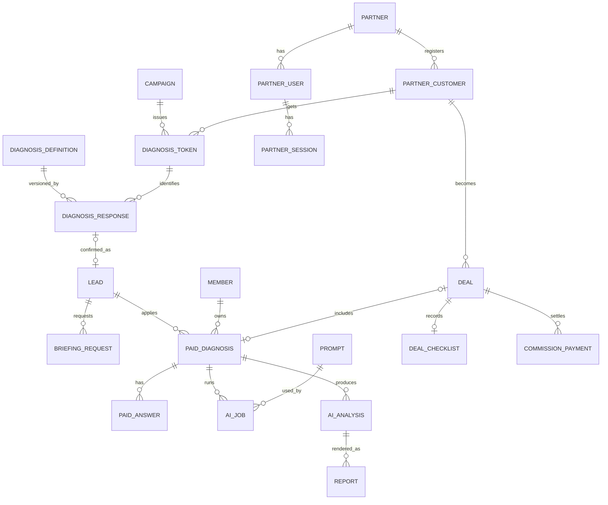

# 11-diagnosis-platform-impact.md — 診断プラットフォーム 技術影響調査

## このセクションの目的

BIZ-04 の 4 モード・4 フェーズを **現行構成に載せた場合の影響範囲と選択肢** を整理する。詳細な技術設計（DEV-04 の API 一覧、DEV-07 のテーブル定義、DEV-09 の状態遷移）は事業・商品設計の承認後に行う。本書は「何が再利用でき、何を変え、どこに判断が要るか」までに留める。

---

## 1. 現行構成（事実）

| 項目 | 現状 | 出典 |
| --- | --- | --- |
| 診断の実装 | `apps/public/src/diagnoses/<slug>/`（データ・判定・UI・クライアント JS）。全ページ prerender。**サーバー処理ゼロ** | PRD-06 §1 |
| D1 / KV / R2 | **サイト全体で未使用**。`packages/schema/migrations/` 未生成（`pnpm db:generate` 未実行、GOV-02 TBD-03） | DEV-01 §0-1 |
| 認証 | `apps/admin`: AdminUser（実装済み、未運用）。`apps/public`: Member（`/login/`・`/mypage/`、コードあり・未提供・noindex） | PRD-03 FG-01 / FG-07 |
| 管理画面 | ログインとダッシュボード骨組みのみ。Inquiry / Media は API のみ | PRD-04 §3-2 |
| メール | Resend REST API を `fetch` で直接（`lib/server/services/contact.ts`） | DEV-01 §0-1 |
| Bot 対策 | Turnstile（`/api/contact/`） | — |
| 計測 | GA4 ページビューのみ | PRD-06 §5 |
| テスト | 診断に関する単体・E2E なし | PRD-06 §5 |
| 外部連携 | Resend、Turnstile、GA4、Google Fonts、Material Symbols。決済・予約・LLM・PDF は無し | DEV-10 |
| Cloudflare | Workers（public / admin 別 Worker）、D1・KV の ID は production に設定済み（public 側）、admin 側は `replace-with-*`、R2 未設定 | `wrangler.jsonc` |

## 2. 再利用できる実装

| 資産 | 再利用の仕方 |
| --- | --- |
| `scoring.ts`（両診断） | 純関数。**Worker 側（営業版・パートナー版の回答保存時の再計算、有料版の引き継ぎ）で同じ関数を import** し、判定を二重実装しない。`CLAUDE.md` の「診断間で判定を共有しない」原則とは矛盾しない（同じ診断の関数をクライアントとサーバーで共有するだけ） |
| `data.ts`（両診断） | 診断定義の正本のまま。`version` を追加し、公開時に D1 `diagnosis_definitions` へスナップショットを保存する（回答の版追跡 — PRD-05 §9） |
| 結果ページ（`ResultPage.astro` + `result.js`） | v2 の表示ブロック追加。営業版・パートナー版も **同じ prerender 済み結果ページ** を使い、トークン付きの場合だけクライアント JS が保存 API を呼ぶ（§4-1） |
| `routes.ts` | URL の正本。トークン用のクエリ名（`t` / `p` / `from` / `v`）をここに定数追加 |
| `DiagnosisLayout` / `diagnosis.css` | 有料版の回答画面・パートナー版の結果画面でも使う |
| `/contact/` の事前入力 | `message` 定型の拡張で 15 分解説・サービス相談の引き継ぎに流用（Phase 2） |
| `lib/server/services/contact.ts` の Resend 送信 | 通知メール（15 分解説申込、有料申込、パートナー完了通知）の送信関数として共通化 |
| `packages/server-kit` の session / lockout / password | パートナー認証・申込者認証に流用（テーブル・クッキーは別にする — §7） |
| `apps/admin` のログイン・セッション検証・`inquiries` Service（参照実装） | 管理画面の新規リソース（ADM-11〜14）は `scaffold` スキルで Inquiry に倣って作る |
| `activity_log` | 承認・区分確定・納品・同意の監査ログ |
| `members` / `member_sessions` | 有料申込者ログインの受け皿として採用可能（TBD-01 の答えになる） |

## 3. 変更が必要な実装（Phase 別）

### 3-1. Phase 2a（無料版 v2 — D1 不要）

| 変更 | 場所 | 影響 |
| --- | --- | --- |
| 診断定義 v2（質問・配点・追加文章・CTA・`version`） | `diagnoses/<slug>/data.ts`, `types.ts` | 型の拡張。既存 ID は不変 |
| 判定 v2（割合比較・該当なし・強み・判定理由） | `diagnoses/business/scoring.ts`、`ai-dx/scoring.ts`（バランス注記・要確認フラグ） | 単体テスト新設 |
| 結果 URL の `v` パラメータ | `questions.js`, `result.js` | `v` 無しは v1 描画を維持 |
| 結果ページ v2 の表示ブロック・タイプ別 CTA | `ResultPage.astro` | ロック UI の削除 |
| 相互誘導 `?from=` | 結果ページ・イントロ | — |
| GA4 イベント | `questions.js`, `result.js`, イントロ | `gtag("event", …)`。GA4 側でコンバージョン設定 |
| フォーカス管理・radiogroup | `questions.js` | `fixing-accessibility` スキルで検証 |
| `/contact/` の `message` 定型拡張・`inquiry-type` の追加候補 | `contact.astro`, `inquiry-types.ts` | 選択肢を足すと `contactSchema` は変わらない（文字列） |
| ポータル（`/diagnosis/`）に有料診断・15 分解説の案内 | `pages/diagnosis/index.astro`, `diagnoses-catalog.ts` | — |
| グローバルナビへの診断リンク | `components/Header.astro` | PRD-06 P-16 |
| E2E（結果ページ prerender、v1 URL 互換、CTA 遷移） | `apps/public/tests/e2e/diagnosis.spec.ts`（新設） | `CLAUDE.md` の記述と実態を一致させる |
| `CLAUDE.md` Diagnoses 節 | 版・CTA データ化の規約追記 | — |

### 3-2. Phase 2b（営業版 — D1 初回利用）

| 変更 | 場所 | 影響 |
| --- | --- | --- |
| **初回 `pnpm db:generate`**（TBD-03）。その前に Member の要否（TBD-01）を決める | `packages/schema` | 以後テーブル削除はマイグレーション |
| テーブル: `campaigns`, `diagnosis_tokens`, `diagnosis_responses`, `diagnosis_definitions`, `leads`, `briefing_requests` | DEV-07 §3-7 | §5 |
| API（public）: `POST /api/v1/diagnosis-responses/`（回答保存）、`POST /api/v1/leads/`（連絡先入力 = 確定紐付け）、`GET /api/v1/tokens/{t}/`（トークン検証・入口文言） | `apps/public/src/pages/api/v1/` | 末尾スラッシュ必須（DEV-04 §1） |
| 結果ページのクライアント JS: トークンがあれば回答をサーバーへ送る（`ctx.waitUntil` 不要、単純 POST） | `questions.js` | prerender は維持（API のみ SSR） |
| イントロの入口文言のキャンペーン別切替 | イントロは prerender のまま、**クライアント JS がトークン API から文言を取得して差し替える**か、`/diagnosis/<slug>/` を SSR に変えるかの選択（§4-1） | — |
| 管理画面 ADM-12（キャンペーン・トークン発行・送付リスト・結果一覧） | `apps/admin` | `scaffold` + `admin-design` |
| `/api/contact/` の送信レコードに診断情報を付与（D1 `inquiries` への INSERT を同時に始めるか — TBD-02） | `contact.ts` | D-005 の見直し |
| プライバシーポリシー・特定電子メール法対応の文面 | `privacy-policy.astro`、メールテンプレ | 法務確認（TBD-13, TBD-18） |
| `X-Robots-Tag: noindex` 対象の追加（`/api/v1/`） | `middleware.ts` | — |

### 3-3. Phase 3（有料版 MVP）

| 変更 | 場所 | 影響 |
| --- | --- | --- |
| 有料版質問定義（48 問）とロジック | `apps/public/src/diagnoses/pro/`（新モジュール。無料版と共有しない原則を踏襲） | 純関数・テスト |
| 申込者認証 | `members` / `member_sessions` を採用（`/login/`・`/mypage/` を有効化・デザイン適用） | TBD-01 が「使う」で決着 |
| テーブル: `paid_diagnoses`, `paid_answers`, `ai_jobs`, `prompts`, `ai_analyses`, `reports` | DEV-07 | §5 |
| AI 連携 | `apps/admin` に Vercel AI SDK（`ai` + `@ai-sdk/anthropic`）。**パッケージ追加は承認後** | DEV-10 §5 |
| PDF 生成 | Cloudflare Browser Rendering（`@cloudflare/puppeteer`、DEV-01 §2）で HTML → PDF、R2 に保存 | R2 バインディング・バケット作成（admin 側。public 側にも配信用に必要かは §6-5） |
| 管理画面 ADM-11（案件・AI 分析確認・編集・承認・納品）、ADM-14（定義・プロンプト版） | `apps/admin` | 本格的な管理画面の初運用 |
| 申込・決済 | 請求書払い（手動）から開始。Stripe は後続（TBD-27） | DEV-10 §2 |
| 結果報告会の管理 | `paid_diagnoses` の状態と日程列で足りる。予約ツールは 15 分解説と共通 | — |
| メール | 申込受付、入金確認、回答依頼、納品通知、報告会案内 | Resend テンプレ関数 |

### 3-4. Phase 4（パートナー版）

| 変更 | 場所 | 影響 |
| --- | --- | --- |
| パートナー認証 | `partner_users` / `partner_sessions`（新系統）または `members` にロール列（§7） | DEV-02 §1-2 の分離原則 |
| テーブル: `partners`, `partner_users`, `partner_sessions`, `partner_customers`, `deals`, `deal_checklists`, `commission_payments` | DEV-07 | §5 |
| public 側画面 SCR-25〜29（`/partner/…`） | `apps/public`（SSR。prerender しない） | `BaseLayout` とは別の簡易レイアウト（`DiagnosisLayout` 拡張）が現実的 |
| 顧客専用トークン `?p=`（回答を顧客に紐付け、同意画面を先に出す） | 診断イントロ・設問 | 2b のトークン機構を拡張 |
| 簡易 PDF（共同名義） | Phase 3 の PDF 基盤を流用 | — |
| 管理画面 ADM-13（パートナー・案件・区分確定・手数料） | `apps/admin` | — |
| 認可: **すべての Service で `partner_id` を条件に含める**。テストで他パートナーの ID を渡すと 404 になることを固定 | `apps/public/src/lib/server/services/partner/*` | DEV-02 §3 の `requireRole` に相当する `requirePartnerScope` |

## 4. public / admin への影響と設計上の選択

### 4-1. 公開側の prerender と動的処理の共存

| 選択肢 | 内容 | 長所 | 短所 |
| --- | --- | --- | --- |
| **A（推奨）** | 診断ページは prerender のまま。トークン検証・入口文言・回答保存はクライアント JS が `/api/v1/…/` を呼ぶ | 現行 URL・SEO・配信構成を変えない。一般公開版は API を一切呼ばない | 入口文言の差し替えが一瞬遅れる（初期表示は共通文言）。JS 無効環境ではトークン機能が働かない（診断自体は動く） |
| B | `?t=` があるときだけ SSR にする | 文言差し替えが確実 | 同一 URL で prerender と SSR を切り替えられない（Astro はページ単位）。トークン用に別 URL（`/diagnosis/<slug>/go/?t=`）を切ると URL が増える |
| C | 営業版・パートナー版の入口を別 URL（`/d/<token>/`）にして SSR、そこから既存の設問ページへリダイレクト | 入口文言・同意画面を SSR で確実に出せる。既存ページは無変更 | URL が 1 つ増える（短縮 URL としてはむしろ有利）。リダイレクトで `?t=` を引き継ぐ |

推奨は **A + C の併用**: 短い入口 URL（`/d/<token>/`）を SSR で用意し（メール・フォームに貼る URL はこれ）、キャンペーン別文言・同意を出したうえで既存の設問ページへ `?t=` 付きで送る。設問・結果ページは prerender のまま、JS が保存 API を呼ぶ。

### 4-2. 管理側

管理画面はここで初めて本格運用に入る。影響:

- AdminUser の発行（`pnpm --filter admin seed`）と運用開始。ロール設計（§7）。
- `apps/admin` の `wrangler.jsonc` の `replace-with-*`（D1 / KV / R2）を実値化（TBD-04）。D1 の `database_id` は public と同一に。
- Phase 2b でも ADM-12（キャンペーン）が必要なので、**管理画面の初運用は Phase 2b** になる。Inquiry の D1 保存（TBD-02）を同時に始めると、既存の Inquiry API・画面が活きる。

### 4-3. ESLint 境界・パッケージ構成

- `apps/public` ↔ `apps/admin` の相互 import は禁止（DEV-01 §1）。判定関数（`scoring.ts`）を admin 側（有料版の引き継ぎ、パートナー結果の再計算）でも使うなら、**`packages/diagnosis`（新共有パッケージ）へ移す** 判断が要る。DEV-01 §1 の「2 つ目の利用者が現れてから作る」方針に合致するのは Phase 3 以降。Phase 2 では public 内で完結する。
- `packages/content` に診断定義を置く案は不採用（定義は TypeScript でロジックと対のため）。

## 5. データモデル候補（論理レベル。物理定義は DEV-07 へ）

| テーブル候補 | 主な列 | Phase | 備考 |
| --- | --- | --- | --- |
| `diagnosis_definitions` | slug, version, definition_json, hash, published_at | 2b | 回答の版追跡 |
| `campaigns` | public_id, channel（form / email / partner / other）, name, owner_admin_user_id, diagnosis_slug, intro_copy, sent_at, status | 2b | 営業内部情報 |
| `diagnosis_tokens` | token（乱数、UNIQUE）, campaign_id, recipient_ref（宛先の内部 ID。任意）, partner_customer_id（4）, expires_at, clicked_at, max_uses | 2b | **会社名・メールを持たない** |
| `diagnosis_responses` | public_id, definition_id, mode, token_id, answers_json, scores_json, result_id, level, flags_json, lead_id（確定後）, created_at | 2b | 一般公開版は保存しない |
| `leads` | public_id, company, name, email, phone, source_response_id, consent_privacy_at, consent_share_partner_at, campaign_id, owner_admin_user_id, status | 2b | 連絡先入力時に生成 = 確定紐付け |
| `briefing_requests` | lead_id, response_id, preferred_at, scheduled_at, held_at, outcome（service / paid / nurture）, notes | 2 | 外部予約ツール採用時は最小限 |
| `paid_diagnoses` | public_id, member_id, lead_id, deal_id, status, applied_at, payment_method, paid_at, consent_ai_at, consent_partner_share_at, interview_at, report_at, definition_id | 3 | 状態遷移は DEV-09 に追加 |
| `paid_answers` | paid_diagnosis_id, question_id, option_index, text | 3 | 記述式は text |
| `ai_jobs` | type, paid_diagnosis_id, prompt_id, prompt_version, model_id, input_json, output_json, tokens_in, tokens_out, duration_ms, status, error, created_by | 3 | DEV-07 §3-4 既定を拡張 |
| `prompts` | prompt_id, version, system, user_template, output_schema_json, constraints_json, status | 3 | DEV-07 §3-4 |
| `ai_analyses` | paid_diagnosis_id, ai_job_id, raw_json, edited_json, status（draft / in_review / approved / delivered / revised）, edited_by, approved_by, approved_at, delivered_at, version | 3 | PRD-05 §11 |
| `reports` | paid_diagnosis_id, ai_analysis_id, kind（paid / partner_light）, r2_key, version, generated_at | 3 / 4 | R2 |
| `partners` | public_id, name, contact, status, contract_signed_at | 4 | 会社 |
| `partner_users` / `partner_sessions` | 認証系統（§7） | 4 | — |
| `partner_customers` | partner_id, company, contact, industry, size, consent_share_at, created_by | 4 | パートナー間で分離 |
| `deals` | public_id, partner_id, partner_customer_id, planned_contribution, confirmed_contribution, commission_rate, contract_amount, paid_amount, commission_amount, status, confirmed_by, confirmed_at | 4 | 確定は admin |
| `deal_checklists` | deal_id, item_key（9 項目）, checked_at, note | 4 | 20% 要件 |
| `commission_payments` | deal_id, amount, invoice_no, paid_at | 4 | インボイス対応は TBD-16 |

KV: トークンのクリック回数制限・API のレート制限補助（既存 lockout と同じ仕組み）。R2: PDF（`reports/<public_id>/<version>.pdf`、非公開、署名付き配信 — DEV-10 §4-3）。Cron: 期限切れトークン・セッションの削除、AI 月次上限のリセット。

## 6. 個別論点

### 6-1. 認証（詳細は §7）

Member（既存・未提供）を「有料申込者」に充てるのが最小。パートナーは別系統。

### 6-2. 権限

- admin 側: `admin` / `editor` + 診断担当者。3 ロール目を足すか、`editor` を「診断担当者」と読み替えるかは TBD-29。DEV-02 §2 のマトリクスに ADM-11〜14 を追加する。
- public 側: パートナーは「自社スコープ」の所有者チェックのみ（ロール階層なし）。申込者は本人チェックのみ。

### 6-3. 決済

DEV-01 §2 の標準は Stripe（`nodejs_compat` 必要 — 既に有効）。Phase 3 は **請求書払い（手動消込）** で開始し、カード決済は後続（TBD-27）。Stripe 採用時は DEV-10 §2 のパターン（Checkout Session + Webhook + `stripe_event_logs`）をそのまま使える。

### 6-4. PDF 生成

DEV-01 §2 の標準は Cloudflare Browser Rendering（`@cloudflare/puppeteer`）。結果ページと同じ HTML/CSS を印刷用レイアウトで描画し、R2 に保存。Browser Rendering の利用枠・課金は Cloudflare 側の現行プランで確認する（TBD-30）。代替: HTML のまま「印刷して PDF 保存」を顧客に案内する（MVP の最小案）。

### 6-5. メール通知

既存の Resend 直叩き関数をテンプレート関数化（DEV-10 §3-4 の「テンプレートを介さない送信禁止」に合わせる）。営業メール自体の送信は **このシステムでは行わない**（送付は営業担当が手動 / 別ツール。システムはトークン URL と追跡だけを担う — `Assumed`、TBD-13 と関連）。

### 6-6. 日程予約

DEV-01 §2 に予約ツールの標準は無い。選択肢: (a) 外部予約ツール（Google カレンダーの予約スケジュール等）へのリンク + 結果 URL を備考に自動入力、(b) 自前フォーム（希望日時 3 候補を送信 → 手動確定）。**MVP は (a)** を推奨（BIZ-04 §16-2）。ツール名の選定は TBD-25 で GOV-01 に記録し、DEV-01 §2 に追記する。

### 6-7. GA4

`gtag("event", …)` の追加（PRD-07 §4）。GA4 側でコンバージョン（`diagnosis_complete`、`diagnosis_cta_click`）を設定。営業版・パートナー版の追跡は GA4 ではなく D1（トークン単位）で行い、GA4 には `mode` パラメータだけ送る（個人特定を GA4 側に持ち込まない）。

### 6-8. Cloudflare 設定

- public: D1・KV は本番 ID 設定済み。R2 は PDF 配信を public 側で行うなら追加（または admin 側から署名付き URL を発行して配信 — DEV-10 §4-3 の Open）。
- admin: `replace-with-*` の実値化（TBD-04）。R2 バケット作成。
- Browser Rendering バインディング（`browser`）を admin 側に追加（Phase 3）。
- Cron Triggers（`triggers.crons`）を admin 側に追加（Phase 2b 以降）。
- WAF / Rate Limiting Rules（DEV-02 §7）: `/api/v1/diagnosis-responses/` と `/api/v1/leads/` に対して設定（TBD-31）。

## 7. 認証系統の選択

| 主体 | 選択肢 | 推奨 | 理由 |
| --- | --- | --- | --- |
| 有料申込者 | (a) `members` を使う (b) 新設 | **(a)** | 既存コード・テーブル・`/mypage/` がそのまま使える。TBD-01 が「使う」で決着する。`members` に `kind` 列は足さず、申込者 = Member とする |
| ビジネスパートナー | (a) `members` に `partner_id` を足して兼用 (b) `partner_users` / `partner_sessions` を新設 | **(b)** | 信頼レベルとデータ範囲が申込者と異なる（他社顧客の情報を扱う）。DEV-02 §1-2 の「別系統」の考え方を適用し、クッキー名（`partner_session`）・テーブル・Service を分ける。`packages/server-kit` のトークン生成・TTL・ロックアウトは共有 |
| 診断担当者（当社） | (a) `admin_users.role` に `analyst` 追加 (b) `editor` を流用 | **(b) で開始** | テンプレ標準の 2 ロールを崩さない。承認は `admin`、編集は `editor`（= 診断担当者）で権限マトリクスが自然に成立する。3 ロール目は運用で不足が出てから（TBD-29） |

パートナー版の顧客（回答者）はログインしない（トークン）。

## 8. セキュリティ・個人情報

| 観点 | 方針 |
| --- | --- |
| トークン | 32 バイト CSPRNG（`packages/server-kit` の session token 生成を流用）。URL に会社名・メールを含めない。期限・回数上限 |
| 紐付け | `diagnosis_responses.lead_id` は連絡先入力 + 同意時のみ設定。管理画面の一覧は `lead_id` が無い行を企業名と結合表示しない |
| パートナー分離 | Service の全クエリに `partner_id` 条件。単体テストで越境アクセスが 404 になることを固定（DEV-03 §3-1「E2E で到達できない条件」に該当） |
| AI 送信 | 会社名・個人名を送らない。記述式は担当者のマスキング確認（PRD-05 §8） |
| 入力検証 | Zod（`drizzle-zod` 導出）。回答 JSON は定義の版に対して質問 ID・選択肢範囲を検証 |
| レート制限 | 保存 API は Turnstile 不要（回答だけで個人情報なし）だが、トークン無しの POST は拒否。連絡先入力（`leads`）は既存フォームと同じく Turnstile + ハニーポット |
| ログ | 承認・区分確定・納品・同意を `activity_log` へ。request_id 付与 |
| 保持期間 | 匿名回答: 2 年（集計用）、リード: 1 年、有料診断: 契約終了後 1 年、AI 入出力: 同上（`Assumed`、TBD-18 と一緒に確定） |
| ポリシー・規約 | プライバシーポリシー（取得情報・利用目的・第三者提供（パートナー・AI ベンダー）・保存期間）、有料診断規約、パートナー規約を追加（TBD-18） |

## 9. URL 互換性・SEO・移行

| 項目 | 方針 |
| --- | --- |
| 既存 URL | 変更なし。結果タイプ ID・レベル ID 不変（PRD-06 §4） |
| 結果 URL の v1 パラメータ | `v` 無しは v1 描画。E2E で固定 |
| 新規 URL | `/d/<token>/`（入口）、`/diagnosis/pro/…`、`/partner/…`、`/mypage/diagnosis/…`、`/api/v1/…`。末尾スラッシュ必須 |
| noindex | `/d/`、`/partner/`、`/mypage/`、`/api/v1/`、`/diagnosis/pro/apply/` 以降を `X-Robots-Tag: noindex`（middleware の `PRIVATE_ROUTES` 拡張）。結果ページの noindex 化は TBD-23 |
| sitemap.xml | 有料診断案内（`/diagnosis/pro/`）を追加。手書き運用（TBD-06） |
| データ移行 | 無し（現行は回答を保存していない） |
| ロールアウト | 2a は通常デプロイ。2b は `pnpm db:generate` → `db:migrate:remote` → デプロイ。DEV-08 §7 の完了ゲート |

## 10. テスト方針（DEV-03 に追加する内容）

| 対象 | 種別 | 内容 |
| --- | --- | --- |
| 判定 v2 | 単体 | 全回答組み合わせのシミュレーション（出現分布・Z 出現率・同点率）、該当なし除外、強み・判定理由 |
| 結果 URL 互換 | E2E | v1 URL（`v` 無し）と v2 URL の描画、パラメータ欠落時の非表示 |
| prerender | E2E | 全結果ページが props 付きで描画される（`CLAUDE.md` の主張をテストで裏付ける） |
| 保存 API | 単体（workerd） | トークン検証、期限、回数、`lead_id` 無しでの企業名非結合 |
| パートナー分離 | 単体 | 越境 ID で 404 |
| 状態遷移 | 単体 | `paid_diagnoses`・`ai_analyses`・`deals` の遷移関数。承認前納品不可、入金前の手数料確定不可 |
| AI 後処理 | 単体 | モック出力で根拠 ID 検証・候補外警告・スキーマ検証 |
| 管理画面 | E2E | ログイン → 承認 → 納品の主要フロー |

## 11. 概算工数を左右する要因

数値は出さない（要件確定前）。大きい順に:

1. **管理画面の初運用**（ADM-11〜14 の 4 画面 + AdminUser 運用）。テンプレの管理画面は骨組みのみで、一覧・詳細・フォームの型から作る。
2. **有料版の質問 48 問・ロジック・PDF テンプレート**（コンテンツ制作を含む）。
3. **AI 分析の後処理・編集 UI**（生出力 → 編集版 → 承認版の 3 段階管理）。
4. **パートナー版の画面群と分離テスト**（SCR-25〜29 + 認証系統）。
5. **法務・ポリシー改訂の待ち時間**（TBD-13・17・18 は実装と並行できるが、公開はブロックされる）。
6. **無料版 v2 の配点シミュレーションと文章の最終稿**（実装より確認の往復が時間を取る）。
7. **初回 `db:generate` 前の Member 要否決定**（TBD-01。決めないと 2b に入れない）。

小さくできる要因: 15 分解説の予約を外部ツールにする、決済を請求書払いにする、PDF を「印刷して保存」から始める、2a を先行リリースして 2b を分ける。

## 12. 記入時チェックポイント

- 新しい技術・ライブラリの **選定** を本書で行っていないか（DEV-01 §2 の範囲内の選択肢提示に留める）
- 既存 URL を変える提案が混ざっていないか
- 判定関数を診断間で共有する提案になっていないか（同一診断のクライアント／サーバー共有のみ）
- パートナー分離・確定紐付け・AI 送信の 3 点がテストで担保される設計か
