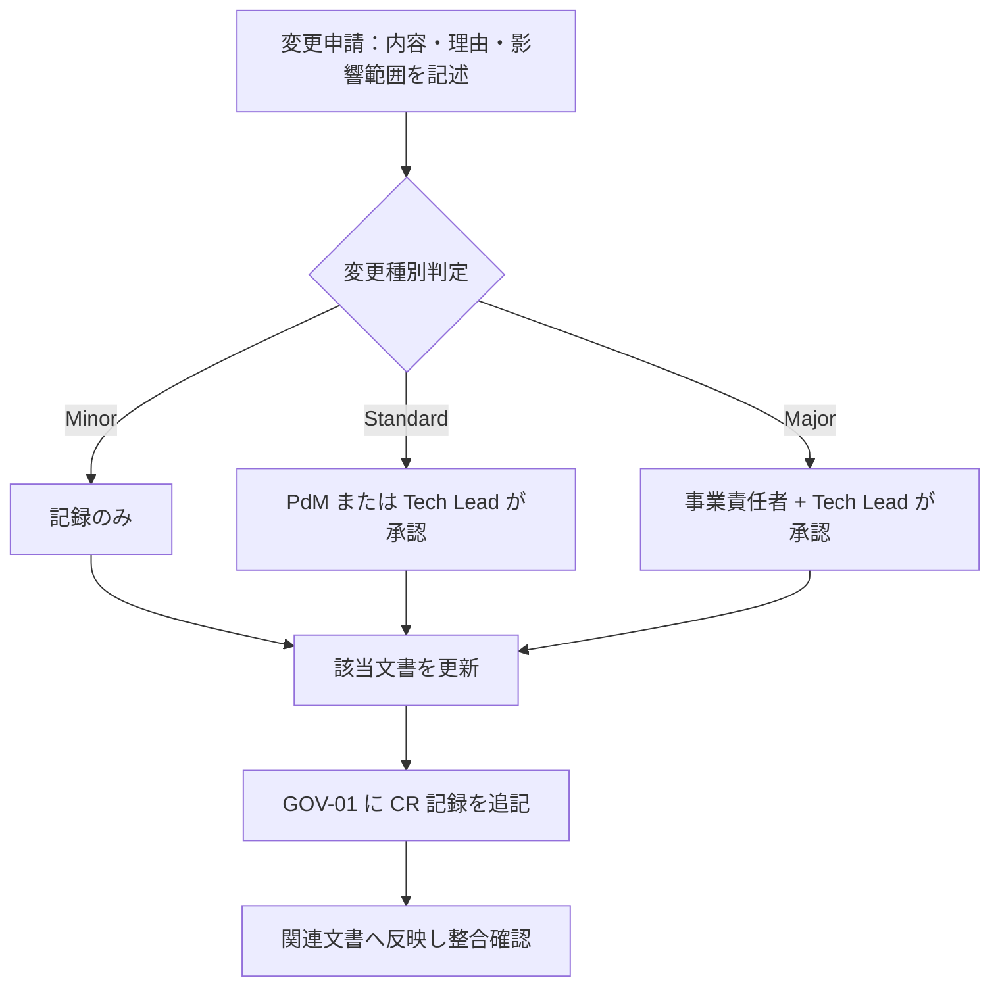

# 01-decision-log.md — 意思決定ログテンプレート

## このセクションの目的

重要な意思決定を時系列で記録し、背景と影響範囲を追跡できるようにする。**全フェーズ横断・プロジェクト開始初日から運用する**。

## 0-H. ハイブリッド編集ガイド（要点）

- 推奨モード: Human-first または Hybrid
- 人間確認必須: 本当に決定済みか、決定者の明確性、影響範囲の漏れ

---

## 1. 凡例

| 区分 | 内容 |
| --- | --- |
| D-ID | 決定 ID（D-NNN 連番） |
| 日付 | 決定確定日（YYYY-MM-DD） |
| カテゴリ | 事業 / プロダクト / 設計 / 運用 |
| 決定内容 | 確定した方針・選択 |
| 背景 | 議論の発端、選択肢、選定理由 |
| 影響範囲 | 反映が必要な文書・コード |
| 決定者 | 最終承認者 |
| 関連 TBD | 解決された GOV-02 の TBD-ID |

---

## 2. 決定ログ

<!-- TEMPLATE: プロジェクトの重要決定を時系列で追加。会議メモから AI に候補抽出させる -->
以下は 2026-09-09 の基盤移行にあたって確定したもの。移行前（旧リポジトリ）の決定は記録が残っていない。

### D-001：Astro 5 完全静的サイトから本テンプレートへ移行する

| 項目 | 内容 |
| --- | --- |
| 日付 | 2026-09-09 |
| カテゴリ | 設計 |
| 決定内容 | naturaling.jp を Astro 5 の完全静的構成から、Astro SSR + Cloudflare Workers のチームテンプレート（pnpm workspaces モノレポ）へ移行する |
| 背景 | 旧構成は単一パッケージ + 手書き Worker。テンプレートに寄せることで管理画面・D1・共有パッケージを将来利用できるようにする |
| 影響範囲 | リポジトリ全体、DEV-01・DEV-04〜06・DEV-08 |
| 決定者 | 藤本 翔太 |
| 関連 TBD | — |

### D-002：公開済み URL を変更しない

| 項目 | 内容 |
| --- | --- |
| 日付 | 2026-09-09 |
| カテゴリ | 設計 |
| 決定内容 | ディレクトリ形式 + 末尾スラッシュ（`/about/`）を維持し、`trailingSlash: "always"` を設定。旧 `.html` URL からの 301（`public/_redirects` 9本）も維持する |
| 背景 | サイトは既にインデックス済みで、URL 変更は SEO の後退にあたる |
| 影響範囲 | `astro.config.mjs`、`public/_redirects`、`public/sitemap.xml`、DEV-06 §1-2 |
| 決定者 | 藤本 翔太 |
| 関連 TBD | — |
| 副作用 | `trailingSlash` は API ルートとリダイレクトにも効くため、内部リンクは全て末尾スラッシュが必須になった |

### D-003：公開ページは prerender する

| 項目 | 内容 |
| --- | --- |
| 日付 | 2026-09-09 |
| カテゴリ | 設計 |
| 決定内容 | `output: "server"` は維持しつつ、公開ページ全てに `export const prerender = true` を付ける |
| 背景 | 静的ページを毎リクエスト Worker に通す理由がない。加えて動的ルートでは `getStaticPaths()` が黙って無視されるため必須 |
| 影響範囲 | `apps/public/src/pages/**`、DEV-01 §0-1、DEV-06 §1-2 |
| 決定者 | 藤本 翔太 |
| 関連 TBD | — |

### D-004：Markdown プロセッサに unified を明示する

| 項目 | 内容 |
| --- | --- |
| 日付 | 2026-09-09 |
| カテゴリ | 設計 |
| 決定内容 | Astro 7 の既定（Sätteri）ではなく `@astrojs/markdown-remark` の `unified()` を使う |
| 背景 | Sätteri は rehype プラグインを実行せず、`rehype-external-links` が効かなくなる。公開済み記事の出力を変えないことを優先した |
| 影響範囲 | `apps/public/astro.config.mjs`、DEV-06 §1-1 |
| 決定者 | 藤本 翔太 |
| 関連 TBD | — |

### D-005：お問い合わせは当面メール送信のみとする

| 項目 | 内容 |
| --- | --- |
| 日付 | 2026-09-09 |
| カテゴリ | プロダクト |
| 決定内容 | 旧実装（Turnstile 検証 + Resend 送信）をそのまま移植し、D1 には保存しない。エンドポイントは `/api/contact/`、レスポンス封筒は `{ ok, error }` を維持 |
| 背景 | 移行時は現行動作の再現を優先。DB 保存は後からマイグレーション 1 本で追加できる |
| 影響範囲 | `apps/public/src/pages/api/contact.ts`、`lib/server/services/contact.ts`、DEV-04 §1・§5-3b |
| 決定者 | 藤本 翔太 |
| 関連 TBD | TBD-02 |

### D-006：公開側の `/api/v1/inquiries` を削除する

| 項目 | 内容 |
| --- | --- |
| 日付 | 2026-09-09 |
| カテゴリ | 設計 |
| 決定内容 | テンプレート同梱の公開側お問い合わせ API を削除する。管理側（`apps/admin`）の一覧・状態遷移 API は残す |
| 背景 | `/api/contact/` と役割が重複する未認証の書き込み口が 2 つ開いており、マイグレーション未生成の状態では 500 を返すだけだった。DB 保存が必要になった際はルートを復活させず `contact.ts` に INSERT を足す |
| 影響範囲 | `apps/public/src/pages/api/v1/`、`lib/server/services|validation/inquiries.ts`、DEV-04 §5-3b |
| 決定者 | 藤本 翔太 |
| 関連 TBD | TBD-02 |

### D-007：管理画面・D1・会員機能は削除せず温存する

| 項目 | 内容 |
| --- | --- |
| 日付 | 2026-09-09 |
| カテゴリ | プロダクト |
| 決定内容 | `apps/admin`、D1 スキーマ、公開側の会員ログインをいずれも削除しない。会員ログイン画面は `X-Robots-Tag: noindex` で検索結果から伏せる |
| 背景 | 将来 D1 を使う可能性があるため。テーブルは未使用・空であれば後から `DROP TABLE` のマイグレーションで消せる |
| 影響範囲 | `apps/public/src/middleware.ts`、`packages/schema`、00_INTAKE TBD-01 |
| 決定者 | 藤本 翔太 |
| 関連 TBD | TBD-01 |

### D-008：お知らせは Content Collections（`packages/content/news/`）で管理する

| 項目 | 内容 |
| --- | --- |
| 日付 | 2026-09-09 |
| カテゴリ | 設計 |
| 決定内容 | お知らせは開発者が git で更新する Markdown とし、D1 + 管理画面にはしない。テンプレート同梱の `articles` コレクションはこれに置き換えて削除 |
| 背景 | 更新者が開発者である限り Content Collections が適切で、D1 の行読み取りも発生しない（DEV-06 §1-1）。ファイル名がそのまま公開 URL になるため、公開後のリネームは禁止 |
| 影響範囲 | `packages/content/`、`apps/public/src/content.config.ts`、DEV-06 §1-1 |
| 決定者 | 藤本 翔太 |
| 関連 TBD | — |

以下は 2026-09-24 の診断プラットフォーム設計（BIZ-04）で確定したもの。

### D-009：業務課題かんたん診断 v2 の判定は「満点に対する割合」で比較する

| 項目 | 内容 |
| --- | --- |
| 日付 | 2026-09-24 |
| カテゴリ | プロダクト |
| 決定内容 | 9 タイプの生点をそれぞれの到達可能最大点で割った課題度（%）で主タイプ・副次タイプ・レーダーチャートを決める。同点処理（関心タイプ優先 → 固定順）と結果 ID・URL は現行を維持。配点の最終値は実装時の全組み合わせシミュレーションで確認する |
| 背景 | 現行はタイプごとの最大点が 3〜7 点とばらつき、B・I がほぼ出ない（PRD-06 P-01）。配点の再調整だけで揃えると選択肢の意味が歪む |
| 影響範囲 | PRD-07 §1-3、`src/diagnoses/business/scoring.ts`・`data.ts`・`result.js`（Phase 2a） |
| 決定者 | 藤本 翔太 |
| 関連 TBD | TBD-21 |

### D-010：無料診断の結果ページから参考価格を撤去する

| 項目 | 内容 |
| --- | --- |
| 日付 | 2026-09-24 |
| カテゴリ | 事業 |
| 決定内容 | 結果ページの「従来 ○万円 → 弊社 ○万円〜」（`pricing`）を表示しない。CSS ぼかしのロックも廃止し、文章は一般的な改善方向として全文公開する。サービスページで価格を公開するかは別途判断（BIZ-03 §2 の記入と一体） |
| 背景 | 「正式な概算費用は無料で確定しない」という無料/有料の境界（BIZ-04 §5-2）と矛盾する。ぼかしは HTML に全文が残り、価格が意図せず公開状態だった（PRD-06 P-09） |
| 影響範囲 | PRD-07 §0-2、`ResultPage.astro`・`data.ts` の `pricing` / `*Locked`（Phase 2a） |
| 決定者 | 藤本 翔太 |
| 関連 TBD | TBD-24 |

### D-011：15 分オンライン結果解説の予約は外部予約ツールへのリンクで行う

| 項目 | 内容 |
| --- | --- |
| 日付 | 2026-09-24 |
| カテゴリ | プロダクト / 設計 |
| 決定内容 | 自前の予約画面（SCR-30）は作らない。結果ページの CTA は `PUBLIC_BRIEFING_BOOKING_URL`（ビルド変数）へ遷移し、結果 URL と回答 ID を備考の初期値として渡す。申込・実施の記録は管理画面（`briefing_requests`）で行う。**ツール名は未定（TBD-25 を「手段は決定・ツール名は未定」に更新）** |
| 背景 | 予約カレンダーの自作は MVP で過剰（BIZ-04 §15）。ツール名が決まり次第 DEV-01 §2・DEV-10 §8-6 に追記する |
| 影響範囲 | PRD-04 SCR-30 欠番、DEV-08 §8-3、DEV-10 §8-6、DEV-11 §6-6 |
| 決定者 | 藤本 翔太 |
| 関連 TBD | TBD-25（一部） |

### D-012：4 モード・全フェーズの詳細設計を先に揃え、正仕様承認後にフェーズ順（2a → 2b → 3 → 4）で実装する

| 項目 | 内容 |
| --- | --- |
| 日付 | 2026-09-24 |
| カテゴリ | プロダクト |
| 決定内容 | Phase 2a だけを先行実装する案（TBD-19）を採らず、PRD-01〜04・PRD-09・DEV-02/03/04/07/08/09/10・OPS-01/02 を診断プラットフォーム全体で埋めてから GOV-01 §4 の正仕様承認を行う。実装は承認後にフェーズ順。Phase 2 は 2a（D1 不要）と 2b（D1 初回利用）に分ける |
| 背景 | 別 PC・別担当への引き継ぎと、後続フェーズの手戻り（認証系統・テーブル設計・PDF 基盤）を避けるため。00_README §9 の生成順序どおり |
| 影響範囲 | 上記文書一式、DEV-11 §12（WBS）、`docs/WIP-diagnosis-platform-tasks.md`（ブランチ限定の進行メモ） |
| 決定者 | 藤本 翔太 |
| 関連 TBD | TBD-19 |

### D-013：既存の Member を有料診断の申込者ログインとして使う

| 項目 | 内容 |
| --- | --- |
| 日付 | 2026-09-24 |
| カテゴリ | プロダクト / 設計 |
| 決定内容 | `members` / `member_sessions`、`/login/`・`/mypage/` を削除せず、Phase 3 で有料診断の申込者ログインに充てる。単独の会員登録画面は作らず、申込（`POST /api/v1/paid-diagnoses/`）が Member を作る。パスワードはメールのリンクで初回設定。初回 `pnpm db:generate` はこの前提で行う |
| 背景 | 既存コード・テーブル・画面をそのまま活かせる（DEV-11 §7）。パートナーは別系統（DEV-02 §1-3） |
| 影響範囲 | PRD-03 FG-07、DEV-07 §3-6、DEV-09 §2-13、`apps/public/src/pages/{login,mypage}` のデザイン適用（Phase 3） |
| 決定者 | 藤本 翔太 |
| 関連 TBD | TBD-01 |

### D-014：有料診断の対外名称は「中小企業向け IT・DX現状診断」

| 項目 | 内容 |
| --- | --- |
| 日付 | 2026-09-24 |
| カテゴリ | 事業 |
| 決定内容 | 対外名称を「中小企業向け IT・DX現状診断」とする。内部呼称「完全版」、slug `pro`、URL `/diagnosis/pro/` は名称と独立に維持 |
| 背景 | 対象と内容が名称だけで伝わる（GOV-02 TBD-14 の推奨案） |
| 影響範囲 | BIZ-04 §6-4、PRD-04 SCR-21/22、OPS-01 §1（規約名）、PRD-09 タイトル |
| 決定者 | 藤本 翔太 |
| 関連 TBD | TBD-14 |

### D-015：有料診断の価格はモニター 30,000 円 → 本価格 50,000 円（税別）

| 項目 | 内容 |
| --- | --- |
| 日付 | 2026-09-24 |
| カテゴリ | 事業 |
| 決定内容 | Phase 3 のモニター 5〜10 社は 30,000 円（税別）。運用時間（目標 3 時間 / 社）を実測したうえで本価格 50,000 円（税別）へ移行する。価格は `PAID_DIAGNOSIS_PRICE_YEN`（環境変数）で持ち、申込時に `paid_diagnoses.amount` へスナップショットする |
| 背景 | BIZ-04 §6-4 の検討幅 30,000〜50,000 円。モニター獲得と実測を優先 |
| 影響範囲 | BIZ-03 §2（転記）、BIZ-04 §6-4・§11、DEV-08 §8-3、OPS-01 §1 |
| 決定者 | 藤本 翔太 |
| 関連 TBD | TBD-15 |

## 3. 記録すべき意思決定の種別

- 顧客セグメントの変更
- MVP スコープの追加 / 除外
- 価格改定・無料層設計の変更
- 認証・権限・セキュリティ方針の変更
- データモデル（PRD-01）の変更
- 技術スタックの変更（DEV-01 §1 確定スタック・§2 機能別標準・§3 不採用リストの変更はすべてここに記録）
- AI 機能採否の変更
- インフラ・デプロイ戦略の変更
- 契約条件・SLA の変更

---

## 4. 正仕様承認ゲート

### 4-1. 正仕様の定義

「正仕様」とは、関係者が合意し、開発・運用・契約の判断基準として参照できる状態の文書セットを指す。必須文書の status が `approved` に達し、本セクションの承認記録が残った時点で正仕様とみなす。

### 4-2. 承認条件

- 必須文書の status が `approved`（必須文書セットは適用フローにより異なる — 00_README §4。デモ・受託の軽量フローでは対象文書のみで可）
- 主要な未決事項が GOV-02 で追跡されている
- 開発着手を止める重大な未決がない
- 承認者が承認記録に記録されている

### 4-3. 承認記録フォーマット

<!-- TEMPLATE: 正仕様が承認されたら記録する -->

| 承認 ID | 承認日 | 承認対象文書リスト | 承認者 | 承認時の未決事項数 | 備考 |
| --- | --- | --- | --- | --- | --- |
| APR-001 | YYYY-MM-DD | BIZ-01〜03, PRD-01〜05, DEV-01〜10, OPS-01〜02, GOV-01, GOV-02 | [承認者名] | [件数]（GOV-02 で管理） | [備考] |

---

## 5. 変更管理フロー（Change Request）

### 5-1. 目的

正仕様承認後に仕様変更が生じた場合、影響範囲を特定し、無承認で実装が進むことを防ぐ。

### 5-2. 変更種別と承認レベル

| 変更種別 | 定義 | 承認レベル |
| --- | --- | --- |
| Minor | 誤字・表現修正・説明補足など内容の実質変更なし | 記録のみ（承認不要） |
| Standard | 既存方針の調整・機能スコープの変更・要件追加 / 削除 | PdM または Tech Lead いずれか 1 名の承認 |
| Major | アーキテクチャ・認証・料金・SLA・権限モデル・技術スタック（DEV-01）の変更 | 事業責任者 + Tech Lead の承認 |

少人数チーム（兼務前提）を想定し、厳格な承認は Major のみとする。

### 5-3. 変更管理フロー

### 5-4. 変更申請記録フォーマット

<!-- TEMPLATE: 正仕様承認後に変更申請が出たら記録する -->

| CR-ID | 申請日 | 変更内容 | 種別 | 影響文書 | 承認者 | 承認日 | 反映状況 |
| --- | --- | --- | --- | --- | --- | --- | --- |
| CR-001 | YYYY-MM-DD | [変更内容の概要] | Minor / Standard / Major | [影響文書] | [承認者] | YYYY-MM-DD | 完了 / 反映中 |

---

## 6. 運用ルール

- 新たな決定が出たら本書に追記する。GOV-02 の TBD は解決時点で D-NNN に転記
- 決定の取り消し・変更は新しい D-NNN として記録し、旧 D-NNN に「→ D-MMM で置換」と注記
- 文書間で矛盾が見つかった場合、本書の最新決定が優先

---

## 7. 記入時チェックポイント

- 決定内容・背景・影響範囲が空欄になっていないか
- 決定者が明確か
- 関連 TBD（GOV-02）が転記されているか
- CR が時系列で追えるか
- Major 変更が 事業責任者 + Tech Lead に承認されているか
